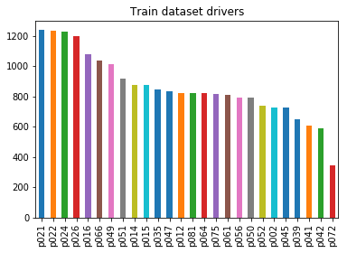
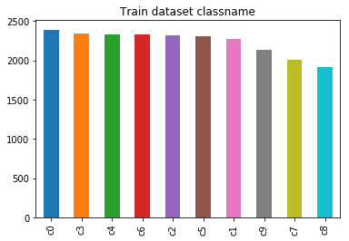
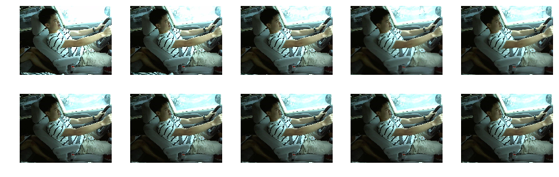
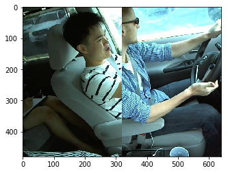
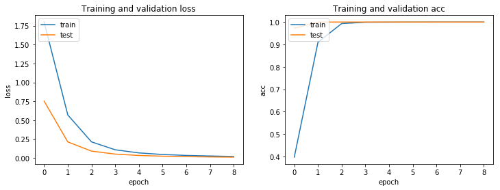

# 机器学习纳米学位
走神司机 潘超 优达学城  
2018年6月6日
## I. 问题的定义
### 项目概述
项目将从一些车载视频摄像头中截取的静态图像识别驾驶员是否处于安全驾驶的状态。

生活中许多驾驶员喜欢一边开车一边做别的事情，如：打电话、发微信、吃东西、聊天、疲劳驾驶等等，安全隐患非常大。特别是一些大巴车司机，关乎到整个大巴车上几十个人的人身安全。该项目的数据来源方Kaggle比赛平台中的资料也指出：
> 根据美国疾病防控中心机动车安全部门的数据，五分之一的车祸是由分心的司机造成的。可悲的是，这意味着每年有42.5万人受伤，3000人因分心驾驶而死亡。

早期驾驶员状态检测方法主要是基于车辆运行状态的检测方法，包括车道偏离报警、转向盘检测等，对驾驶员本身的特征敏感度不高，容易因环境因素误判，也不能从根本上解决驾驶员状态检测的问题，而近年的基于深度学习的图像识别技术则提供了不错的解决办法，可以通过对视频图像进行分析检测驾驶员当前的状态并给予提醒，甚至在出现更严重的危险情况时通过车辆控制信号及时主动刹停汽车。

项目使用的相关数据及评分规则均来于二年前的Kaggle比赛，当年一共有1440名参赛队伍参于该赛事。项目地址：
### 问题陈述
处理通过车载摄像头记录到的驾驶员状态图像，对图像进行识别处理，分析图像中驾驶员当前所处的状态，以满足对安全驾驶提醒的需求。需要从图像中识别包括如下的驾驶员状态：
0. 安全驾驶
1. 右手打字
2. 右手打电话
3. 左手打字
4. 左手打电话
5. 调收音机
6. 喝饮料
7. 拿后面的东西
8. 整理头发和化妆
9. 和其他乘客说话

每一张图片识别出的结果应该是该图片分别在十种状态中的概率值，如安全驾驶的图片的理想识别结果应该为c0类别的概率为1，其他9种类别的概率为0。

项目将使用卷积神经网络来识别这些图像属于哪种状态，卷积神经网络是从2012年开始迅速成长起来的新型图像识别算法和架构，至今已发展出许多不同的版本，在图像识别方面取得了越来越高的准确率。
### 评价指标
评估指标使用kaggle中该项目的评估方式，即multi-class logarithmic loss，损失值计算公式：
$$
logloss = -\frac{1}{N}\sum_{i=1}^{N}\sum_{j=1}^{M}y_{ij}log(p_{ij})
$$
公式中$N$为图像的数量，用于训练集时为当前训练集的数量，用于验证集时为验证集的数量，测试集同理。$M$表示图像标记的数量，在该项目中$M$为10。$y_{ij}$为第$i$个图像在第$j$分类中的标记概率，如果图像为该类，则该值为1，否则为0。$log$为自然对数，$p_{ij}$为第$i$个图像在第$j$分类中标记的预测概率。将每一张图像每个分类的预测概率的自然对数与分类目标标记的积相加再取负均值，最终即为多分类损失值。
## II. 分析
### 数据的探索
数据集来源于往年的Kaggle竞赛。压缩包中文件结构如下：
- driver_imgs_list.csv
- sample_submission.csv
- imgs.zip
  - test
    - img_1.jpg
    - img_2.jpg
    - ......
  - train
    - c0
      - img_34.jpg
      - img_105.jpg
      - ......
    - c1
    - c2
    - ......

数据集中包含大量车载摄像头对驾驶员位置的摄影截图，可清楚看到驾驶员的各种行为，包括打电话、喝饮料、拿后面的东西、打字等。数据集中将图片数据分为了训练集和测试集，训练集可用于该项目中训练模型，测试集可在模型训练完毕后检验预测效果，可提交至Kaggle中计算已训练模型的最终得分。训练集中已将图像标记分类，分为c0到c9一共十个文件夹存放，共22424张图片。测试集中有79729张未标记分类的图片。

数据集中每一张图片大小为640*480像素。图片中的驾驶员各种各样，有胖有瘦，有高有矮，有男有女、甚至还有不同肤色的驾驶员，有的驾驶员手臂上还有纹身。图片的光线有明，也有暗，甚至还有些有点爆光过度，导致难以发现手中的透明杯子。
1. 因光照原因看不见喝饮料的杯子  

2. 胖驾驶员  

3. 图像模糊  

### 探索性可视化
从数据集中的driver_imgs_list.csv文件中可得处一些关于该数据集的信息：
- 总共有22424张已标记图像
- 总共有26名驾驶员的不同状态的图像，每名驾驶员的图像数量并不完全相同，最多的驾驶员有1237张图像，最少的驾驶员只有346张图像
- 总共有10种不同的驾驶状态，且每种状态的图片数量差别不大，即它们呈均匀分布

训练数据中司机状态分类呈均匀分布：

每个司机拥有的图像数量：

### 算法和技术
#### Tensorflow
Tensorflow是一个Google公司开发的基于数据流图计算的人工智能神经网络处理框架，可广泛应用于如语音识别，自然语言理解，计算机视觉，广告等。
#### Keras
Keras是一个高层神经网络API，基于tensorflow、Theano以及CNTK后端框架的上层框架，让tensorflow等基础神经网络框架更易于使用。
#### 数据增强
由于图像有明有暗，司机在图像中所处的位置也不同，甚至有些图片比较模糊，决定在训练之前对分割出的训练图像和验证图像做数据增强处理。

数据增强是将图片变换处理出多式多样的不同副本，图像中的主要内容不变，但经过数据增强预处理的图像会被挤压、缩小、旋转角度、添加噪点、Dropout、模糊处理、提升亮度、降低亮度等，将图像这样预处理后模型将有机会认识到图像的各种形态，增加模型的鲁棒性和泛化能力。

项目将尝试使用Keras中的ImageDataGenerator对训练的图像数据做增强处理。
#### InceptionV3

#### Xception

#### ResNet50

#### InceptionResNetV2

#### DenseNet201

#### SGD

#### Adam

#### Fine-tune

####

### 基准模型
使用Kaggle中该项目的排名分数做为基准模型。使用前10%的分数作为基准，第144名，最小损失值为0.25634。
## III. 方法
### 数据预处理
经过抽察数据集发现，ID为p081的这名司机在c0安全驾驶类别中存在多张图像能判断为与其他乘客聊天的状态，属于异常数据，决定弃用p081在c0类别中的所有数据。如：img_6002.jpg、img_28578.jpg、img_45571.jpg、img_47447.jpg、img_49150.jpg、img_51985.jpg、img_5963.jpg、img_3349.jpg


`driver_imgs_list.csv`数据表就像一个训练图像集的索引文件，通过它可引用到对应的图像文件。使用该文件中的司机ID的指引，排除掉ID为p081的司机在c0分类中的图像数据（并不删除p081司机在c0文件夹中的图像，仅仅在该csv文件中删除p081在c0分类的文件索引），排除后生成一份新的csv文件`drivers_img_nop081_list.csv`，此后的数据处理和训练都将基于该数据索引文件来处理。

清除p081的司机在c0分类中的图像索引后，新的csv数据表中各类数据分布仍然呈平均分布：

排除p081的c0数据后，总共有22342张图像数据可用。

查看原始图像文件，这里选取数据表中同一个司机ID的前10张图片，发现几乎完全一样，连肉眼都不能清楚分辨，图片的重复程度非常高。如下图片展示：


参考了原比赛中前几名选手的方案，决定使用图像拼接的方式对其进行数据增强处理，目的是为了让模型在训练时更多地关注司机的行为，如：双手握盘安全驾驶、拿手机打电话、拿手机发短信、转身拿后方东西等，而不让模型去记住这些司机的样貌、行态、穿着。图像拼接后的效果：


使用新的`driver_imgs_nop081_list.csv`数据索引文件处理每一份图像，拼接时将每张图像的右半块替换为与该图像相同分类下的随机另一张图数据的右半块，并保存拼接后的新图像到新的`data/imgs/train_aug`文件夹中，同样按c0-c9文件夹分类存放好，并记录在新的数据索引文件`drivers_img_aug_list.csv`中，记录时同样存放司机ID、所属分类、图像文件名这些信息，便于后期分割验证集和训练时使用。执行图像拼接数据增强后，其中可用的数据集增加到了44648张图像，大大丰富了训练集。
### 执行过程
该项目执行时将使用Keras框架中各带有imagenet预训练权重的深度学习模型，如：InceptionV3、Xception、InceptionResNetV2、ResNet50、DenseNet201。使用这些模型进行训练时都将排除掉原模型中的顶层全边接层，加入全局平均池化层对模型的高层特征向量进行降维，并加入Dropout层，Dropout层将在训练过程中按一定的概率将网络中的神经元暂时丢弃，减少模型的训练参数，防止过拟合。为了在学习过拟合、欠拟合之间找到一个平衡，Dropout层的参数将设置为0.5。Dropout参数大，丢弃率高，学习速度慢，同样的精度需要的训练代数更多，容易欠拟合；Dropout参数小，丢弃率低，学习速度快，模型更早进入过拟合状态。

再在模型的最顶部加入一个10分类的全连接层（因项目有10种数据类别），使用`use_bias=False, kernel_regularizer=l2(0.01)`参数去掉全连接层的偏移项，并加入L2正则对训练参数进行惩罚，以此来防止过拟合。

因数据集较多，在向模型中fit训练数据时使用ImageDataGenerator来分批fit图像，并对图像做旋转、缩放、翻转等数据增强处理
#### 验证集分割
这里因为数据集中的司机图像是从视频中截取出来的，可能存在两张甚至多种几乎一样的图像分别位于训练集和验证集中。训练后做验证时因为验证集存在几乎相同的图像，会导致验证分数被提高，但实际上模型仅仅是记住了该图片，因此分割验证集里需要采用一些策略：使用司机ID来做验证集分割。

因使用图像拼接的方法生成了更多的图像文件及新的数据索引表`drivers_img_aug_list.csv`，因此分割验证集将更麻烦一些，需要同时处理源始图像及拼接图像。这里编写了一个`split_valid.py`模块，其中中`split`方法专门用于处理验证集分割。传入需要作为验证集的司机ID、训练集目录、验证集目录等参数后，将分割验证集图像到新的目录中，便于模型训练时使用。

这里采用软链接的方式将分割后的验证集图像链接到新的目录`data/imgs/val2`中，这样减少COPY图像文件的时间，迅速分割，也减少磁盘占用。因为我们验证集的目的主要是验证模型在原图像集中的精确度和泛化能力，所以并没有将拼接后的图像提取出来也作为验证集。

训练集也同样采用软链接的方式将原始图像和拼接后的图像都链接到新的一个训练目录`data/imgs/train2`中，并按分类文件夹存放。

分割的效果如下：
```
split_valid.split(choice_ids=choices,
                  train_pd_path="data/drivers_img_nop081_list.csv",
                  train_aug_pd_path="data/drivers_img_aug_list.csv",
                  train_dir=train_dir,
                  val_dir=val_dir,
                  test_dir=test_dir,
                  origin_test_dir="data/imgs/test",
                  saved_weights_dir="saved_weights")
```
output:
```
选择作为验证集的司机ID: ['p024', 'p002']
分割的训练集数量: 20373 ，验证集数量: 1951
从增强数据集中分割的训练集数量: 20373
link images to directory data/imgs/train2
link augmented images to directory data/imgs/train2
link images to directory data/imgs/val2
split valid data done!
```
#### 使用clip来防止logloss分数过高


#### 使用InceptionV3模型训练
这里使用Keras框架中的InceptionV3模型训练，并使用imagenet的预训练权重。具体实现代码：inceptionv3.ipynb
**1. 未使用拼接图像的模型训练**
使用SGD优化器，学习率为0.0003，衰减为9e-8，未排除全连接层的偏置项，没有使用L2正则化，可以看到模型val_loss在下降到0.8几的时候就出现了过拟合现象

SGD优化器学习率降为0.0002，衰减为9e-8，未排除全连接层的偏置项，没有使用L2正则化，模型过拟合现象有减少，val_loss在下降到大概0.7几时才出现过拟合

SGD优化器学习率降为0.0002，衰减为20e-8，排除了全连接层的偏置项，没有使用L2正则化，发现模型过拟合现象有明显减少，val_loss在下降到大概0.5左右才出现过拟合。

由上可见降低学习率，提高衰减，排除全连接层偏置项是可以防止过拟合的。

再次尝试通过锁层的方式来防止过拟合，锁定InceptionV3模型中的第229-310层，也即不训练最后3个块，使用SGD优化器，学习率为0.0003，衰减为30e-8，排除全连接层的偏置项，发现模型训练非常缓慢，处于欠拟合状态，不适合使用该方法来防止过拟合

**2. 使用拼接图像的模型训练**
使用SGD优化器，学习率为0.0003，衰减为30e-8，未排除全连接层的偏置项，没有使用L2正则化，实际使用的训练集是原来的2倍，可发现模型的训练效果明显提升，val_loss已能下降到0.11左右：

使用该模型对测试集进行预测后得到分数：private 0.41971, public 0.63264。看来我们离设定的目标大大近了一步。

因SGD优化器收敛速度较慢，且可能下降到一个局部最优值后无法再次下降，因此决定使用Adam优化器，并继续排除全连接层的偏置项，加入L2正则化来更近一步防止过拟合。学习速度为0.0001，衰减为6e-8。可看到Adam优化器可快速使loss分数下降，迅速达到极小值附近，但可能这里设定的学习率参数较大，模型训练中出现了较大的波动。

使用该模型对测试集进行预测后得到分数：private: 0.31309, public: 0.35854。更加接近设定的目标。

再次修改Adam优化器参数，学习率降低为0.00005，衰减设为2e-8，并使用Keras框架中的`ModelCheckpoint`和`EarlyStopping`使模型出现过拟合时保存最优训练模型，多次调整尝试后得到的最优结果为：

loss: 0.0148 - acc: 0.9993 - val_loss: 0.0248 - val_acc: 0.9959

使用该模型对测试集进行预测后得到分数：private: 0.28068, public: 0.31967。经过多次尝试后发现该参数训练出的模型得出的分数是最优的，因此最终采用了该模型。
#### 使用Xception模型训练
这里使用Keras框架中的Xception模型训练，并使用imagenet的预训练权重。具体实现代码：xception.ipynb

因为在训练InceptionV3模型时已尝试不使用拼接图像进行训练，发现效果不，因此该模型及后续模型的训练都将使用原始图像+拼接图像的方式训练。多次调整尝试后，使用的最终训练参数如下：
- Adam优化器
- 学习率：0.00003
- 衰减：1e-8
- 排除全连接层偏置项
- 加入L2正则化

最优训练结果：loss: 0.0254 - acc: 0.9990 - val_loss: 0.0410 - val_acc: 0.9931

提交到kaggle中后得到成绩：private:  0.30469, public: 0.35846
#### 使用InceptionResNetV2模型训练
这里使用Keras框架中的InceptionResNetV2模型训练，并使用imagenet的预训练权重。具体实现代码：InceptionResNetV2.ipynb

多次调整尝试后，使用的最终训练参数如下：
- Adam优化器
- 学习率：0.00003
- 衰减：1e-8
- 排除全连接层偏置项
- 加入L2正则化

最优训练结果：loss: 0.0267 - acc: 0.9986 - val_loss: 0.1077 - val_acc: 0.9731

提交到kaggle中后得到成绩：private: 0.32819, public: 0.43092
#### 使用ResNet50模型训练
这里使用Keras框架中的ResNet50模型训练，并使用imagenet的预训练权重。具体实现代码：resnet50.ipynb

多次调整尝试后，使用的最终训练参数如下：
- Adam优化器
- 学习率：0.00005
- 衰减：2e-8
- 排除全连接层偏置项
- 加入L2正则化

最优训练结果：loss: 0.2102 - acc: 0.9933 - val_loss: 0.2963 - val_acc: 0.9575

提交到kaggle中后得到成绩：private: 0.37406, public: 0.42121
#### 使用DenseNet201
这里使用Keras框架中的DenseNet201模型训练，并使用imagenet的预训练权重。具体实现代码：densenet201.ipynb

多次调整尝试后，使用的最终训练参数如下：
- Adam优化器
- 学习率：0.00003
- 衰减：1e-8
- 排除全连接层偏置项
- 加入L2正则化

最优训练结果：loss: 0.0206 - acc: 0.9991 - val_loss: 0.0540 - val_acc: 0.9923

提交到kaggle中后得到成绩：private: 0.28420, public: 0.30792
#### 模型融合
以上每一个模型在kaggle中的分数都在0.28以上，离我们设定的0.25的目标还有一段距离。决定使用模型融合的技术来继续降低该loss分数。模型融合类似于多个模型对它们的预测结果进行投票选举，通过该选举选出测试集中每张图片的最优预测结果，达到进一步提升模型准确度的目的。

以下是选取的各模型的训练比较：
|        模型       |训练acc|验证acc|训练loss|验证loss|Kaggle public|Kaggle private|
|------------------|---------|---------|---------|--------|----------|----------|
|   InceptionV3    | 0.9993  | 0.9959  | 0.0148  | 0.0248 | 0.31967  |  0.28068 |
|   Xception       | 0.9990  | 0.9931  | 0.0254  | 0.0410 | 0.35846  |  0.30469 |
|InceptionResNetV2 | 0.9986  | 0.9731  | 0.0267  | 0.1077 | 0.43092  |  0.32819 |
|   ResNet50       | 0.9933  | 0.9575  | 0.2102  | 0.2963 | 0.42121  |  0.37406 |
|   DenseNet201    | 0.9991  | 0.9923  | 0.0206  | 0.0540 | 0.30792  |  0.28420 |

从该比较中将选取最优的4个模型作为融合训练的模型，选取的模型为：InceptionV3、Xception、InceptionResNetV2、DenseNet201。

加载每一个需要融合的模型，去掉最后的全连接分类层，对训练集、验证集、测试集提取特征向量，保存到bottleneck文件中，具体实现代码：write_bottleneck.ipynb。这里只提取原始图像的特征向量。

构建一个只有Dropout层和全连接分类层的最简模型，加载bottleneck文件中的特征向量进行训练。因为只对各模型提取出的高层次特征向量进行训练，因此训练速度将非常快:

loss: 0.0089 - acc: 0.9999 - val_loss: 0.0050 - val_acc: 1.0000


融合训练后就可以对测试集的特征向量进行预测了，最终预测成绩：

kaggle的private分数达到了0.22399的好成绩，在kaggle的排名表中可以排在第95名，也达到了最初设定的基准。

## IV. 项目结论
### 结果可视化
在这一部分，你需要用可视化的方式展示项目中需要强调的重要技术特性。至于什么形式，你可以自由把握，但需要表达出一个关于这个项目重要的结论和特点，并对此作出讨论。一些需要考虑的：

你是否对一个与问题，数据集，输入数据，或结果相关的，重要的技术特性进行了可视化？
可视化结果是否详尽的分析讨论了？
绘图的坐标轴，标题，基准面是不是清晰定义了？
### 对项目的思考
在这一部分，你需要从头到尾总结一下整个问题的解决方案，讨论其中你认为有趣或困难的地方。从整体来反思一下整个项目，确保自己对整个流程是明确掌握的。需要考虑：

你是否详尽总结了项目的整个流程？
项目里有哪些比较有意思的地方？
项目里有哪些比较困难的地方？
最终模型和结果是否符合你对这个问题的期望？它可以在通用的场景下解决这些类型的问题吗？
### 需要作出的改进
在这一部分，你需要讨论你可以怎么样去完善你执行流程中的某一方面。例如考虑一下你的操作的方法是否可以进一步推广，泛化，有没有需要作出变更的地方。你并不需要确实作出这些改进，不过你应能够讨论这些改进可能对结果的影响，并与现有结果进行比较。一些需要考虑的问题：

是否可以有算法和技术层面的进一步的完善？
是否有一些你了解到，但是你还没能够实践的算法和技术？
如果将你最终模型作为新的基准，你认为还能有更好的解决方案吗？

## 参考文献
[1]Christian Szegedy, Vincent Vanhoucke, Sergey Ioffe, Jonathon Shlens, Zbigniew Wojna. [
Rethinking the Inception Architecture for Computer Vision](https://arxiv.org/pdf/1512.00567). arXiv:1512.00567, 2015.
[2]François Chollet. [Xception: Deep Learning with Depthwise Separable Convolutions](https://arxiv.org/pdf/1610.02357). arXiv prepr int arXiv:1610.02357, 2016.
[3]黄文坚. [CNN浅析和历年ImageNet冠军模型解析](http://www.infoq.com/cn/articles/cnn-and-imagenet-champion-model-analysis). 发表时间: 2017年5月22日.
[4]Kaggle. [State Farm Distracted Driver Detection](https://www.kaggle.com/c/state-farm-distracted-driver-detection). 2016.

**在提交之前， 问一下自己...**
- 你所写的项目报告结构对比于这个模板而言足够清晰了没有？
- 每一个部分（尤其分析和方法）是否清晰，简洁，明了？有没有存在歧义的术语和用语需要进一步说明的？
- 你的目标读者是不是能够明白你的分析，方法和结果？
- 报告里面是否有语法错误或拼写错误？
- 报告里提到的一些外部资料及来源是不是都正确引述或引用了？
- 代码可读性是否良好？必要的注释是否加上了？
- 代码是否可以顺利运行并重现跟报告相似的结果？
