# 机器学习纳米学位
走神司机 潘超 优达学城  
2018年6月6日
## I. 问题的定义
### 项目概述
项目将从一些车载视频摄像头中截取的静态图像识别驾驶员是否处于安全驾驶的状态。

生活中许多驾驶员喜欢一边开车一边做别的事情，如：打电话、发微信、吃东西、聊天、疲劳驾驶等等，安全隐患非常大。特别是一些大巴车司机，关乎到整个大巴车上几十个人的人身安全。该项目的数据来源方Kaggle比赛平台中的资料也指出：
> 根据美国疾病防控中心机动车安全部门的数据，五分之一的车祸是由分心的司机造成的。可悲的是，这意味着每年有42.5万人受伤，3000人因分心驾驶而死亡。

早期驾驶员状态检测方法主要是基于车辆运行状态的检测方法，包括车道偏离报警、转向盘检测等，对驾驶员本身的特征敏感度不高，容易因环境因素误判，也不能从根本上解决驾驶员状态检测的问题，而近年的基于深度学习的图像识别技术则提供了不错的解决办法，可以通过对视频图像进行分析检测驾驶员当前的状态并给予提醒，甚至在出现更严重的危险情况时通过车辆控制信号及时主动刹停汽车。

项目使用的数据源来源于二年前的Kaggle比赛，当年一共有1440名参赛队伍参于该赛事。
### 问题陈述
处理通过车载摄像头记录到的驾驶员状态图像，对图像进行识别处理，分析图像中驾驶员当前所处的状态，以满足对安全驾驶提醒的需求。需要从图像中识别包括如下的驾驶员状态：
0. 安全驾驶
1. 右手打字
2. 右手打电话
3. 左手打字
4. 左手打电话
5. 调收音机
6. 喝饮料
7. 拿后面的东西
8. 整理头发和化妆
9. 和其他乘客说话
每一张图片识别出的结果应该是该图片分别在十种状态中的概率值，如安全驾驶的图片的理想识别结果应该为c0类别的概率为1，其他9种类别的概率为0。

项目将使用卷积神经网络来识别这些图像属于哪种状态，卷积神经网络是从2012年开始迅速成长起来的新型图像识别算法和架构，至今已发展出许多不同的版本，在图像识别方面取得了越来越高的准确率。
### 评价指标
评估指标使用kaggle中该项目的评估方式，即multi-class logarithmic loss，损失值计算公式：
$$
logloss = -\frac{1}{N}\sum_{i=1}^{N}\sum_{j=1}^{M}y_{ij}log(p_{ij})
$$
公式中$N$为图像的数量，用于训练集时为当前训练集的数量，用于验证集时为验证集的数量，测试集同理。$M$表示图像标记的数量，在该项目中$M$为10。$y_{ij}$为第$i$个图像在第$j$分类中的标记概率，如果图像为该类，则该值为1，否则为0。$log$为自然对数，$p_{ij}$为第$i$个图像在第$j$分类中标记的预测概率。将每一张图像每个分类的预测概率的自然对数与分类目标标记的积相加再取负均值，最终即为多分类损失值。
## II. 分析
### 数据的探索
数据集来源于往年的Kaggle竞赛。数据集中包含大量车载摄像头对驾驶员位置的摄影截图，可清楚看到驾驶员的各种行为，包括打电话、喝饮料、拿后面的东西、打字等。数据集中将图片数据分为了训练集和测试集，训练集可用于该项目中训练模型，测试集可在模型训练完毕后检验预测效果，可提交至Kaggle中计算已训练模型的最终得分。训练集中已将图像标记分类，分为c0到c9一共十个文件夹存放，共22424张图片。测试集中有79729张未标记分类的图片。

数据集中每一张图片大小为640*480像素。图片中的驾驶员各种各样，有胖有瘦，有高有矮，有男有女、甚至还有不同肤色的驾驶员，有的驾驶员手臂上还有纹身。图片的光线有明，也有暗，甚至还有些有点爆光过度，导致难以发现手中的透明杯子。
1. 因光照原因看不见喝饮料的杯子  

2. 胖驾驶员  

3. 图像模糊

### 探索性可视化
训练数据中司机状态分类呈均匀分布：
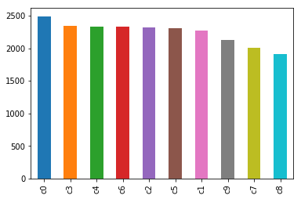

在这一部分，你需要对数据的特征或特性进行概括性或提取性的可视化。这个可视化的过程应该要适应你所使用的数据。就你为何使用这个形式的可视化，以及这个可视化过程为什么是有意义的，进行一定的讨论。你需要考虑的问题：

你是否对数据中与问题有关的特性进行了可视化？
你对可视化结果进行详尽的分析和讨论了吗？
绘图的坐标轴，标题，基准面是不是清晰定义了？
### 算法和技术
> 介绍tensorflow、Keras
> 介绍数据增强
> 介绍InceptionV3
> 介绍Xception
> 在最后的报告中， 也需要介绍一下InceptionV3和Xception，讨论一下选择这两个算法的理由：训练参数少，速度快，提出了新的神经网络架构（网中网）

### 基准模型
使用Kaggle中该项目的排名分数做为基准模型。使用前10%的分数作为基准，第144名，最小损失值为0.25634。
## III. 方法
(大概 3-5 页）
### 数据预处理
> 对图像数据进行预处理：旋转、添加噪点、模糊、缩小图片

在这一部分， 你需要清晰记录你所有必要的数据预处理步骤。在前一个部分所描述的数据的异常或特性在这一部分需要被更正和处理。需要考虑的问题有：

如果你选择的算法需要进行特征选取或特征变换，你对此进行记录和描述了吗？
数据的探索这一部分中提及的异常和特性是否被更正了，对此进行记录和描述了吗？
如果你认为不需要进行预处理，你解释个中原因了吗？
### 执行过程
12. 第十二次
```
epochs = 20
batch_size=32
out_image_size = (299, 299)

x = Dropout(0.5)(x)
x = GlobalAveragePooling2D()(x)
x = Dropout(0.5)(x)
predictions = Dense(10, activation='softmax')(x)

sgd = SGD(lr=0.0001, decay=1e-7, momentum=0.9, nesterov=True)
```
```
Found 20622 images belonging to 10 classes.
Found 1802 images belonging to 10 classes.
model name: inceptionv3 , save weight file: saved_weights/inceptionv3_0.h5
Epoch 1/20
644/644 [==============================] - 823s 1s/step - loss: 2.3173 - acc: 0.1498 - val_loss: 2.0363 - val_acc: 0.3253
Epoch 2/20
644/644 [==============================] - 800s 1s/step - loss: 1.9181 - acc: 0.3263 - val_loss: 1.3049 - val_acc: 0.6217
Epoch 3/20
644/644 [==============================] - 799s 1s/step - loss: 1.2794 - acc: 0.5822 - val_loss: 0.7394 - val_acc: 0.7885
Epoch 4/20
644/644 [==============================] - 795s 1s/step - loss: 0.8195 - acc: 0.7442 - val_loss: 0.5157 - val_acc: 0.8387
Epoch 5/20
644/644 [==============================] - 794s 1s/step - loss: 0.5611 - acc: 0.8251 - val_loss: 0.3948 - val_acc: 0.8834
Epoch 6/20
644/644 [==============================] - 794s 1s/step - loss: 0.4305 - acc: 0.8688 - val_loss: 0.3637 - val_acc: 0.8761
Epoch 7/20
644/644 [==============================] - 795s 1s/step - loss: 0.3503 - acc: 0.8952 - val_loss: 0.3263 - val_acc: 0.8884
Epoch 8/20
644/644 [==============================] - 795s 1s/step - loss: 0.2964 - acc: 0.9087 - val_loss: 0.3658 - val_acc: 0.8705
```
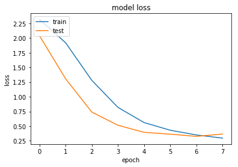
15. 第十五次
```
epochs = 20
batch_size=32
out_image_size = (299, 299)

x = Dropout(0.5)(x)
x = GlobalAveragePooling2D()(x)
x = Dropout(0.5)(x)
predictions = Dense(10, activation='softmax')(x)

sgd = SGD(lr=0.0002, decay=6e-8, momentum=0.9, nesterov=True)
```
```
Found 20673 images belonging to 10 classes.
Found 1751 images belonging to 10 classes.
model name: inceptionv3 , will save weight file: saved_weights/inceptionv3_0.h5
Epoch 1/20
646/646 [==============================] - 816s 1s/step - loss: 2.1847 - acc: 0.2111 - val_loss: 1.7028 - val_acc: 0.4404
Epoch 2/20
646/646 [==============================] - 791s 1s/step - loss: 1.1735 - acc: 0.6189 - val_loss: 0.7388 - val_acc: 0.7847
Epoch 3/20
646/646 [==============================] - 789s 1s/step - loss: 0.5489 - acc: 0.8351 - val_loss: 0.4982 - val_acc: 0.8322
Epoch 4/20
646/646 [==============================] - 786s 1s/step - loss: 0.3462 - acc: 0.8973 - val_loss: 0.3818 - val_acc: 0.8814
Epoch 5/20
646/646 [==============================] - 786s 1s/step - loss: 0.2567 - acc: 0.9240 - val_loss: 0.3237 - val_acc: 0.8866
Epoch 6/20
646/646 [==============================] - 785s 1s/step - loss: 0.2097 - acc: 0.9383 - val_loss: 0.2726 - val_acc: 0.9201
Epoch 7/20
646/646 [==============================] - 786s 1s/step - loss: 0.1676 - acc: 0.9517 - val_loss: 0.3537 - val_acc: 0.8785
```
18. 第十九次
```
epochs = 20
batch_size=32
out_image_size = (299, 299)
val_loss_stop = 0.01

x = Dropout(0.5)(x)
x = GlobalAveragePooling2D()(x)
predictions = Dense(10, activation='softmax')(x)

op = Adam(lr=0.0003)
```
自动停止
```
Found 20600 images belonging to 10 classes.
Found 1824 images belonging to 10 classes.
model name: inceptionv3 , will save weight file: saved_weights/inceptionv3_0.h5
Epoch 1/10
643/643 [==============================] - 711s 1s/step - loss: 0.7969 - acc: 0.7280 - val_loss: 0.1855 - val_acc: 0.9276
Epoch 2/10
643/643 [==============================] - 695s 1s/step - loss: 0.3945 - acc: 0.8697 - val_loss: 0.2586 - val_acc: 0.9112

Found 20593 images belonging to 10 classes.
Found 1831 images belonging to 10 classes.
model name: inceptionv3 , will save weight file: saved_weights/inceptionv3_1.h5
Epoch 1/10
643/643 [==============================] - 705s 1s/step - loss: 0.8024 - acc: 0.7301 - val_loss: 0.2657 - val_acc: 0.9013
Epoch 2/10
643/643 [==============================] - 694s 1s/step - loss: 0.3988 - acc: 0.8697 - val_loss: 0.2169 - val_acc: 0.9227
Epoch 3/10
643/643 [==============================] - 698s 1s/step - loss: 0.3369 - acc: 0.8876 - val_loss: 0.2117 - val_acc: 0.9282

Found 20577 images belonging to 10 classes.
Found 1847 images belonging to 10 classes.
model name: inceptionv3 , will save weight file: saved_weights/inceptionv3_2.h5
Epoch 1/10
643/643 [==============================] - 700s 1s/step - loss: 0.7956 - acc: 0.7307 - val_loss: 0.7737 - val_acc: 0.7615
Epoch 2/10
643/643 [==============================] - 731s 1s/step - loss: 0.4041 - acc: 0.8697 - val_loss: 0.2663 - val_acc: 0.9265
Epoch 3/10
643/643 [==============================] - 729s 1s/step - loss: 0.3291 - acc: 0.8941 - val_loss: 0.2251 - val_acc: 0.9221
Epoch 4/10
643/643 [==============================] - 716s 1s/step - loss: 0.2981 - acc: 0.9040 - val_loss: 0.1864 - val_acc: 0.9293
Epoch 5/10
643/643 [==============================] - 706s 1s/step - loss: 0.2704 - acc: 0.9112 - val_loss: 0.2249 - val_acc: 0.9090

Found 20622 images belonging to 10 classes.
Found 1802 images belonging to 10 classes.
model name: inceptionv3 , will save weight file: saved_weights/inceptionv3_3.h5
Epoch 1/10
644/644 [==============================] - 725s 1s/step - loss: 0.7771 - acc: 0.7370 - val_loss: 0.3927 - val_acc: 0.8789
Epoch 2/10
644/644 [==============================] - 701s 1s/step - loss: 0.3955 - acc: 0.8714 - val_loss: 0.4207 - val_acc: 0.8605

Found 20665 images belonging to 10 classes.
Found 1759 images belonging to 10 classes.
model name: inceptionv3 , will save weight file: saved_weights/inceptionv3_4.h5
Epoch 1/10
645/645 [==============================] - 708s 1s/step - loss: 0.7724 - acc: 0.7365 - val_loss: 0.4658 - val_acc: 0.8461
Epoch 2/10
645/645 [==============================] - 707s 1s/step - loss: 0.3953 - acc: 0.8712 - val_loss: 0.5559 - val_acc: 0.8681

Found 20673 images belonging to 10 classes.
Found 1751 images belonging to 10 classes.
model name: inceptionv3 , will save weight file: saved_weights/inceptionv3_5.h5
Epoch 1/10
646/646 [==============================] - 717s 1s/step - loss: 0.7878 - acc: 0.7301 - val_loss: 0.3215 - val_acc: 0.9034
Epoch 2/10
646/646 [==============================] - 709s 1s/step - loss: 0.4031 - acc: 0.8661 - val_loss: 0.4694 - val_acc: 0.8634

Found 20714 images belonging to 10 classes.
Found 1710 images belonging to 10 classes.
model name: inceptionv3 , will save weight file: saved_weights/inceptionv3_6.h5
Epoch 1/10
647/647 [==============================] - 725s 1s/step - loss: 0.7579 - acc: 0.7437 - val_loss: 0.7232 - val_acc: 0.7995
Epoch 2/10
647/647 [==============================] - 710s 1s/step - loss: 0.3827 - acc: 0.8765 - val_loss: 1.0598 - val_acc: 0.7936

Found 20754 images belonging to 10 classes.
Found 1670 images belonging to 10 classes.
model name: inceptionv3 , will save weight file: saved_weights/inceptionv3_7.h5
Epoch 1/10
648/648 [==============================] - 735s 1s/step - loss: 0.7734 - acc: 0.7397 - val_loss: 0.2928 - val_acc: 0.9261
Epoch 2/10
648/648 [==============================] - 697s 1s/step - loss: 0.3890 - acc: 0.8727 - val_loss: 0.5392 - val_acc: 0.8504

Found 20740 images belonging to 10 classes.
Found 1684 images belonging to 10 classes.
model name: inceptionv3 , will save weight file: saved_weights/inceptionv3_8.h5
Epoch 1/10
648/648 [==============================] - 748s 1s/step - loss: 0.8334 - acc: 0.7189 - val_loss: 0.8631 - val_acc: 0.7386
Epoch 2/10
648/648 [==============================] - 707s 1s/step - loss: 0.4124 - acc: 0.8655 - val_loss: 0.6439 - val_acc: 0.8005
Epoch 3/10
648/648 [==============================] - 707s 1s/step - loss: 0.3281 - acc: 0.8932 - val_loss: 0.5077 - val_acc: 0.8155
Epoch 4/10
648/648 [==============================] - 709s 1s/step - loss: 0.2815 - acc: 0.9084 - val_loss: 0.4365 - val_acc: 0.8528
Epoch 5/10
648/648 [==============================] - 706s 1s/step - loss: 0.2655 - acc: 0.9141 - val_loss: 0.4702 - val_acc: 0.8714
```
19. 第十九次
使用Xception模型
```
epochs = 20
batch_size=32
out_image_size = (299, 299)
val_loss_stop = 0.01

x = Dropout(0.5)(x)
x = GlobalAveragePooling2D()(x)
predictions = Dense(10, activation='softmax')(x)

op = Adadelta()
```
```
Found 20754 images belonging to 10 classes.
Found 1670 images belonging to 10 classes.
model name: xception , will save weight file: saved_weights/xception_0.h5
Epoch 1/10
648/648 [==============================] - 738s 1s/step - loss: 0.6810 - acc: 0.7740 - val_loss: 0.3584 - val_acc: 0.8804
Epoch 2/10
648/648 [==============================] - 742s 1s/step - loss: 0.3443 - acc: 0.8896 - val_loss: 0.2012 - val_acc: 0.9417
Epoch 3/10
648/648 [==============================] - 736s 1s/step - loss: 0.2783 - acc: 0.9116 - val_loss: 0.2665 - val_acc: 0.9171
```
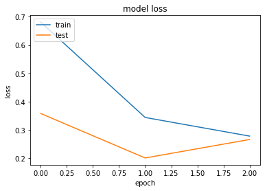
```
Found 20740 images belonging to 10 classes.
Found 1684 images belonging to 10 classes.
model name: xception , will save weight file: saved_weights/xception_1.h5
Epoch 1/10
648/648 [==============================] - 758s 1s/step - loss: 0.6857 - acc: 0.7733 - val_loss: 0.8786 - val_acc: 0.8017
Epoch 2/10
648/648 [==============================] - 727s 1s/step - loss: 0.3378 - acc: 0.8920 - val_loss: 0.2434 - val_acc: 0.9213
Epoch 3/10
648/648 [==============================] - 751s 1s/step - loss: 0.2795 - acc: 0.9109 - val_loss: 0.3092 - val_acc: 0.9099
```
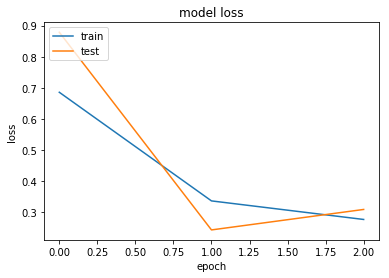
```
Found 20762 images belonging to 10 classes.
Found 1662 images belonging to 10 classes.
model name: xception , will save weight file: saved_weights/xception_2.h5
Epoch 1/10
648/648 [==============================] - 747s 1s/step - loss: 0.6995 - acc: 0.7654 - val_loss: 0.1780 - val_acc: 0.9485
Epoch 2/10
648/648 [==============================] - 747s 1s/step - loss: 0.3354 - acc: 0.8927 - val_loss: 0.3984 - val_acc: 0.9001
```
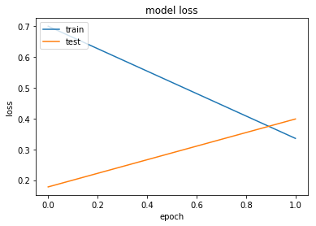
```
Found 20769 images belonging to 10 classes.
Found 1655 images belonging to 10 classes.
model name: xception , will save weight file: saved_weights/xception_3.h5
Epoch 1/10
649/649 [==============================] - 763s 1s/step - loss: 0.6959 - acc: 0.7666 - val_loss: 0.5046 - val_acc: 0.8634
Epoch 2/10
649/649 [==============================] - 729s 1s/step - loss: 0.3423 - acc: 0.8892 - val_loss: 0.4905 - val_acc: 0.8315
Epoch 3/10
649/649 [==============================] - 743s 1s/step - loss: 0.2615 - acc: 0.9150 - val_loss: 0.4351 - val_acc: 0.8493
Epoch 4/10
649/649 [==============================] - 743s 1s/step - loss: 0.2368 - acc: 0.9225 - val_loss: 0.5228 - val_acc: 0.8505
```
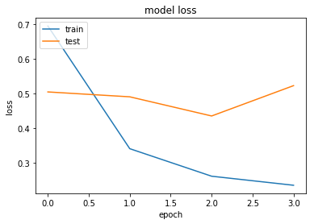
```
Found 20778 images belonging to 10 classes.
Found 1646 images belonging to 10 classes.
model name: xception , will save weight file: saved_weights/xception_4.h5
Epoch 1/10
649/649 [==============================] - 781s 1s/step - loss: 0.6643 - acc: 0.7800 - val_loss: 1.0727 - val_acc: 0.7212
Epoch 2/10
649/649 [==============================] - 744s 1s/step - loss: 0.3314 - acc: 0.8915 - val_loss: 0.6295 - val_acc: 0.8499
Epoch 3/10
649/649 [==============================] - 731s 1s/step - loss: 0.2747 - acc: 0.9118 - val_loss: 0.5324 - val_acc: 0.8542
Epoch 4/10
649/649 [==============================] - 739s 1s/step - loss: 0.2272 - acc: 0.9279 - val_loss: 0.3692 - val_acc: 0.8811
Epoch 5/10
649/649 [==============================] - 743s 1s/step - loss: 0.2042 - acc: 0.9330 - val_loss: 0.7392 - val_acc: 0.8480
```
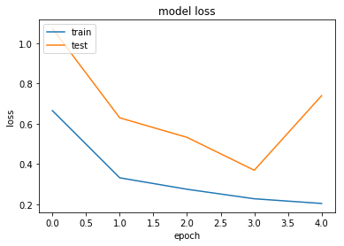
20. 第二十次
使用InceptionV3模型，KFold分为5组
```
epochs = 6
batch_size=32
out_image_size = (299, 299)
val_loss_stop = None

x = Dropout(0.5)(x)
x = GlobalAveragePooling2D()(x)
x = Dropout(0.5)(x)
predictions = Dense(10, activation='softmax')(x)

op = Adam(lr=0.0003, decay=3e-8)
```
```
Found 18017 images belonging to 10 classes.
Found 4407 images belonging to 10 classes.
model name: inception_v3 , will save weight file: saved_weights/inception_v3_0.h5
WARNING:tensorflow:Variable *= will be deprecated. Use variable.assign_mul if you want assignment to the variable value or 'x = x * y' if you want a new python Tensor object.
Epoch 1/6
563/563 [==============================] - 925s 2s/step - loss: 0.9648 - acc: 0.6748 - val_loss: 0.6726 - val_acc: 0.8200
Epoch 2/6
563/563 [==============================] - 654s 1s/step - loss: 0.4614 - acc: 0.8518 - val_loss: 0.5315 - val_acc: 0.8369
Epoch 3/6
563/563 [==============================] - 652s 1s/step - loss: 0.3580 - acc: 0.8840 - val_loss: 0.7412 - val_acc: 0.8047
Epoch 4/6
563/563 [==============================] - 647s 1s/step - loss: 0.3204 - acc: 0.8978 - val_loss: 0.4037 - val_acc: 0.8652
Epoch 5/6
563/563 [==============================] - 645s 1s/step - loss: 0.2838 - acc: 0.9084 - val_loss: 0.4717 - val_acc: 0.8679
Epoch 6/6
563/563 [==============================] - 643s 1s/step - loss: 0.2694 - acc: 0.9142 - val_loss: 0.4441 - val_acc: 0.8807
```
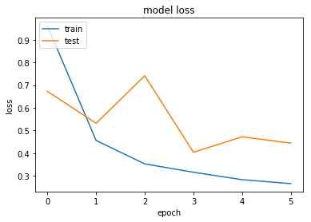
21. 第二十一次
使用InceptionV3模型，KFold分为5组
```
epochs = 10
batch_size=32
out_image_size = (299, 299)
val_loss_stop = None

x = Dropout(0.5)(x)
x = GlobalAveragePooling2D()(x)
predictions = Dense(10, activation='softmax')(x)

op = Adam(lr=0.0001, decay=4e-8)
```
```
Found 18017 images belonging to 10 classes.
Found 4407 images belonging to 10 classes.
model name: inception_v3 , will save weight file: saved_weights/inception_v3_0.h5
WARNING:tensorflow:Variable *= will be deprecated. Use variable.assign_mul if you want assignment to the variable value or 'x = x * y' if you want a new python Tensor object.
Epoch 1/10
563/563 [==============================] - 724s 1s/step - loss: 0.4831 - acc: 0.8466 - val_loss: 0.6032 - val_acc: 0.8159
Epoch 2/10
563/563 [==============================] - 494s 878ms/step - loss: 0.1116 - acc: 0.9647 - val_loss: 0.8054 - val_acc: 0.7876
Epoch 3/10
563/563 [==============================] - 489s 868ms/step - loss: 0.0741 - acc: 0.9772 - val_loss: 0.5017 - val_acc: 0.8485
Epoch 4/10
563/563 [==============================] - 483s 859ms/step - loss: 0.0597 - acc: 0.9805 - val_loss: 0.7995 - val_acc: 0.8417
```
22. 第二十二次
使用InceptionV3模型，KFold分为5组，使用ImageDataGenerator
```
epochs = 20
batch_size=64
out_image_size = (299, 299)
val_loss_stop = None

x = Dropout(0.5)(x)
x = GlobalAveragePooling2D()(x)
x = Dropout(0.5)(x)
predictions = Dense(10, activation='softmax')(x)

op = Adam(lr=0.0001, decay=10e-8)
```
```
Found 17949 images belonging to 10 classes.
Found 4475 images belonging to 10 classes.
model name: inception_v3 , will save weight file: saved_weights/inception_v3_0.h5
Epoch 1/20
280/280 [==============================] - 506s 2s/step - loss: 0.7758 - acc: 0.7400 - val_loss: 0.5572 - val_acc: 0.8306
Epoch 2/20
280/280 [==============================] - 505s 2s/step - loss: 0.1233 - acc: 0.9615 - val_loss: 0.6580 - val_acc: 0.7973
Epoch 3/20
280/280 [==============================] - 484s 2s/step - loss: 0.0745 - acc: 0.9772 - val_loss: 0.5475 - val_acc: 0.8243
Epoch 4/20
280/280 [==============================] - 498s 2s/step - loss: 0.0531 - acc: 0.9845 - val_loss: 1.4999 - val_acc: 0.6440
Epoch 5/20
280/280 [==============================] - 489s 2s/step - loss: 0.0415 - acc: 0.9864 - val_loss: 0.5675 - val_acc: 0.8376
Epoch 6/20
280/280 [==============================] - 485s 2s/step - loss: 0.0399 - acc: 0.9883 - val_loss: 1.0448 - val_acc: 0.7321
Epoch 7/20
280/280 [==============================] - 481s 2s/step - loss: 0.0345 - acc: 0.9887 - val_loss: 1.1757 - val_acc: 0.7285
Epoch 8/20
280/280 [==============================] - 487s 2s/step - loss: 0.0329 - acc: 0.9909 - val_loss: 0.6601 - val_acc: 0.8471
Epoch 9/20
280/280 [==============================] - 490s 2s/step - loss: 0.0246 - acc: 0.9922 - val_loss: 0.8080 - val_acc: 0.8105
Epoch 10/20
280/280 [==============================] - 488s 2s/step - loss: 0.0223 - acc: 0.9933 - val_loss: 0.9342 - val_acc: 0.7991
Epoch 11/20
280/280 [==============================] - 485s 2s/step - loss: 0.0247 - acc: 0.9929 - val_loss: 0.5744 - val_acc: 0.8585
Epoch 12/20
280/280 [==============================] - 482s 2s/step - loss: 0.0226 - acc: 0.9928 - val_loss: 0.6600 - val_acc: 0.8261
Epoch 13/20
280/280 [==============================] - 496s 2s/step - loss: 0.0211 - acc: 0.9929 - val_loss: 0.3713 - val_acc: 0.9049
Epoch 14/20
280/280 [==============================] - 481s 2s/step - loss: 0.0214 - acc: 0.9935 - val_loss: 0.6793 - val_acc: 0.8179
Epoch 15/20
280/280 [==============================] - 483s 2s/step - loss: 0.0240 - acc: 0.9927 - val_loss: 0.4862 - val_acc: 0.8845
Epoch 16/20
280/280 [==============================] - 482s 2s/step - loss: 0.0173 - acc: 0.9949 - val_loss: 1.3515 - val_acc: 0.7095
Epoch 17/20
280/280 [==============================] - 473s 2s/step - loss: 0.0160 - acc: 0.9959 - val_loss: 0.4426 - val_acc: 0.8834
```
24. 第二十四次
使用InceptionV3模型，KFold分为5组，使用ImageDataGenerator，不锁层
```
epochs = 20
batch_size=64
out_image_size = (299, 299)
val_loss_stop = None

x = Dropout(0.5)(x)
x = GlobalAveragePooling2D()(x)
x = Dropout(0.5)(x)
predictions = Dense(10, activation='softmax')(x)

op = SGD(lr=0.0002, decay=4e-8, momentum=0.9, nesterov=True)
```
```
Found 18060 images belonging to 10 classes.
Found 4364 images belonging to 10 classes.
model name: inception_v3 , will save weight file: saved_weights/inception_v3_0.h5
Epoch 1/20
282/282 [==============================] - 487s 2s/step - loss: 2.3355 - acc: 0.1451 - val_loss: 2.1266 - val_acc: 0.2877
Epoch 2/20
282/282 [==============================] - 492s 2s/step - loss: 2.0175 - acc: 0.2914 - val_loss: 1.7082 - val_acc: 0.4596
Epoch 3/20
282/282 [==============================] - 485s 2s/step - loss: 1.4400 - acc: 0.5394 - val_loss: 1.1838 - val_acc: 0.6365
Epoch 4/20
282/282 [==============================] - 490s 2s/step - loss: 0.8942 - acc: 0.7267 - val_loss: 0.9241 - val_acc: 0.6990
Epoch 5/20
282/282 [==============================] - 489s 2s/step - loss: 0.5983 - acc: 0.8210 - val_loss: 0.7710 - val_acc: 0.7390
Epoch 6/20
282/282 [==============================] - 480s 2s/step - loss: 0.4437 - acc: 0.8670 - val_loss: 0.7111 - val_acc: 0.7569
Epoch 7/20
282/282 [==============================] - 482s 2s/step - loss: 0.3534 - acc: 0.8965 - val_loss: 0.6931 - val_acc: 0.7624
Epoch 8/20
282/282 [==============================] - 494s 2s/step - loss: 0.2924 - acc: 0.9151 - val_loss: 0.6475 - val_acc: 0.7721
Epoch 9/20
282/282 [==============================] - 479s 2s/step - loss: 0.2515 - acc: 0.9249 - val_loss: 0.6469 - val_acc: 0.7769
Epoch 10/20
282/282 [==============================] - 484s 2s/step - loss: 0.2182 - acc: 0.9365 - val_loss: 0.6128 - val_acc: 0.7916
Epoch 11/20
282/282 [==============================] - 487s 2s/step - loss: 0.2000 - acc: 0.9413 - val_loss: 0.6187 - val_acc: 0.7920
Epoch 12/20
282/282 [==============================] - 484s 2s/step - loss: 0.1724 - acc: 0.9500 - val_loss: 0.6657 - val_acc: 0.7790
```
26. 第二十六次
使用InceptionV3模型，KFold分为5组，使用ImageDataGenerator，不锁层
```
epochs = 30
batch_size=96
out_image_size = (299, 299)
val_loss_stop = None

x = GlobalAveragePooling2D()(x)
x = Dropout(0.5)(x)
predictions = Dense(10, activation='softmax')(x)

op = SGD(lr=0.0003, decay=9e-8, momentum=0.9, nesterov=True)
```
```
Found 17949 images belonging to 10 classes.
Found 4475 images belonging to 10 classes.
model name: inception_v3 , will save weight file: saved_weights/inception_v3_0.h5
Epoch 1/30
186/186 [==============================] - 498s 3s/step - loss: 2.3412 - acc: 0.1413 - val_loss: 2.1325 - val_acc: 0.2434
Epoch 2/30
186/186 [==============================] - 478s 3s/step - loss: 2.0382 - acc: 0.2836 - val_loss: 1.7160 - val_acc: 0.4688
Epoch 3/30
186/186 [==============================] - 507s 3s/step - loss: 1.4908 - acc: 0.5310 - val_loss: 1.1032 - val_acc: 0.6166
Epoch 4/30
186/186 [==============================] - 483s 3s/step - loss: 0.9380 - acc: 0.7236 - val_loss: 0.7529 - val_acc: 0.7568
Epoch 5/30
186/186 [==============================] - 486s 3s/step - loss: 0.6222 - acc: 0.8237 - val_loss: 0.5732 - val_acc: 0.8238
Epoch 6/30
186/186 [==============================] - 484s 3s/step - loss: 0.4437 - acc: 0.8760 - val_loss: 0.4956 - val_acc: 0.8478
Epoch 7/30
186/186 [==============================] - 490s 3s/step - loss: 0.3438 - acc: 0.9016 - val_loss: 0.4629 - val_acc: 0.8598
Epoch 8/30
186/186 [==============================] - 482s 3s/step - loss: 0.2861 - acc: 0.9178 - val_loss: 0.4212 - val_acc: 0.8732
Epoch 9/30
186/186 [==============================] - 491s 3s/step - loss: 0.2404 - acc: 0.9304 - val_loss: 0.4211 - val_acc: 0.8723
Epoch 10/30
186/186 [==============================] - 489s 3s/step - loss: 0.2125 - acc: 0.9389 - val_loss: 0.4176 - val_acc: 0.8730
Epoch 11/30
186/186 [==============================] - 491s 3s/step - loss: 0.1875 - acc: 0.9464 - val_loss: 0.4217 - val_acc: 0.8798
```
27. 第二十七次
使用InceptionV3模型，KFold分为5组，使用ImageDataGenerator，不锁层
```
epochs = 30
batch_size=96
out_image_size = (299, 299)
val_loss_stop = 0.01

x = GlobalAveragePooling2D()(x)
x = Dropout(0.8)(x)
predictions = Dense(10, activation='softmax')(x)

op = SGD(lr=0.0003, decay=9e-8, momentum=0.9, nesterov=True)
```
```
Found 18017 images belonging to 10 classes.
Found 4407 images belonging to 10 classes.
model name: inception_v3 , will save weight file: saved_weights/inception_v3_0.h5
WARNING:tensorflow:Variable *= will be deprecated. Use variable.assign_mul if you want assignment to the variable value or 'x = x * y' if you want a new python Tensor object.
Epoch 1/30
187/187 [==============================] - 500s 3s/step - loss: 2.4817 - acc: 0.1111 - val_loss: 2.2818 - val_acc: 0.1481
Epoch 2/30
187/187 [==============================] - 496s 3s/step - loss: 2.3047 - acc: 0.1266 - val_loss: 2.2683 - val_acc: 0.1977
Epoch 3/30
187/187 [==============================] - 485s 3s/step - loss: 2.2719 - acc: 0.1487 - val_loss: 2.2364 - val_acc: 0.2873
Epoch 4/30
187/187 [==============================] - 489s 3s/step - loss: 2.1899 - acc: 0.2025 - val_loss: 2.1157 - val_acc: 0.3275
Epoch 5/30
187/187 [==============================] - 483s 3s/step - loss: 1.8973 - acc: 0.3404 - val_loss: 1.7119 - val_acc: 0.4139
Epoch 6/30
187/187 [==============================] - 493s 3s/step - loss: 1.3464 - acc: 0.5550 - val_loss: 1.3021 - val_acc: 0.5442
Epoch 7/30
187/187 [==============================] - 487s 3s/step - loss: 0.9071 - acc: 0.7056 - val_loss: 1.1667 - val_acc: 0.5958
Epoch 8/30
187/187 [==============================] - 485s 3s/step - loss: 0.6448 - acc: 0.8039 - val_loss: 1.0653 - val_acc: 0.6512
Epoch 9/30
187/187 [==============================] - 468s 3s/step - loss: 0.4673 - acc: 0.8652 - val_loss: 0.9697 - val_acc: 0.6826
Epoch 10/30
187/187 [==============================] - 482s 3s/step - loss: 0.3591 - acc: 0.8984 - val_loss: 0.9909 - val_acc: 0.6951
```
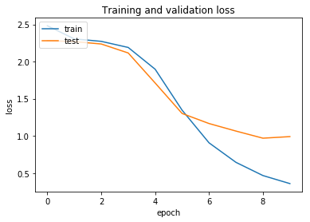
28. 第二十八次
使用InceptionV3模型，KFold分为5组，使用ImageDataGenerator，从249开始锁层
```
epochs = 30
batch_size=96
out_image_size = (299, 299)
val_loss_stop = 0.01

x = GlobalAveragePooling2D()(x)
x = Dropout(0.5)(x)
predictions = Dense(10, activation='softmax')(x)

op = SGD(lr=0.0003, decay=9e-8, momentum=0.9, nesterov=True)
```
```
Found 17949 images belonging to 10 classes.
Found 4475 images belonging to 10 classes.
model name: inception_v3 , will save weight file: saved_weights/inception_v3_0.h5
Epoch 1/30
186/186 [==============================] - 463s 2s/step - loss: 2.3617 - acc: 0.1329 - val_loss: 2.4160 - val_acc: 0.1039
Epoch 2/30
186/186 [==============================] - 460s 2s/step - loss: 2.1765 - acc: 0.2169 - val_loss: 2.4193 - val_acc: 0.1037
Epoch 3/30
186/186 [==============================] - 461s 2s/step - loss: 1.9887 - acc: 0.3042 - val_loss: 2.4258 - val_acc: 0.1037
```
**29. 29**

**参数：**
- 模型: InceptionV3
- epochs = 30
- batch_size = 96
- 锁层: NO
- val_loss_stop: 0.01
- 自定义层:
  ```
  x = GlobalAveragePooling2D()(x)
  x = Dropout(0.5)(x)
  predictions = Dense(10, activation='softmax')(x)
  ```
- 优化器: SGD
  - lr = 0.0003
  - decay = 9e-8

**结果：**
```
Epoch 1/30
187/187 [==============================] - 821s 4s/step - loss: 2.3334 - acc: 0.1457 - val_loss: 2.1769 - val_acc: 0.2509
Epoch 2/30
187/187 [==============================] - 479s 3s/step - loss: 2.0047 - acc: 0.2973 - val_loss: 1.8025 - val_acc: 0.3958
Epoch 3/30
187/187 [==============================] - 476s 3s/step - loss: 1.4364 - acc: 0.5514 - val_loss: 1.2536 - val_acc: 0.5958
Epoch 4/30
187/187 [==============================] - 491s 3s/step - loss: 0.9082 - acc: 0.7324 - val_loss: 0.9935 - val_acc: 0.6595
Epoch 5/30
187/187 [==============================] - 489s 3s/step - loss: 0.6038 - acc: 0.8266 - val_loss: 0.8646 - val_acc: 0.7074
Epoch 6/30
187/187 [==============================] - 491s 3s/step - loss: 0.4371 - acc: 0.8767 - val_loss: 0.8365 - val_acc: 0.7106
Epoch 7/30
187/187 [==============================] - 480s 3s/step - loss: 0.3423 - acc: 0.9041 - val_loss: 0.7979 - val_acc: 0.7248
Epoch 8/30
187/187 [==============================] - 485s 3s/step - loss: 0.2744 - acc: 0.9215 - val_loss: 0.8147 - val_acc: 0.7278
```
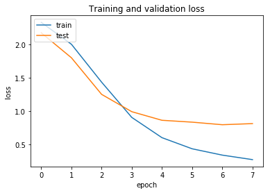
**说明：**
模型在第3代时val_loss下降缓慢，并在第8代时出现过拟合
**30. 30**

**参数：**
- 模型: InceptionV3
- epochs = 30
- batch_size = 96
- 锁层: NO
- val_loss_stop: 0.01
- 自定义层:
  ```
  x = GlobalAveragePooling2D()(x)
  x = Dropout(0.3)(x)
  predictions = Dense(10, activation='softmax')(x)
  ```
- 优化器: SGD
  - lr = 0.0003
  - decay = 9e-8

**结果：**
```
Epoch 1/30
188/188 [==============================] - 485s 3s/step - loss: 2.2476 - acc: 0.1738 - val_loss: 2.1018 - val_acc: 0.2347
Epoch 2/30
188/188 [==============================] - 488s 3s/step - loss: 1.8626 - acc: 0.4055 - val_loss: 1.5970 - val_acc: 0.5264
Epoch 3/30
188/188 [==============================] - 486s 3s/step - loss: 1.2457 - acc: 0.6573 - val_loss: 1.1073 - val_acc: 0.6343
Epoch 4/30
188/188 [==============================] - 482s 3s/step - loss: 0.7851 - acc: 0.7897 - val_loss: 0.9541 - val_acc: 0.6949
Epoch 5/30
188/188 [==============================] - 493s 3s/step - loss: 0.5371 - acc: 0.8531 - val_loss: 0.9079 - val_acc: 0.6903
Epoch 6/30
188/188 [==============================] - 478s 3s/step - loss: 0.3935 - acc: 0.8922 - val_loss: 0.8682 - val_acc: 0.7162
Epoch 7/30
188/188 [==============================] - 482s 3s/step - loss: 0.3086 - acc: 0.9154 - val_loss: 0.8218 - val_acc: 0.7502
Epoch 8/30
188/188 [==============================] - 486s 3s/step - loss: 0.2552 - acc: 0.9296 - val_loss: 0.8038 - val_acc: 0.7493
Epoch 9/30
188/188 [==============================] - 484s 3s/step - loss: 0.2178 - acc: 0.9399 - val_loss: 0.8054 - val_acc: 0.7535
```
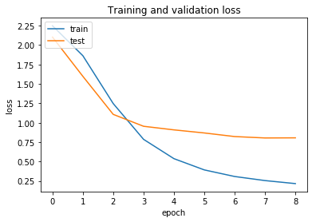
**说明：**
尝试降低Dropout比例为0.3，第9代出现轻微上扬，loss下降太快，val_loss出现轻微过拟合现象
**31. 31**

**参数：**
- 模型: InceptionV3
- epochs = 30
- batch_size = 96
- 锁层: NO
- 停止提升轮数(patience): 2
- 自定义层:
  ```
  x = GlobalAveragePooling2D()(x)
  x = Dropout(0.7)(x)
  predictions = Dense(10, activation='softmax')(x)
  ```
- 优化器: SGD
  - lr = 0.0003
  - decay = 9e-8

**结果：**
```
Epoch 1/30
187/187 [==============================] - 490s 3s/step - loss: 2.4303 - acc: 0.1169 - val_loss: 2.2587 - val_acc: 0.1694
Epoch 2/30
187/187 [==============================] - 473s 3s/step - loss: 2.2521 - acc: 0.1708 - val_loss: 2.1665 - val_acc: 0.2917
Epoch 3/30
187/187 [==============================] - 483s 3s/step - loss: 2.0116 - acc: 0.2949 - val_loss: 1.8511 - val_acc: 0.3868
Epoch 4/30
187/187 [==============================] - 475s 3s/step - loss: 1.4214 - acc: 0.5359 - val_loss: 1.3291 - val_acc: 0.5134
Epoch 5/30
187/187 [==============================] - 491s 3s/step - loss: 0.8565 - acc: 0.7343 - val_loss: 1.1148 - val_acc: 0.5900
Epoch 6/30
187/187 [==============================] - 471s 3s/step - loss: 0.5490 - acc: 0.8373 - val_loss: 0.9959 - val_acc: 0.6444
Epoch 7/30
187/187 [==============================] - 483s 3s/step - loss: 0.3970 - acc: 0.8857 - val_loss: 0.9279 - val_acc: 0.6803
Epoch 8/30
187/187 [==============================] - 482s 3s/step - loss: 0.3017 - acc: 0.9143 - val_loss: 0.8721 - val_acc: 0.6970
Epoch 9/30
187/187 [==============================] - 476s 3s/step - loss: 0.2547 - acc: 0.9263 - val_loss: 0.9392 - val_acc: 0.6972
Epoch 10/30
187/187 [==============================] - 468s 3s/step - loss: 0.2064 - acc: 0.9398 - val_loss: 0.8845 - val_acc: 0.7118
```
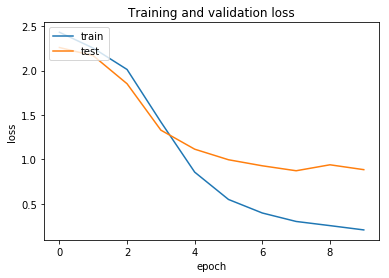
**说明：**
尝试升高Dropout比例为0.7，loss和val_loss下降速度慢，且同样val_loss在0.8左右出现过拟合现象
**32. 32**

**参数：**
- 模型: InceptionV3
- epochs = 30
- batch_size = 96
- 锁层: NO
- 停止提升轮数(patience): 2
- 自定义层:
  ```
  x = GlobalAveragePooling2D()(x)
  x = Dropout(0.5)(x)
  predictions = Dense(10, activation='softmax')(x)
  ```
- 优化器: SGD
  - lr = 0.0002
  - decay = 9e-8

**结果：**
```
Epoch 1/30
188/188 [==============================] - 496s 3s/step - loss: 2.3805 - acc: 0.1293 - val_loss: 2.1918 - val_acc: 0.2431
Epoch 2/30
188/188 [==============================] - 476s 3s/step - loss: 2.1874 - acc: 0.2112 - val_loss: 1.9785 - val_acc: 0.3947
Epoch 3/30
188/188 [==============================] - 493s 3s/step - loss: 1.9071 - acc: 0.3509 - val_loss: 1.5750 - val_acc: 0.5248
Epoch 4/30
188/188 [==============================] - 484s 3s/step - loss: 1.4455 - acc: 0.5495 - val_loss: 1.1933 - val_acc: 0.6405
Epoch 5/30
188/188 [==============================] - 492s 3s/step - loss: 1.0245 - acc: 0.6946 - val_loss: 0.9980 - val_acc: 0.6850
Epoch 6/30
188/188 [==============================] - 482s 3s/step - loss: 0.7428 - acc: 0.7849 - val_loss: 0.8743 - val_acc: 0.7275
Epoch 7/30
188/188 [==============================] - 491s 3s/step - loss: 0.5806 - acc: 0.8321 - val_loss: 0.8376 - val_acc: 0.7361
Epoch 8/30
188/188 [==============================] - 476s 3s/step - loss: 0.4589 - acc: 0.8698 - val_loss: 0.8047 - val_acc: 0.7428
Epoch 9/30
188/188 [==============================] - 477s 3s/step - loss: 0.3871 - acc: 0.8892 - val_loss: 0.7625 - val_acc: 0.7706
Epoch 10/30
188/188 [==============================] - 472s 3s/step - loss: 0.3410 - acc: 0.9008 - val_loss: 0.7680 - val_acc: 0.7711
Epoch 11/30
188/188 [==============================] - 474s 3s/step - loss: 0.2909 - acc: 0.9163 - val_loss: 0.7543 - val_acc: 0.7725
Epoch 12/30
188/188 [==============================] - 484s 3s/step - loss: 0.2665 - acc: 0.9203 - val_loss: 0.7452 - val_acc: 0.7708
Epoch 13/30
188/188 [==============================] - 477s 3s/step - loss: 0.2337 - acc: 0.9323 - val_loss: 0.7198 - val_acc: 0.7833
Epoch 14/30
188/188 [==============================] - 484s 3s/step - loss: 0.2197 - acc: 0.9364 - val_loss: 0.7321 - val_acc: 0.7803
Epoch 15/30
188/188 [==============================] - 477s 3s/step - loss: 0.2003 - acc: 0.9414 - val_loss: 0.7250 - val_acc: 0.7861
```
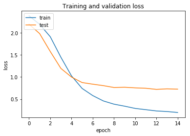
**说明：**
Dropout恢复为0.5，尝试通过使用减低学习率来减少过拟合，学习率降为0.0002。
**33. 33**

**参数：**
- 模型: InceptionV3
- epochs = 30
- batch_size = 96
- 锁层: NO
- 停止提升轮数(patience): 5
- 自定义层:
  ```
  x = GlobalAveragePooling2D()(x)
  x = Dropout(0.5)(x)
  predictions = Dense(10, activation='softmax')(x)
  ```
- 优化器: SGD
  - lr = 0.0001
  - decay = 9e-8

**结果：**
```
Epoch 1/30
186/186 [==============================] - 491s 3s/step - loss: 2.4127 - acc: 0.1180 - val_loss: 2.2753 - val_acc: 0.1209
Epoch 2/30
186/186 [==============================] - 480s 3s/step - loss: 2.3112 - acc: 0.1495 - val_loss: 2.2073 - val_acc: 0.1680
Epoch 3/30
186/186 [==============================] - 486s 3s/step - loss: 2.2089 - acc: 0.1970 - val_loss: 2.1102 - val_acc: 0.2396
Epoch 4/30
186/186 [==============================] - 482s 3s/step - loss: 2.0815 - acc: 0.2645 - val_loss: 1.9669 - val_acc: 0.3530
Epoch 5/30
186/186 [==============================] - 487s 3s/step - loss: 1.9131 - acc: 0.3430 - val_loss: 1.7733 - val_acc: 0.4975
Epoch 6/30
186/186 [==============================] - 477s 3s/step - loss: 1.6889 - acc: 0.4400 - val_loss: 1.5697 - val_acc: 0.5772
Epoch 7/30
186/186 [==============================] - 487s 3s/step - loss: 1.4547 - acc: 0.5384 - val_loss: 1.4068 - val_acc: 0.6313
Epoch 8/30
186/186 [==============================] - 480s 3s/step - loss: 1.2337 - acc: 0.6176 - val_loss: 1.2480 - val_acc: 0.6653
Epoch 9/30
186/186 [==============================] - 484s 3s/step - loss: 1.0535 - acc: 0.6694 - val_loss: 1.1291 - val_acc: 0.6827
Epoch 10/30
186/186 [==============================] - 483s 3s/step - loss: 0.8924 - acc: 0.7289 - val_loss: 1.0438 - val_acc: 0.7047
Epoch 11/30
186/186 [==============================] - 475s 3s/step - loss: 0.7840 - acc: 0.7604 - val_loss: 0.9671 - val_acc: 0.7156
Epoch 12/30
186/186 [==============================] - 494s 3s/step - loss: 0.6780 - acc: 0.7952 - val_loss: 0.9007 - val_acc: 0.7285
Epoch 13/30
186/186 [==============================] - 474s 3s/step - loss: 0.6001 - acc: 0.8188 - val_loss: 0.8616 - val_acc: 0.7348
```
**说明：**
学习率降为0.0001，非常慢，训练未结束

**34. 34**
**参数：**
- 模型: InceptionV3
- epochs = 30
- batch_size = 96
- 锁层: NO
- 停止提升轮数(patience): 5
- 自定义层:
  ```
  x = GlobalAveragePooling2D()(x)
  x = Dropout(0.5)(x)
  predictions = Dense(10, activation='softmax')(x)
  ```
- 优化器: SGD
  - lr = 0.0002
  - decay = 20e-8

**结果：**
```
Epoch 1/30
187/187 [==============================] - 808s 4s/step - loss: 2.3717 - acc: 0.1260 - val_loss: 2.1831 - val_acc: 0.2176
Epoch 2/30
187/187 [==============================] - 506s 3s/step - loss: 2.1638 - acc: 0.2171 - val_loss: 2.0203 - val_acc: 0.3153
Epoch 3/30
187/187 [==============================] - 491s 3s/step - loss: 1.8767 - acc: 0.3629 - val_loss: 1.7501 - val_acc: 0.4634
Epoch 4/30
187/187 [==============================] - 485s 3s/step - loss: 1.4680 - acc: 0.5393 - val_loss: 1.3558 - val_acc: 0.5674
Epoch 5/30
187/187 [==============================] - 486s 3s/step - loss: 1.0615 - acc: 0.6856 - val_loss: 1.1250 - val_acc: 0.6241
Epoch 6/30
187/187 [==============================] - 483s 3s/step - loss: 0.7588 - acc: 0.7848 - val_loss: 0.9835 - val_acc: 0.6734
Epoch 7/30
187/187 [==============================] - 488s 3s/step - loss: 0.5683 - acc: 0.8359 - val_loss: 0.9091 - val_acc: 0.7042
Epoch 8/30
187/187 [==============================] - 489s 3s/step - loss: 0.4445 - acc: 0.8762 - val_loss: 0.8566 - val_acc: 0.7280
Epoch 9/30
187/187 [==============================] - 484s 3s/step - loss: 0.3688 - acc: 0.8968 - val_loss: 0.8086 - val_acc: 0.7407
Epoch 10/30
187/187 [==============================] - 471s 3s/step - loss: 0.3182 - acc: 0.9114 - val_loss: 0.8428 - val_acc: 0.7326
Epoch 11/30
187/187 [==============================] - 490s 3s/step - loss: 0.2764 - acc: 0.9211 - val_loss: 0.7950 - val_acc: 0.7488
Epoch 12/30
187/187 [==============================] - 482s 3s/step - loss: 0.2400 - acc: 0.9327 - val_loss: 0.7864 - val_acc: 0.7535
Epoch 13/30
187/187 [==============================] - 481s 3s/step - loss: 0.2183 - acc: 0.9371 - val_loss: 0.8432 - val_acc: 0.7451
Epoch 14/30
187/187 [==============================] - 467s 2s/step - loss: 0.1985 - acc: 0.9428 - val_loss: 0.8217 - val_acc: 0.7521
Epoch 15/30
187/187 [==============================] - 482s 3s/step - loss: 0.1843 - acc: 0.9478 - val_loss: 0.8261 - val_acc: 0.7514
```
**说明：**
学习率为0.0001时loss下降太慢，尝试提高学习率，并提高衰减率，看是否可达到相同效果
**35. 35**

**参数：**
- 模型: InceptionV3
- epochs = 30
- batch_size = 96
- 锁层: NO
- 停止提升轮数(patience): 3
- 自定义层:
  ```
  x = GlobalAveragePooling2D()(x)
  x = Dropout(0.5)(x)
  predictions = Dense(10, activation='softmax', use_bias=False)(x)
  ```
- 优化器: SGD
  - lr = 0.0003
  - decay = 30e-8

**结果：**
```
Epoch 1/30
186/186 [==============================] - 526s 3s/step - loss: 2.3387 - acc: 0.1413 - val_loss: 2.1858 - val_acc: 0.2312
Epoch 2/30
186/186 [==============================] - 488s 3s/step - loss: 1.9921 - acc: 0.3061 - val_loss: 1.7949 - val_acc: 0.4606
Epoch 3/30
186/186 [==============================] - 509s 3s/step - loss: 1.3871 - acc: 0.5684 - val_loss: 1.2660 - val_acc: 0.6409
Epoch 4/30
186/186 [==============================] - 488s 3s/step - loss: 0.8625 - acc: 0.7415 - val_loss: 0.9622 - val_acc: 0.7147
Epoch 5/30
186/186 [==============================] - 505s 3s/step - loss: 0.5828 - acc: 0.8245 - val_loss: 0.8393 - val_acc: 0.7457
Epoch 6/30
186/186 [==============================] - 531s 3s/step - loss: 0.4346 - acc: 0.8738 - val_loss: 0.7152 - val_acc: 0.7822
Epoch 7/30
186/186 [==============================] - 522s 3s/step - loss: 0.3379 - acc: 0.9036 - val_loss: 0.6595 - val_acc: 0.7912
Epoch 8/30
186/186 [==============================] - 511s 3s/step - loss: 0.2794 - acc: 0.9206 - val_loss: 0.6053 - val_acc: 0.8177
Epoch 9/30
186/186 [==============================] - 515s 3s/step - loss: 0.2371 - acc: 0.9326 - val_loss: 0.5575 - val_acc: 0.8286
Epoch 10/30
186/186 [==============================] - 528s 3s/step - loss: 0.2014 - acc: 0.9430 - val_loss: 0.5449 - val_acc: 0.8331
Epoch 11/30
186/186 [==============================] - 515s 3s/step - loss: 0.1813 - acc: 0.9491 - val_loss: 0.5305 - val_acc: 0.8361
Epoch 12/30
186/186 [==============================] - 512s 3s/step - loss: 0.1583 - acc: 0.9549 - val_loss: 0.5480 - val_acc: 0.8272
Epoch 13/30
186/186 [==============================] - 507s 3s/step - loss: 0.1432 - acc: 0.9601 - val_loss: 0.5344 - val_acc: 0.8338
Epoch 14/30
186/186 [==============================] - 502s 3s/step - loss: 0.1240 - acc: 0.9648 - val_loss: 0.5445 - val_acc: 0.8286
```
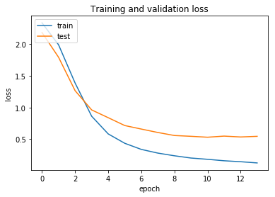
**说明：**
学习率提升为0.0003，增加衰减，尝试使用use_bias=False减少参数来防止过拟合
**36. 36**

**参数：**
- 模型: InceptionV3
- epochs = 30
- batch_size = 96
- 锁层: NO
- 停止提升轮数(patience): 3
- 自定义层:
  ```
  x = GlobalAveragePooling2D()(x)
  x = Dropout(0.5)(x)
  predictions = Dense(10, activation='softmax', use_bias=False)(x)
  ```
- 优化器: SGD
  - lr = 0.0002
  - decay = 20e-8

**结果：**
```
Epoch 1/30
186/186 [==============================] - 526s 3s/step - loss: 2.3941 - acc: 0.1181 - val_loss: 2.2084 - val_acc: 0.1916
Epoch 2/30
186/186 [==============================] - 509s 3s/step - loss: 2.2166 - acc: 0.1919 - val_loss: 2.0533 - val_acc: 0.2933
Epoch 3/30
186/186 [==============================] - 529s 3s/step - loss: 1.9745 - acc: 0.3193 - val_loss: 1.7213 - val_acc: 0.4377
Epoch 4/30
186/186 [==============================] - 512s 3s/step - loss: 1.5896 - acc: 0.4943 - val_loss: 1.2519 - val_acc: 0.5981
Epoch 5/30
186/186 [==============================] - 513s 3s/step - loss: 1.1721 - acc: 0.6458 - val_loss: 0.9385 - val_acc: 0.6816
Epoch 6/30
186/186 [==============================] - 505s 3s/step - loss: 0.8768 - acc: 0.7387 - val_loss: 0.7683 - val_acc: 0.7518
Epoch 7/30
186/186 [==============================] - 493s 3s/step - loss: 0.6632 - acc: 0.8079 - val_loss: 0.6481 - val_acc: 0.8098
Epoch 8/30
186/186 [==============================] - 498s 3s/step - loss: 0.5261 - acc: 0.8468 - val_loss: 0.5707 - val_acc: 0.8286
Epoch 9/30
186/186 [==============================] - 501s 3s/step - loss: 0.4269 - acc: 0.8778 - val_loss: 0.5232 - val_acc: 0.8390
Epoch 10/30
186/186 [==============================] - 513s 3s/step - loss: 0.3561 - acc: 0.9001 - val_loss: 0.5131 - val_acc: 0.8456
Epoch 11/30
186/186 [==============================] - 505s 3s/step - loss: 0.3123 - acc: 0.9104 - val_loss: 0.4800 - val_acc: 0.8535
Epoch 12/30
186/186 [==============================] - 494s 3s/step - loss: 0.2734 - acc: 0.9243 - val_loss: 0.4880 - val_acc: 0.8537
Epoch 13/30
186/186 [==============================] - 500s 3s/step - loss: 0.2413 - acc: 0.9306 - val_loss: 0.4744 - val_acc: 0.8551
Epoch 14/30
186/186 [==============================] - 490s 3s/step - loss: 0.2140 - acc: 0.9387 - val_loss: 0.4594 - val_acc: 0.8569
Epoch 15/30
186/186 [==============================] - 498s 3s/step - loss: 0.1957 - acc: 0.9443 - val_loss: 0.5053 - val_acc: 0.8388
Epoch 16/30
186/186 [==============================] - 490s 3s/step - loss: 0.1758 - acc: 0.9518 - val_loss: 0.4823 - val_acc: 0.8469
Epoch 17/30
186/186 [==============================] - 501s 3s/step - loss: 0.1657 - acc: 0.9527 - val_loss: 0.4755 - val_acc: 0.8548
```
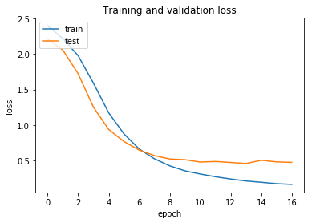

**说明：**
尝试降低学习率来防止过拟合

**37. 37**

**参数：**
- 模型: InceptionV3
- epochs = 30
- batch_size = 96
- 锁层: 229-310，不训练最后3个块
- 停止提升轮数(patience): 3
- 自定义层:
  ```
  x = GlobalAveragePooling2D()(x)
  x = Dropout(0.5)(x)
  predictions = Dense(10, activation='softmax', use_bias=False)(x)
  ```
- 优化器: SGD
  - lr = 0.0003
  - decay = 30e-8

**结果：**
```
Epoch 1/30
187/187 [==============================] - 518s 3s/step - loss: 2.4147 - acc: 0.1102 - val_loss: 2.3480 - val_acc: 0.1370
Epoch 2/30
187/187 [==============================] - 487s 3s/step - loss: 2.3277 - acc: 0.1331 - val_loss: 2.2995 - val_acc: 0.1480
Epoch 3/30
187/187 [==============================] - 490s 3s/step - loss: 2.2558 - acc: 0.1686 - val_loss: 2.2073 - val_acc: 0.2114
Epoch 4/30
187/187 [==============================] - 499s 3s/step - loss: 2.1478 - acc: 0.2319 - val_loss: 2.0525 - val_acc: 0.2881
Epoch 5/30
187/187 [==============================] - 494s 3s/step - loss: 1.9842 - acc: 0.3154 - val_loss: 1.8545 - val_acc: 0.4186
Epoch 6/30
187/187 [==============================] - 496s 3s/step - loss: 1.7542 - acc: 0.4218 - val_loss: 1.6575 - val_acc: 0.4662
Epoch 7/30
187/187 [==============================] - 502s 3s/step - loss: 1.5380 - acc: 0.5011 - val_loss: 1.4659 - val_acc: 0.5304
Epoch 8/30
187/187 [==============================] - 491s 3s/step - loss: 1.3248 - acc: 0.5839 - val_loss: 1.3152 - val_acc: 0.5789
Epoch 9/30
187/187 [==============================] - 501s 3s/step - loss: 1.1368 - acc: 0.6543 - val_loss: 1.1903 - val_acc: 0.6187
Epoch 10/30
187/187 [==============================] - 488s 3s/step - loss: 0.9534 - acc: 0.7224 - val_loss: 1.0965 - val_acc: 0.6536
Epoch 11/30
187/187 [==============================] - 503s 3s/step - loss: 0.8080 - acc: 0.7678 - val_loss: 1.0041 - val_acc: 0.6893
Epoch 12/30
187/187 [==============================] - 498s 3s/step - loss: 0.6791 - acc: 0.8103 - val_loss: 0.9138 - val_acc: 0.7090
Epoch 13/30
187/187 [==============================] - 494s 3s/step - loss: 0.5860 - acc: 0.8329 - val_loss: 0.8688 - val_acc: 0.7329
Epoch 14/30
187/187 [==============================] - 503s 3s/step - loss: 0.4961 - acc: 0.8634 - val_loss: 0.8238 - val_acc: 0.7465
Epoch 15/30
187/187 [==============================] - 497s 3s/step - loss: 0.4407 - acc: 0.8785 - val_loss: 0.7668 - val_acc: 0.7599
Epoch 16/30
187/187 [==============================] - 504s 3s/step - loss: 0.3900 - acc: 0.8929 - val_loss: 0.7491 - val_acc: 0.7667
Epoch 17/30
187/187 [==============================] - 514s 3s/step - loss: 0.3504 - acc: 0.9030 - val_loss: 0.7290 - val_acc: 0.7729
Epoch 18/30
187/187 [==============================] - 509s 3s/step - loss: 0.3181 - acc: 0.9152 - val_loss: 0.7257 - val_acc: 0.7736
Epoch 19/30
187/187 [==============================] - 522s 3s/step - loss: 0.2922 - acc: 0.9214 - val_loss: 0.7243 - val_acc: 0.7789
Epoch 20/30
187/187 [==============================] - 498s 3s/step - loss: 0.2669 - acc: 0.9276 - val_loss: 0.7042 - val_acc: 0.7747
Epoch 21/30
187/187 [==============================] - 501s 3s/step - loss: 0.2427 - acc: 0.9353 - val_loss: 0.7095 - val_acc: 0.7736
Epoch 22/30
187/187 [==============================] - 501s 3s/step - loss: 0.2218 - acc: 0.9401 - val_loss: 0.6926 - val_acc: 0.7834
Epoch 23/30
187/187 [==============================] - 499s 3s/step - loss: 0.2085 - acc: 0.9448 - val_loss: 0.6877 - val_acc: 0.7745
Epoch 24/30
187/187 [==============================] - 491s 3s/step - loss: 0.1890 - acc: 0.9486 - val_loss: 0.7096 - val_acc: 0.7696
Epoch 25/30
187/187 [==============================] - 513s 3s/step - loss: 0.1763 - acc: 0.9541 - val_loss: 0.7121 - val_acc: 0.7705
Epoch 26/30
187/187 [==============================] - 490s 3s/step - loss: 0.1667 - acc: 0.9550 - val_loss: 0.7650 - val_acc: 0.7544
```
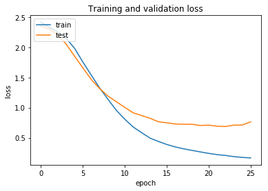
**说明：**
比锁层前loss下降更慢，val_loss在0.7左右就无法下降，过拟合更严重
#### **38. 38**
**说明：**
尝试对模型进行两次训练，先用学习速度快的adam优化器做第一次训练快速收敛，在模型出现过拟合时停止训练，保存训练的权重，然后再使用学习率低的SGD优化器进行第二次训练，并锁定280层以上（即最后一个inception block）

**参数：**
- 模型: InceptionV3
- epochs = 30
- batch_size = 96
- 锁层: 第1次不锁，第2次锁280
- 数据增强：ImageDataGenerator
- 停止提升参数:
  - val_loss: 0.0003
  - 轮数(patience): 5
- 自定义层:
  ```
  x = GlobalAveragePooling2D()(x)
  x = Dropout(0.5)(x)
  predictions = Dense(10, activation='softmax', use_bias=False)(x)
  ```
- 优化器:
  - SGD:
    - lr = 0.0003
    - decay = 30e-8
  - SGD:
    - lr = 0.00005
    - decay = 10e-8

**结果：**
```
Epoch 1/30
217/217 [==============================] - 786s 4s/step - loss: 2.3218 - acc: 0.1536 - val_loss: 2.1598 - val_acc: 0.2454
Epoch 2/30
217/217 [==============================] - 547s 3s/step - loss: 1.8838 - acc: 0.3529 - val_loss: 1.6111 - val_acc: 0.4063
Epoch 3/30
217/217 [==============================] - 537s 2s/step - loss: 1.1540 - acc: 0.6440 - val_loss: 0.9715 - val_acc: 0.6852
Epoch 4/30
217/217 [==============================] - 541s 2s/step - loss: 0.6825 - acc: 0.7968 - val_loss: 0.7454 - val_acc: 0.7870
Epoch 5/30
217/217 [==============================] - 545s 3s/step - loss: 0.4521 - acc: 0.8663 - val_loss: 0.6694 - val_acc: 0.8001
Epoch 6/30
217/217 [==============================] - 535s 2s/step - loss: 0.3465 - acc: 0.8985 - val_loss: 0.6702 - val_acc: 0.7983
Epoch 7/30
217/217 [==============================] - 552s 3s/step - loss: 0.2752 - acc: 0.9190 - val_loss: 0.6439 - val_acc: 0.8019
Epoch 8/30
217/217 [==============================] - 534s 2s/step - loss: 0.2394 - acc: 0.9315 - val_loss: 0.6631 - val_acc: 0.7911
Epoch 9/30
217/217 [==============================] - 543s 3s/step - loss: 0.2029 - acc: 0.9397 - val_loss: 0.6740 - val_acc: 0.7899
Epoch 10/30
217/217 [==============================] - 542s 2s/step - loss: 0.1796 - acc: 0.9463 - val_loss: 0.6952 - val_acc: 0.7923
Epoch 00010: early stopping
```
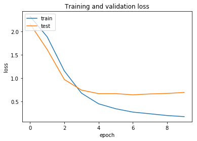
锁层后：
```

```
**结论：**

#### **39. 39**
**说明：**
使用了imgaug库对图像进行了增强处理，为每一张图片的右半都随机与同分类图片拼接，因此实际的训练数据集为原来的2倍
**参数：**
- 模型: InceptionV3
- epochs = 20
- batch_size = 96
- 锁层: NO
- 数据增强：imgaug+ImageDataGenerator
- 停止提升参数:
  - val_loss: 0.0003
  - 轮数(patience): 3
- 自定义层:
  ```
  x = GlobalAveragePooling2D()(x)
  x = Dropout(0.5)(x)
  predictions = Dense(10, activation='softmax', kernel_regularizer=l2(0.01))(x)
  ```
- 优化器:
  - Adam

**结果：**
```
Epoch 1/20
436/436 [==============================] - 1755s 4s/step - loss: 0.2292 - acc: 0.9552 - val_loss: 0.3875 - val_acc: 0.8656
Epoch 2/20
436/436 [==============================] - 1093s 3s/step - loss: 0.0756 - acc: 0.9859 - val_loss: 0.5823 - val_acc: 0.8385
Epoch 3/20
436/436 [==============================] - 1120s 3s/step - loss: 0.0620 - acc: 0.9887 - val_loss: 0.5245 - val_acc: 0.8721
Epoch 4/20
436/436 [==============================] - 1129s 3s/step - loss: 0.0502 - acc: 0.9913 - val_loss: 0.2039 - val_acc: 0.9464
Epoch 5/20
436/436 [==============================] - 1124s 3s/step - loss: 0.0474 - acc: 0.9919 - val_loss: 1.6246 - val_acc: 0.6447
Epoch 6/20
436/436 [==============================] - 1115s 3s/step - loss: 0.0325 - acc: 0.9956 - val_loss: 3.0233 - val_acc: 0.4146
Epoch 7/20
436/436 [==============================] - 1121s 3s/step - loss: 0.0451 - acc: 0.9925 - val_loss: 2.0540 - val_acc: 0.5518
Epoch 00007: early stopping
```
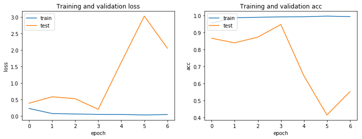
**结论：**
在第5代时出现过拟合，且波动非常大

#### **40. 40**
**说明：**
使用了imgaug库对图像进行了增强处理，为每一张图片的右半都随机与同分类图片拼接，因此实际的训练数据集为原来的2倍，在39的基础上调低学习率
**参数：**
- 模型: InceptionV3
- epochs = 20
- batch_size = 96
- 锁层: NO
- 数据增强：imgaug+ImageDataGenerator
- 停止提升参数:
  - val_loss: 0.0003
  - 轮数(patience): 3
- 自定义层:
  ```
  x = GlobalAveragePooling2D()(x)
  x = Dropout(0.5)(x)
  predictions = Dense(10, activation='softmax', kernel_regularizer=l2(0.01))(x)
  ```
- 优化器:
  - Adam:
    - lr = 0.0003
  - SGD:
    - lr = 0.00001
    - decay = 1e-8

**结果：**
```
Epoch 1/20
436/436 [==============================] - 1130s 3s/step - loss: 0.2782 - acc: 0.9572 - val_loss: 0.2173 - val_acc: 0.9535
Epoch 2/20
436/436 [==============================] - 1100s 3s/step - loss: 0.0694 - acc: 0.9942 - val_loss: 0.2025 - val_acc: 0.9357
Epoch 3/20
436/436 [==============================] - 1103s 3s/step - loss: 0.0398 - acc: 0.9955 - val_loss: 0.1046 - val_acc: 0.9650
Epoch 4/20
436/436 [==============================] - 1092s 3s/step - loss: 0.0379 - acc: 0.9946 - val_loss: 0.3438 - val_acc: 0.9035
Epoch 5/20
436/436 [==============================] - 1111s 3s/step - loss: 0.0317 - acc: 0.9960 - val_loss: 0.0989 - val_acc: 0.9743
Epoch 6/20
436/436 [==============================] - 1127s 3s/step - loss: 0.0252 - acc: 0.9968 - val_loss: 0.5372 - val_acc: 0.8713
Epoch 7/20
436/436 [==============================] - 1117s 3s/step - loss: 0.0260 - acc: 0.9964 - val_loss: 1.9505 - val_acc: 0.6154
Epoch 8/20
436/436 [==============================] - 1094s 3s/step - loss: 0.0276 - acc: 0.9962 - val_loss: 0.2541 - val_acc: 0.9128
Epoch 00008: early stopping
```
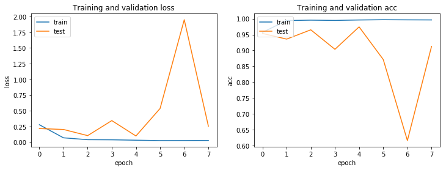
第二次训练
```
Epoch 1/10
436/436 [==============================] - 1119s 3s/step - loss: 0.0176 - acc: 0.9988 - val_loss: 0.1157 - val_acc: 0.9557
Epoch 2/10
436/436 [==============================] - 1097s 3s/step - loss: 0.0176 - acc: 0.9986 - val_loss: 0.1146 - val_acc: 0.9557
Epoch 3/10
436/436 [==============================] - 1134s 3s/step - loss: 0.0174 - acc: 0.9987 - val_loss: 0.1092 - val_acc: 0.9585
Epoch 4/10
436/436 [==============================] - 1131s 3s/step - loss: 0.0173 - acc: 0.9988 - val_loss: 0.1141 - val_acc: 0.9557
Epoch 5/10
436/436 [==============================] - 1113s 3s/step - loss: 0.0172 - acc: 0.9989 - val_loss: 0.1132 - val_acc: 0.9557
Epoch 6/10
436/436 [==============================] - 1108s 3s/step - loss: 0.0169 - acc: 0.9988 - val_loss: 0.1147 - val_acc: 0.9557
Epoch 00006: early stopping
```
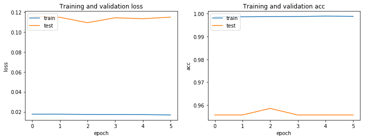
**结论：**
在第7代出现过拟合，且波动较大，后通过低学习率的SGD收敛模型
使用该模型对测试集进行预测后得到分数：
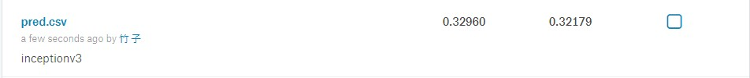

#### **41. 41**
**说明：**
使用了imgaug库对图像进行了增强处理，为每一张图片的右半都随机与同分类图片拼接，因此实际的训练数据集为原来的2倍，在40的基础上换用SGD优化器，去掉l2正则化
**参数：**
- 模型: InceptionV3
- epochs = 20
- batch_size = 96
- 锁层: NO
- 数据增强：imgaug+ImageDataGenerator
- 停止提升参数:
  - val_loss: 0.0003
  - 轮数(patience): 3
- 自定义层:
  ```
  x = GlobalAveragePooling2D()(x)
  x = Dropout(0.5)(x)
  predictions = Dense(10, activation='softmax')(x)
  ```
- 优化器:
  - SGD:
    - lr = 0.0003
    - decay = 30e-8

**结果：**
```
Epoch 1/20
436/436 [==============================] - 1834s 4s/step - loss: 1.5718 - acc: 0.4844 - val_loss: 0.5980 - val_acc: 0.8142
Epoch 2/20
436/436 [==============================] - 1137s 3s/step - loss: 0.3443 - acc: 0.9102 - val_loss: 0.2564 - val_acc: 0.8992
Epoch 3/20
436/436 [==============================] - 1153s 3s/step - loss: 0.1495 - acc: 0.9609 - val_loss: 0.1626 - val_acc: 0.9364
Epoch 4/20
436/436 [==============================] - 1123s 3s/step - loss: 0.0945 - acc: 0.9757 - val_loss: 0.1339 - val_acc: 0.9450
Epoch 5/20
436/436 [==============================] - 1114s 3s/step - loss: 0.0645 - acc: 0.9833 - val_loss: 0.1350 - val_acc: 0.9435
Epoch 6/20
436/436 [==============================] - 1154s 3s/step - loss: 0.0520 - acc: 0.9867 - val_loss: 0.1208 - val_acc: 0.9535
Epoch 7/20
436/436 [==============================] - 1129s 3s/step - loss: 0.0387 - acc: 0.9905 - val_loss: 0.1169 - val_acc: 0.9578
Epoch 8/20
436/436 [==============================] - 1116s 3s/step - loss: 0.0329 - acc: 0.9916 - val_loss: 0.1173 - val_acc: 0.9593
Epoch 9/20
436/436 [==============================] - 1126s 3s/step - loss: 0.0256 - acc: 0.9938 - val_loss: 0.1177 - val_acc: 0.9564
Epoch 10/20
436/436 [==============================] - 1124s 3s/step - loss: 0.0223 - acc: 0.9949 - val_loss: 0.1207 - val_acc: 0.9564
Epoch 00010: early stopping
```
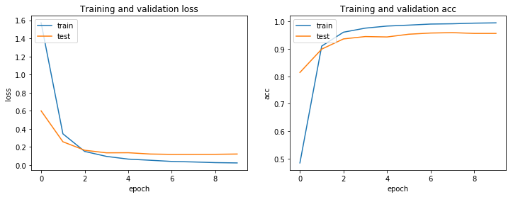
**结论：**
收敛较好，使用该模型对测试集进行预测后得到分数：
private 0.41971, public 0.63264

**42. 42**
**说明：**
使用了imgaug库对图像进行了增强处理，为每一张图片的右半都随机与同分类图片拼接，因此实际的训练数据集为原来的2倍，在上一次的基础上增加l2正则化，去掉最顶层的偏置项参数，调低学习率，尝试防止过拟合

**参数：**
- 模型: InceptionV3
- epochs = 30
- batch_size = 96
- 锁层: NO
- 数据增强：imgaug+ImageDataGenerator
- 停止提升参数:
  - val_loss: 0.0003
  - 轮数(patience): 2
- 自定义层:
  ```
  x = GlobalAveragePooling2D()(x)
  x = Dropout(0.5)(x)
  predictions = Dense(10, activation='softmax', use_bias=False, kernel_regularizer=l2(0.01))(x)
  ```
- 优化器: SGD
  - lr = 0.0002
  - decay = 20e-8

**结果：**
```
Epoch 1/20
436/436 [==============================] - 1811s 4s/step - loss: 2.0969 - acc: 0.3525 - val_loss: 1.2693 - val_acc: 0.7219
Epoch 2/20
436/436 [==============================] - 1103s 3s/step - loss: 0.8479 - acc: 0.8260 - val_loss: 0.5861 - val_acc: 0.8670
Epoch 3/20
436/436 [==============================] - 1100s 3s/step - loss: 0.4710 - acc: 0.9289 - val_loss: 0.4615 - val_acc: 0.8914
Epoch 4/20
436/436 [==============================] - 1054s 2s/step - loss: 0.3592 - acc: 0.9563 - val_loss: 0.4009 - val_acc: 0.9171
Epoch 5/20
436/436 [==============================] - 1064s 2s/step - loss: 0.3027 - acc: 0.9707 - val_loss: 0.3728 - val_acc: 0.9264
Epoch 6/20
436/436 [==============================] - 1064s 2s/step - loss: 0.2726 - acc: 0.9774 - val_loss: 0.3384 - val_acc: 0.9407
Epoch 7/20
436/436 [==============================] - 1085s 2s/step - loss: 0.2513 - acc: 0.9821 - val_loss: 0.3187 - val_acc: 0.9407
Epoch 8/20
436/436 [==============================] - 1071s 2s/step - loss: 0.2345 - acc: 0.9854 - val_loss: 0.3082 - val_acc: 0.9521
Epoch 9/20
436/436 [==============================] - 1086s 2s/step - loss: 0.2188 - acc: 0.9879 - val_loss: 0.2942 - val_acc: 0.9492
Epoch 10/20
436/436 [==============================] - 1060s 2s/step - loss: 0.2084 - acc: 0.9895 - val_loss: 0.2871 - val_acc: 0.9535
Epoch 11/20
436/436 [==============================] - 1065s 2s/step - loss: 0.1986 - acc: 0.9908 - val_loss: 0.2735 - val_acc: 0.9557
Epoch 12/20
436/436 [==============================] - 1066s 2s/step - loss: 0.1903 - acc: 0.9919 - val_loss: 0.2853 - val_acc: 0.9471
Epoch 13/20
436/436 [==============================] - 1057s 2s/step - loss: 0.1818 - acc: 0.9934 - val_loss: 0.2709 - val_acc: 0.9528
Epoch 14/20
436/436 [==============================] - 1065s 2s/step - loss: 0.1752 - acc: 0.9937 - val_loss: 0.2602 - val_acc: 0.9557
Epoch 15/20
436/436 [==============================] - 1091s 3s/step - loss: 0.1681 - acc: 0.9942 - val_loss: 0.2614 - val_acc: 0.9521
Epoch 16/20
436/436 [==============================] - 1067s 2s/step - loss: 0.1604 - acc: 0.9957 - val_loss: 0.2654 - val_acc: 0.9492
Epoch 00016: early stopping
```
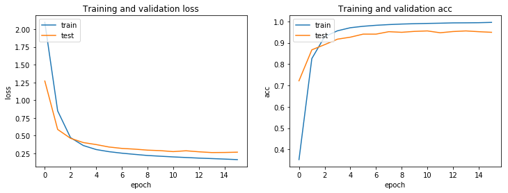
**结论：**
private: 0.38998, public: 0.56024

**43. 43**
**说明：**
使用了imgaug库对图像进行了增强处理，为每一张图片的右半都随机与同分类图片拼接，因此实际的训练数据集为原来的2倍，增加l2正则化，去掉最顶层的偏置项参数，使用Adam优化器，调低学习率，给予衰减值，尝试防止过拟合

**参数：**
- 模型: InceptionV3
- epochs = 30
- batch_size = 96
- 锁层: NO
- 数据增强：imgaug+ImageDataGenerator
- 停止提升参数:
  - val_loss: 0.0005
  - 轮数(patience): 2
- 自定义层:
  ```
  x = GlobalAveragePooling2D()(x)
  x = Dropout(0.5)(x)
  predictions = Dense(10, activation='softmax', use_bias=False, kernel_regularizer=l2(0.01))(x)
  ```
- 优化器:
  - Adam:
    - lr = 0.0001
    - decay = 6e-8

**结果：**
```
Epoch 1/10
436/436 [==============================] - 1922s 4s/step - loss: 0.4078 - acc: 0.9286 - val_loss: 0.2400 - val_acc: 0.9693
Epoch 2/10
436/436 [==============================] - 1116s 3s/step - loss: 0.1486 - acc: 0.9960 - val_loss: 0.1841 - val_acc: 0.9721
Epoch 3/10
436/436 [==============================] - 1143s 3s/step - loss: 0.0920 - acc: 0.9973 - val_loss: 0.1520 - val_acc: 0.9664
Epoch 4/10
436/436 [==============================] - 1130s 3s/step - loss: 0.0571 - acc: 0.9979 - val_loss: 0.1179 - val_acc: 0.9714
Epoch 5/10
436/436 [==============================] - 1134s 3s/step - loss: 0.0365 - acc: 0.9984 - val_loss: 0.1626 - val_acc: 0.9492
Epoch 6/10
436/436 [==============================] - 1119s 3s/step - loss: 0.0304 - acc: 0.9981 - val_loss: 0.1991 - val_acc: 0.9364
Epoch 00006: early stopping
```
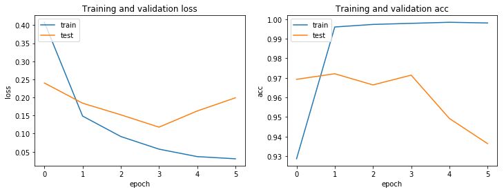
**结论：**
提交到kaggle中后得到成绩：private: 0.31309, public: 0.35854

**44. 44**
**说明：**
使用了imgaug库对图像进行了增强处理，为每一张图片的右半都随机与同分类图片拼接，因此实际的训练数据集为原来的2倍，增加l2正则化，去掉最顶层的偏置项参数，使用Adam优化器，调低学习率，给予衰减值，尝试防止过拟合，使用ModelCheckpoint回调函数保存训练过程中得到的最优模型

**参数：**
- 模型: Xception
- epochs = 20
- batch_size = 32
- 锁层: NO
- 数据增强：imgaug+ImageDataGenerator
- 停止提升参数:
  - val_loss: 0.0005
  - 轮数(patience): 3
- 自定义层:
  ```
  x = GlobalAveragePooling2D()(x)
  x = Dropout(0.5)(x)
  predictions = Dense(10, activation='softmax', use_bias=False, kernel_regularizer=l2(0.01))(x)
  ```
- 优化器:
  - Adam:
    - lr = 0.00005
    - decay = 2e-8

**结果：**
```
Epoch 1/20
1308/1308 [==============================] - 1739s 1s/step - loss: 0.4313 - acc: 0.9279 - val_loss: 0.2288 - val_acc: 0.9714

Epoch 00001: val_loss improved from inf to 0.22877, saving model to saved_weights/xception_model.h5
Epoch 2/20
1308/1308 [==============================] - 1143s 874ms/step - loss: 0.1272 - acc: 0.9966 - val_loss: 0.1659 - val_acc: 0.9707

Epoch 00002: val_loss improved from 0.22877 to 0.16592, saving model to saved_weights/xception_model.h5
Epoch 3/20
1308/1308 [==============================] - 1138s 870ms/step - loss: 0.0687 - acc: 0.9978 - val_loss: 0.1276 - val_acc: 0.9728

Epoch 00003: val_loss improved from 0.16592 to 0.12761, saving model to saved_weights/xception_model.h5
Epoch 4/20
1308/1308 [==============================] - 1134s 867ms/step - loss: 0.0445 - acc: 0.9987 - val_loss: 0.0815 - val_acc: 0.9857

Epoch 00004: val_loss improved from 0.12761 to 0.08146, saving model to saved_weights/xception_model.h5
Epoch 5/20
1308/1308 [==============================] - 1143s 874ms/step - loss: 0.0360 - acc: 0.9985 - val_loss: 0.0810 - val_acc: 0.9836

Epoch 00005: val_loss improved from 0.08146 to 0.08101, saving model to saved_weights/xception_model.h5
Epoch 6/20
1308/1308 [==============================] - 1136s 868ms/step - loss: 0.0298 - acc: 0.9991 - val_loss: 0.0988 - val_acc: 0.9771

Epoch 00006: val_loss did not improve from 0.08101
Epoch 7/20
1308/1308 [==============================] - 1152s 881ms/step - loss: 0.0293 - acc: 0.9987 - val_loss: 0.0809 - val_acc: 0.9800

Epoch 00007: val_loss improved from 0.08101 to 0.08088, saving model to saved_weights/xception_model.h5
Epoch 8/20
1308/1308 [==============================] - 1116s 853ms/step - loss: 0.0243 - acc: 0.9993 - val_loss: 0.0832 - val_acc: 0.9857

Epoch 00008: val_loss did not improve from 0.08088
Epoch 9/20
1308/1308 [==============================] - 1120s 857ms/step - loss: 0.0237 - acc: 0.9991 - val_loss: 0.1961 - val_acc: 0.9507

Epoch 00009: val_loss did not improve from 0.08088
Epoch 10/20
1308/1308 [==============================] - 1136s 868ms/step - loss: 0.0223 - acc: 0.9990 - val_loss: 0.0924 - val_acc: 0.9693

Epoch 00010: val_loss did not improve from 0.08088
Epoch 00010: early stopping
```
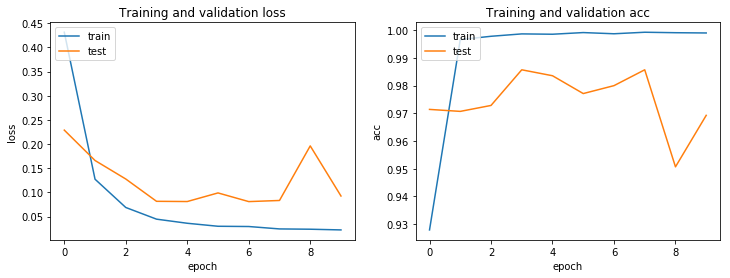
**结论：**
提交到kaggle中后得到成绩：private: 0.29201, public: 0.35846

**45. 45**
**说明：**
使用了imgaug库对图像进行了增强处理，为每一张图片的右半都随机与同分类图片拼接，因此实际的训练数据集为原来的2倍，增加l2正则化，去掉最顶层的偏置项参数，使用Adam优化器，调低学习率，给予衰减值，尝试防止过拟合，使用ModelCheckpoint回调函数保存训练过程中得到的最优模型

**参数：**
- 模型: InceptionResNetV2
- epochs = 20
- batch_size = 32
- 锁层: NO
- 数据增强：imgaug+ImageDataGenerator
- 停止提升参数:
  - val_loss: 0.0005
  - 轮数(patience): 2
- 自定义层:
  ```
  x = GlobalAveragePooling2D()(x)
  x = Dropout(0.5)(x)
  predictions = Dense(10, activation='softmax', use_bias=False, kernel_regularizer=l2(0.01))(x)
  ```
- 优化器:
  - Adam:
    - lr = 0.00005
    - decay = 2e-8

**结果：**
```
Epoch 1/20
1308/1308 [==============================] - 1263s 965ms/step - loss: 0.3870 - acc: 0.9350 - val_loss: 0.3092 - val_acc: 0.9485

Epoch 00001: val_loss improved from inf to 0.30917, saving model to saved_weights/inception_resnet_v2_model.h5
Epoch 2/20
1308/1308 [==============================] - 1185s 906ms/step - loss: 0.1395 - acc: 0.9942 - val_loss: 0.2685 - val_acc: 0.9414

Epoch 00002: val_loss improved from 0.30917 to 0.26853, saving model to saved_weights/inception_resnet_v2_model.h5
Epoch 3/20
1308/1308 [==============================] - 1155s 883ms/step - loss: 0.0777 - acc: 0.9969 - val_loss: 0.1460 - val_acc: 0.9700

Epoch 00003: val_loss improved from 0.26853 to 0.14600, saving model to saved_weights/inception_resnet_v2_model.h5
Epoch 4/20
1308/1308 [==============================] - 1165s 891ms/step - loss: 0.0520 - acc: 0.9960 - val_loss: 0.1650 - val_acc: 0.9543

Epoch 00004: val_loss did not improve from 0.14600
Epoch 5/20
1308/1308 [==============================] - 1163s 889ms/step - loss: 0.0378 - acc: 0.9972 - val_loss: 0.1776 - val_acc: 0.9550

Epoch 00005: val_loss did not improve from 0.14600
Epoch 00005: early stopping
```
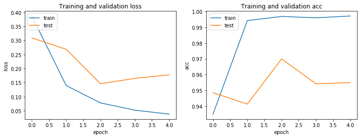
**结论：**
提交到kaggle中后得到成绩：private: 0.43748, public: 0.53600

**46. 46**
**说明：**
使用了imgaug库对图像进行了增强处理，为每一张图片的右半都随机与同分类图片拼接，因此实际的训练数据集为原来的2倍，增加l2正则化，去掉最顶层的偏置项参数，使用Adam优化器，调低学习率，给予衰减值，尝试防止过拟合，使用ModelCheckpoint回调函数保存训练过程中得到的最优模型

**参数：**
- 模型: InceptionResNetV2
- epochs = 20
- batch_size = 32
- 锁层: NO
- 数据增强：imgaug+ImageDataGenerator
- 停止提升参数:
  - val_loss: 0.0005
  - 轮数(patience): 2
- 自定义层:
  ```
  x = GlobalAveragePooling2D()(x)
  x = Dropout(0.5)(x)
  predictions = Dense(10, activation='softmax', use_bias=False, kernel_regularizer=l2(0.01))(x)
  ```
- 优化器:
  - Adam:
    - lr = 0.00005
    - decay = 2e-8

**结果：**
```
Epoch 1/20
1275/1275 [==============================] - 1778s 1s/step - loss: 0.3926 - acc: 0.9334 - val_loss: 0.2642 - val_acc: 0.9644

Epoch 00001: val_loss improved from inf to 0.26425, saving model to saved_weights/inception_resnet_v2_model.h5
Epoch 2/20
1275/1275 [==============================] - 1171s 919ms/step - loss: 0.1417 - acc: 0.9945 - val_loss: 0.2447 - val_acc: 0.9473

Epoch 00002: val_loss improved from 0.26425 to 0.24468, saving model to saved_weights/inception_resnet_v2_model.h5
Epoch 3/20
1275/1275 [==============================] - 1171s 918ms/step - loss: 0.0804 - acc: 0.9965 - val_loss: 0.1736 - val_acc: 0.9607

Epoch 00003: val_loss improved from 0.24468 to 0.17357, saving model to saved_weights/inception_resnet_v2_model.h5
Epoch 4/20
1275/1275 [==============================] - 1179s 925ms/step - loss: 0.0508 - acc: 0.9967 - val_loss: 0.2948 - val_acc: 0.9277

Epoch 00004: val_loss did not improve from 0.17357
Epoch 5/20
1275/1275 [==============================] - 1160s 910ms/step - loss: 0.0387 - acc: 0.9967 - val_loss: 0.1481 - val_acc: 0.9644

Epoch 00005: val_loss improved from 0.17357 to 0.14806, saving model to saved_weights/inception_resnet_v2_model.h5
Epoch 6/20
1275/1275 [==============================] - 1174s 921ms/step - loss: 0.0318 - acc: 0.9973 - val_loss: 0.1683 - val_acc: 0.9571

Epoch 00006: val_loss did not improve from 0.14806
Epoch 7/20
1275/1275 [==============================] - 1126s 883ms/step - loss: 0.0268 - acc: 0.9980 - val_loss: 0.1350 - val_acc: 0.9690

Epoch 00007: val_loss improved from 0.14806 to 0.13503, saving model to saved_weights/inception_resnet_v2_model.h5
Epoch 8/20
1275/1275 [==============================] - 1125s 882ms/step - loss: 0.0249 - acc: 0.9979 - val_loss: 0.1222 - val_acc: 0.9706

Epoch 00008: val_loss improved from 0.13503 to 0.12222, saving model to saved_weights/inception_resnet_v2_model.h5
Epoch 9/20
1275/1275 [==============================] - 1107s 868ms/step - loss: 0.0207 - acc: 0.9986 - val_loss: 0.1367 - val_acc: 0.9690

Epoch 00009: val_loss did not improve from 0.12222
Epoch 10/20
1275/1275 [==============================] - 1102s 865ms/step - loss: 0.0206 - acc: 0.9985 - val_loss: 0.1223 - val_acc: 0.9742

Epoch 00010: val_loss did not improve from 0.12222
Epoch 00010: early stopping
```
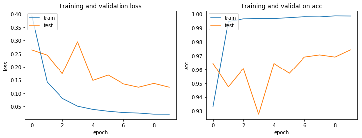
**结论：**
提交到kaggle中后得到成绩：private: 0.34102, public: 0.37520

**47.47**
**说明：**
使用了imgaug库对图像进行了增强处理，为每一张图片的右半都随机与同分类图片拼接，因此实际的训练数据集为原来的2倍，增加l2正则化，去掉最顶层的偏置项参数，使用Adam优化器，调低学习率，给予衰减值，尝试防止过拟合，使用ModelCheckpoint回调函数保存训练过程中得到的最优模型

**参数：**
- 模型: InceptionV3
- epochs = 20
- batch_size = 96
- 锁层: NO
- 数据增强：imgaug+ImageDataGenerator
- 停止提升参数:
  - val_loss: 0.0005
  - 轮数(patience): 3
- 自定义层:
  ```
  x = GlobalAveragePooling2D()(x)
  x = Dropout(0.5)(x)
  predictions = Dense(10, activation='softmax', use_bias=False, kernel_regularizer=l2(0.01))(x)
  ```
- 优化器:
  - Adam:
    - lr = 0.00005
    - decay = 2e-8

**结果：**
```
Epoch 1/20
425/425 [==============================] - 1101s 3s/step - loss: 0.5540 - acc: 0.8888 - val_loss: 0.2646 - val_acc: 0.9769

Epoch 00001: val_loss improved from inf to 0.26456, saving model to saved_weights/inception_v3_model.h5
Epoch 2/20
425/425 [==============================] - 1030s 2s/step - loss: 0.1946 - acc: 0.9944 - val_loss: 0.2528 - val_acc: 0.9708

Epoch 00002: val_loss improved from 0.26456 to 0.25283, saving model to saved_weights/inception_v3_model.h5
Epoch 3/20
425/425 [==============================] - 1038s 2s/step - loss: 0.1534 - acc: 0.9974 - val_loss: 0.2762 - val_acc: 0.9431

Epoch 00003: val_loss did not improve from 0.25283
Epoch 4/20
425/425 [==============================] - 1027s 2s/step - loss: 0.1187 - acc: 0.9981 - val_loss: 0.1847 - val_acc: 0.9646

Epoch 00004: val_loss improved from 0.25283 to 0.18466, saving model to saved_weights/inception_v3_model.h5
Epoch 5/20
425/425 [==============================] - 1030s 2s/step - loss: 0.0867 - acc: 0.9991 - val_loss: 0.1302 - val_acc: 0.9831

Epoch 00005: val_loss improved from 0.18466 to 0.13019, saving model to saved_weights/inception_v3_model.h5
Epoch 6/20
425/425 [==============================] - 1054s 2s/step - loss: 0.0618 - acc: 0.9994 - val_loss: 0.1204 - val_acc: 0.9805

Epoch 00006: val_loss improved from 0.13019 to 0.12042, saving model to saved_weights/inception_v3_model.h5
Epoch 7/20
425/425 [==============================] - 1019s 2s/step - loss: 0.0464 - acc: 0.9990 - val_loss: 0.2858 - val_acc: 0.9088

Epoch 00007: val_loss did not improve from 0.12042
Epoch 8/20
425/425 [==============================] - 1024s 2s/step - loss: 0.0348 - acc: 0.9991 - val_loss: 0.2177 - val_acc: 0.9359

Epoch 00008: val_loss did not improve from 0.12042
Epoch 9/20
425/425 [==============================] - 1027s 2s/step - loss: 0.0276 - acc: 0.9990 - val_loss: 0.0824 - val_acc: 0.9780

Epoch 00009: val_loss improved from 0.12042 to 0.08245, saving model to saved_weights/inception_v3_model.h5
Epoch 10/20
425/425 [==============================] - 1026s 2s/step - loss: 0.0257 - acc: 0.9985 - val_loss: 0.0668 - val_acc: 0.9872

Epoch 00010: val_loss improved from 0.08245 to 0.06683, saving model to saved_weights/inception_v3_model.h5
Epoch 11/20
425/425 [==============================] - 1031s 2s/step - loss: 0.0201 - acc: 0.9991 - val_loss: 0.0381 - val_acc: 0.9944

Epoch 00011: val_loss improved from 0.06683 to 0.03811, saving model to saved_weights/inception_v3_model.h5
Epoch 12/20
425/425 [==============================] - 1031s 2s/step - loss: 0.0203 - acc: 0.9988 - val_loss: 0.0330 - val_acc: 0.9954

Epoch 00012: val_loss improved from 0.03811 to 0.03300, saving model to saved_weights/inception_v3_model.h5
Epoch 13/20
425/425 [==============================] - 1010s 2s/step - loss: 0.0174 - acc: 0.9992 - val_loss: 0.1358 - val_acc: 0.9646

Epoch 00013: val_loss did not improve from 0.03300
Epoch 14/20
425/425 [==============================] - 1033s 2s/step - loss: 0.0187 - acc: 0.9987 - val_loss: 0.0316 - val_acc: 0.9954

Epoch 00014: val_loss improved from 0.03300 to 0.03157, saving model to saved_weights/inception_v3_model.h5
Epoch 15/20
425/425 [==============================] - 1015s 2s/step - loss: 0.0148 - acc: 0.9995 - val_loss: 0.0328 - val_acc: 0.9949

Epoch 00015: val_loss did not improve from 0.03157
Epoch 16/20
425/425 [==============================] - 1033s 2s/step - loss: 0.0150 - acc: 0.9991 - val_loss: 0.0884 - val_acc: 0.9795

Epoch 00016: val_loss did not improve from 0.03157
Epoch 17/20
425/425 [==============================] - 1032s 2s/step - loss: 0.0148 - acc: 0.9993 - val_loss: 0.0248 - val_acc: 0.9959

Epoch 00017: val_loss improved from 0.03157 to 0.02483, saving model to saved_weights/inception_v3_model.h5
Epoch 18/20
425/425 [==============================] - 1030s 2s/step - loss: 0.0149 - acc: 0.9990 - val_loss: 0.0467 - val_acc: 0.9887

Epoch 00018: val_loss did not improve from 0.02483
Epoch 19/20
425/425 [==============================] - 1031s 2s/step - loss: 0.0158 - acc: 0.9988 - val_loss: 0.0795 - val_acc: 0.9754

Epoch 00019: val_loss did not improve from 0.02483
Epoch 20/20
425/425 [==============================] - 1037s 2s/step - loss: 0.0133 - acc: 0.9994 - val_loss: 0.0538 - val_acc: 0.9851

Epoch 00020: val_loss did not improve from 0.02483
Epoch 00020: early stopping
```
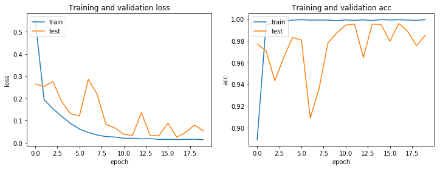
**结论：**
提交到kaggle中后得到成绩：private: 0.28068, public: 0.31967

**48. 48**
**说明：**
使用了imgaug库对图像进行了增强处理，为每一张图片的右半都随机与同分类图片拼接，因此实际的训练数据集为原来的2倍，增加l2正则化，去掉最顶层的偏置项参数，使用Adam优化器，调低学习率，给予衰减值，尝试防止过拟合，使用ModelCheckpoint回调函数保存训练过程中得到的最优模型

**参数：**
- 模型: ResNet50
- epochs = 20
- batch_size = 96
- 锁层: NO
- 数据增强：imgaug+ImageDataGenerator
- 停止提升参数:
  - val_loss: 0.0005
  - 轮数(patience): 3
- 自定义层:
  ```
  x = GlobalAveragePooling2D()(x)
  x = Dropout(0.5)(x)
  predictions = Dense(10, activation='softmax', use_bias=False, kernel_regularizer=l2(0.01))(x)
  ```
- 优化器:
  - Adam:
    - lr = 0.00005
    - decay = 2e-8

**结果：**
```
Epoch 1/20
425/425 [==============================] - 1044s 2s/step - loss: 0.5090 - acc: 0.9011 - val_loss: 0.2658 - val_acc: 0.9713

Epoch 00001: val_loss improved from inf to 0.26581, saving model to saved_weights/resnet50_model.h5
Epoch 2/20
425/425 [==============================] - 624s 1s/step - loss: 0.1981 - acc: 0.9938 - val_loss: 0.4172 - val_acc: 0.9247

Epoch 00002: val_loss did not improve from 0.26581
Epoch 3/20
425/425 [==============================] - 628s 1s/step - loss: 0.1618 - acc: 0.9969 - val_loss: 0.7317 - val_acc: 0.8965

Epoch 00003: val_loss did not improve from 0.26581
Epoch 4/20
425/425 [==============================] - 626s 1s/step - loss: 0.1321 - acc: 0.9979 - val_loss: 0.2420 - val_acc: 0.9544

Epoch 00004: val_loss improved from 0.26581 to 0.24199, saving model to saved_weights/resnet50_model.h5
Epoch 5/20
425/425 [==============================] - 633s 1s/step - loss: 0.1020 - acc: 0.9989 - val_loss: 0.3930 - val_acc: 0.9083

Epoch 00005: val_loss did not improve from 0.24199
Epoch 6/20
425/425 [==============================] - 629s 1s/step - loss: 0.0787 - acc: 0.9984 - val_loss: 0.1797 - val_acc: 0.9621

Epoch 00006: val_loss improved from 0.24199 to 0.17966, saving model to saved_weights/resnet50_model.h5
Epoch 7/20
425/425 [==============================] - 621s 1s/step - loss: 0.0558 - acc: 0.9991 - val_loss: 0.2267 - val_acc: 0.9457

Epoch 00007: val_loss did not improve from 0.17966
Epoch 8/20
425/425 [==============================] - 632s 1s/step - loss: 0.0395 - acc: 0.9994 - val_loss: 0.4773 - val_acc: 0.8924

Epoch 00008: val_loss did not improve from 0.17966
Epoch 9/20
425/425 [==============================] - 625s 1s/step - loss: 0.0312 - acc: 0.9984 - val_loss: 0.2580 - val_acc: 0.9262

Epoch 00009: val_loss did not improve from 0.17966
Epoch 00009: early stopping
```
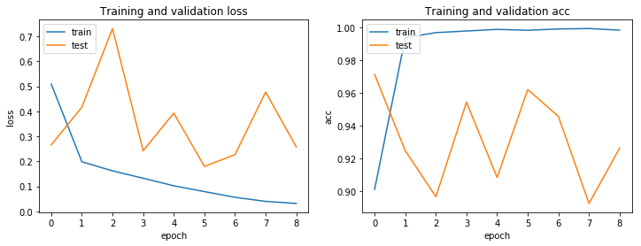
**结论：**
波动较大，尝试降低学习率重新训练

**49. 49**
**说明：**
使用了imgaug库对图像进行了增强处理，为每一张图片的右半都随机与同分类图片拼接，因此实际的训练数据集为原来的2倍，增加l2正则化，去掉最顶层的偏置项参数，使用Adam优化器，调低学习率，给予衰减值，尝试防止过拟合，使用ModelCheckpoint回调函数保存训练过程中得到的最优模型

**参数：**
- 模型: ResNet50
- epochs = 20
- batch_size = 96
- 锁层: NO
- 数据增强：imgaug+ImageDataGenerator
- 停止提升参数:
  - val_loss: 0.0005
  - 轮数(patience): 3
- 自定义层:
  ```
  x = GlobalAveragePooling2D()(x)
  x = Dropout(0.5)(x)
  predictions = Dense(10, activation='softmax', use_bias=False, kernel_regularizer=l2(0.01))(x)
  ```
- 优化器:
  - Adam:
    - lr = 0.00002
    - decay = 1e-8

**结果：**
```
Epoch 1/20
425/425 [==============================] - 639s 2s/step - loss: 0.8224 - acc: 0.8028 - val_loss: 0.3506 - val_acc: 0.9534

Epoch 00001: val_loss improved from inf to 0.35056, saving model to saved_weights/resnet50_model.h5
Epoch 2/20
425/425 [==============================] - 628s 1s/step - loss: 0.2432 - acc: 0.9865 - val_loss: 0.3362 - val_acc: 0.9452

Epoch 00002: val_loss improved from 0.35056 to 0.33622, saving model to saved_weights/resnet50_model.h5
Epoch 3/20
425/425 [==============================] - 625s 1s/step - loss: 0.2056 - acc: 0.9943 - val_loss: 0.3917 - val_acc: 0.9206

Epoch 00003: val_loss did not improve from 0.33622
Epoch 4/20
425/425 [==============================] - 627s 1s/step - loss: 0.1866 - acc: 0.9966 - val_loss: 0.3413 - val_acc: 0.9395

Epoch 00004: val_loss did not improve from 0.33622
Epoch 5/20
425/425 [==============================] - 630s 1s/step - loss: 0.1710 - acc: 0.9975 - val_loss: 0.2239 - val_acc: 0.9733

Epoch 00005: val_loss improved from 0.33622 to 0.22392, saving model to saved_weights/resnet50_model.h5
Epoch 6/20
425/425 [==============================] - 631s 1s/step - loss: 0.1544 - acc: 0.9982 - val_loss: 0.2984 - val_acc: 0.9349

Epoch 00006: val_loss did not improve from 0.22392
Epoch 7/20
425/425 [==============================] - 629s 1s/step - loss: 0.1371 - acc: 0.9988 - val_loss: 0.2692 - val_acc: 0.9498

Epoch 00007: val_loss did not improve from 0.22392
Epoch 8/20
425/425 [==============================] - 627s 1s/step - loss: 0.1205 - acc: 0.9989 - val_loss: 0.2413 - val_acc: 0.9534

Epoch 00008: val_loss did not improve from 0.22392
Epoch 00008: early stopping
```
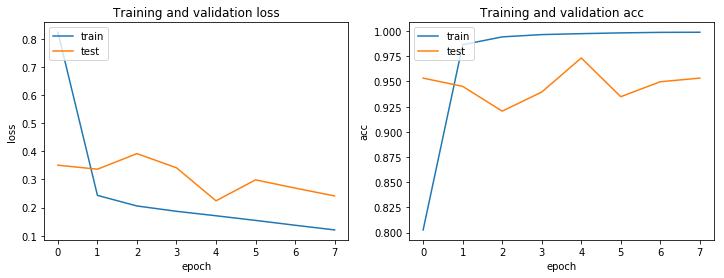
**结论：**
提交到kaggle中后得到成绩：private: 0.37406, public: 0.42121

**50. 50**
**说明：**
使用了imgaug库对图像进行了增强处理，为每一张图片的右半都随机与同分类图片拼接，因此实际的训练数据集为原来的2倍，增加l2正则化，去掉最顶层的偏置项参数，使用Adam优化器，调低学习率，给予衰减值，尝试防止过拟合，使用ModelCheckpoint回调函数保存训练过程中得到的最优模型

**参数：**
- 模型: InceptionV3
- epochs = 30
- batch_size = 64
- 锁层: NO
- 数据增强：imgaug+ImageDataGenerator
- 停止提升参数:
  - val_loss: 0.0005
  - 轮数(patience): 3
- 自定义层:
  ```
  x = GlobalAveragePooling2D()(x)
  x = Dropout(0.7)(x)
  predictions = Dense(10, activation='softmax', use_bias=False, kernel_regularizer=l2(0.01))(x)
  ```
- 优化器:
  - Adam:
    - lr = 0.00003
    - decay = 1e-8

**结果：**
```
Epoch 1/30
637/637 [==============================] - 1507s 2s/step - loss: 0.7803 - acc: 0.8079 - val_loss: 0.2816 - val_acc: 0.9728

Epoch 00001: val_loss improved from inf to 0.28155, saving model to saved_weights/inception_v3_model.h5
Epoch 2/30
637/637 [==============================] - 1436s 2s/step - loss: 0.2223 - acc: 0.9893 - val_loss: 0.2395 - val_acc: 0.9749

Epoch 00002: val_loss improved from 0.28155 to 0.23948, saving model to saved_weights/inception_v3_model.h5
Epoch 3/30
637/637 [==============================] - 1440s 2s/step - loss: 0.1792 - acc: 0.9957 - val_loss: 0.1785 - val_acc: 0.9964

Epoch 00003: val_loss improved from 0.23948 to 0.17845, saving model to saved_weights/inception_v3_model.h5
Epoch 4/30
637/637 [==============================] - 1430s 2s/step - loss: 0.1490 - acc: 0.9972 - val_loss: 0.1547 - val_acc: 0.9923

Epoch 00004: val_loss improved from 0.17845 to 0.15474, saving model to saved_weights/inception_v3_model.h5
Epoch 5/30
637/637 [==============================] - 1429s 2s/step - loss: 0.1200 - acc: 0.9985 - val_loss: 0.1172 - val_acc: 0.9954

Epoch 00005: val_loss improved from 0.15474 to 0.11725, saving model to saved_weights/inception_v3_model.h5
Epoch 6/30
637/637 [==============================] - 1428s 2s/step - loss: 0.0939 - acc: 0.9984 - val_loss: 0.1005 - val_acc: 0.9933

Epoch 00006: val_loss improved from 0.11725 to 0.10052, saving model to saved_weights/inception_v3_model.h5
Epoch 7/30
637/637 [==============================] - 1430s 2s/step - loss: 0.0696 - acc: 0.9991 - val_loss: 0.0651 - val_acc: 0.9985

Epoch 00007: val_loss improved from 0.10052 to 0.06515, saving model to saved_weights/inception_v3_model.h5
Epoch 8/30
637/637 [==============================] - 1432s 2s/step - loss: 0.0529 - acc: 0.9988 - val_loss: 0.0621 - val_acc: 0.9933

Epoch 00008: val_loss improved from 0.06515 to 0.06212, saving model to saved_weights/inception_v3_model.h5
Epoch 9/30
637/637 [==============================] - 1426s 2s/step - loss: 0.0411 - acc: 0.9988 - val_loss: 0.1052 - val_acc: 0.9723

Epoch 00009: val_loss did not improve from 0.06212
Epoch 10/30
637/637 [==============================] - 1426s 2s/step - loss: 0.0336 - acc: 0.9987 - val_loss: 0.0503 - val_acc: 0.9933

Epoch 00010: val_loss improved from 0.06212 to 0.05033, saving model to saved_weights/inception_v3_model.h5
Epoch 11/30
637/637 [==============================] - 1449s 2s/step - loss: 0.0282 - acc: 0.9990 - val_loss: 0.0565 - val_acc: 0.9903

Epoch 00011: val_loss did not improve from 0.05033
Epoch 12/30
637/637 [==============================] - 1430s 2s/step - loss: 0.0258 - acc: 0.9989 - val_loss: 0.0449 - val_acc: 0.9933

Epoch 00012: val_loss improved from 0.05033 to 0.04495, saving model to saved_weights/inception_v3_model.h5
Epoch 13/30
637/637 [==============================] - 1425s 2s/step - loss: 0.0230 - acc: 0.9992 - val_loss: 0.0627 - val_acc: 0.9846

Epoch 00013: val_loss did not improve from 0.04495
Epoch 14/30
637/637 [==============================] - 1426s 2s/step - loss: 0.0202 - acc: 0.9993 - val_loss: 0.0509 - val_acc: 0.9897

Epoch 00014: val_loss did not improve from 0.04495
Epoch 15/30
637/637 [==============================] - 1444s 2s/step - loss: 0.0191 - acc: 0.9994 - val_loss: 0.0776 - val_acc: 0.9851

Epoch 00015: val_loss did not improve from 0.04495
Epoch 00015: early stopping
```
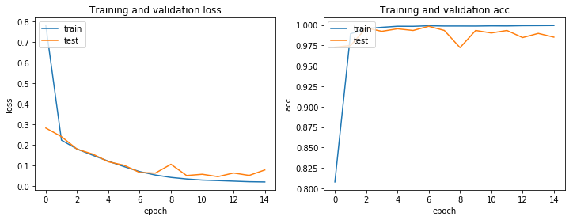
**结论：**
提交到kaggle中后得到成绩：private: 0.32686, public: 0.38984

**51. 51**
**说明：**
使用了imgaug库对图像进行了增强处理，为每一张图片的右半都随机与同分类图片拼接，因此实际的训练数据集为原来的2倍，增加l2正则化，去掉最顶层的偏置项参数，使用Adam优化器，调低学习率，给予衰减值，尝试防止过拟合，使用ModelCheckpoint回调函数保存训练过程中得到的最优模型

**参数：**
- 模型: InceptionV3
- epochs = 30
- batch_size = 64
- 锁层: NO
- 数据增强：imgaug+ImageDataGenerator
- 停止提升参数:
  - val_loss: 0.0005
  - 轮数(patience): 3
- 自定义层:
  ```
  x = GlobalAveragePooling2D()(x)
  x = Dropout(0.5)(x)
  predictions = Dense(10, activation='softmax', use_bias=False, kernel_regularizer=l2(0.01))(x)
  ```
- 优化器:
  - Adam:
    - lr = 0.00003
    - decay = 1e-8

**结果：**
```
Epoch 1/30
637/637 [==============================] - 2043s 3s/step - loss: 0.6385 - acc: 0.8626 - val_loss: 0.3319 - val_acc: 0.9595

Epoch 00001: val_loss improved from inf to 0.33192, saving model to saved_weights/inception_v3_model.h5
Epoch 2/30
637/637 [==============================] - 1453s 2s/step - loss: 0.2121 - acc: 0.9923 - val_loss: 0.2592 - val_acc: 0.9733

Epoch 00002: val_loss improved from 0.33192 to 0.25921, saving model to saved_weights/inception_v3_model.h5
Epoch 3/30
637/637 [==============================] - 1454s 2s/step - loss: 0.1712 - acc: 0.9965 - val_loss: 0.2058 - val_acc: 0.9851

Epoch 00003: val_loss improved from 0.25921 to 0.20578, saving model to saved_weights/inception_v3_model.h5
Epoch 4/30
637/637 [==============================] - 1453s 2s/step - loss: 0.1371 - acc: 0.9981 - val_loss: 0.1717 - val_acc: 0.9862

Epoch 00004: val_loss improved from 0.20578 to 0.17173, saving model to saved_weights/inception_v3_model.h5
Epoch 5/30
637/637 [==============================] - 1454s 2s/step - loss: 0.1065 - acc: 0.9984 - val_loss: 0.1337 - val_acc: 0.9856

Epoch 00005: val_loss improved from 0.17173 to 0.13370, saving model to saved_weights/inception_v3_model.h5
Epoch 6/30
637/637 [==============================] - 1455s 2s/step - loss: 0.0798 - acc: 0.9985 - val_loss: 0.0957 - val_acc: 0.9918

Epoch 00006: val_loss improved from 0.13370 to 0.09570, saving model to saved_weights/inception_v3_model.h5
Epoch 7/30
637/637 [==============================] - 1457s 2s/step - loss: 0.0579 - acc: 0.9988 - val_loss: 0.0902 - val_acc: 0.9872

Epoch 00007: val_loss improved from 0.09570 to 0.09024, saving model to saved_weights/inception_v3_model.h5
Epoch 8/30
637/637 [==============================] - 1458s 2s/step - loss: 0.0419 - acc: 0.9991 - val_loss: 0.0885 - val_acc: 0.9836

Epoch 00008: val_loss improved from 0.09024 to 0.08847, saving model to saved_weights/inception_v3_model.h5
Epoch 9/30
637/637 [==============================] - 1458s 2s/step - loss: 0.0344 - acc: 0.9987 - val_loss: 0.0767 - val_acc: 0.9862

Epoch 00009: val_loss improved from 0.08847 to 0.07668, saving model to saved_weights/inception_v3_model.h5
Epoch 10/30
637/637 [==============================] - 1458s 2s/step - loss: 0.0281 - acc: 0.9990 - val_loss: 0.0704 - val_acc: 0.9867

Epoch 00010: val_loss improved from 0.07668 to 0.07039, saving model to saved_weights/inception_v3_model.h5
Epoch 11/30
637/637 [==============================] - 1459s 2s/step - loss: 0.0233 - acc: 0.9992 - val_loss: 0.1760 - val_acc: 0.9677

Epoch 00011: val_loss did not improve from 0.07039
Epoch 12/30
637/637 [==============================] - 1459s 2s/step - loss: 0.0227 - acc: 0.9989 - val_loss: 0.0578 - val_acc: 0.9882

Epoch 00012: val_loss improved from 0.07039 to 0.05784, saving model to saved_weights/inception_v3_model.h5
Epoch 13/30
637/637 [==============================] - 1459s 2s/step - loss: 0.0197 - acc: 0.9992 - val_loss: 0.0486 - val_acc: 0.9918

Epoch 00013: val_loss improved from 0.05784 to 0.04857, saving model to saved_weights/inception_v3_model.h5
Epoch 14/30
637/637 [==============================] - 1484s 2s/step - loss: 0.0184 - acc: 0.9993 - val_loss: 0.0494 - val_acc: 0.9908

Epoch 00014: val_loss did not improve from 0.04857
Epoch 15/30
637/637 [==============================] - 1478s 2s/step - loss: 0.0180 - acc: 0.9991 - val_loss: 0.0744 - val_acc: 0.9815

Epoch 00015: val_loss did not improve from 0.04857
Epoch 16/30
637/637 [==============================] - 1458s 2s/step - loss: 0.0171 - acc: 0.9990 - val_loss: 0.1400 - val_acc: 0.9554

Epoch 00016: val_loss did not improve from 0.04857
Epoch 00016: early stopping
```
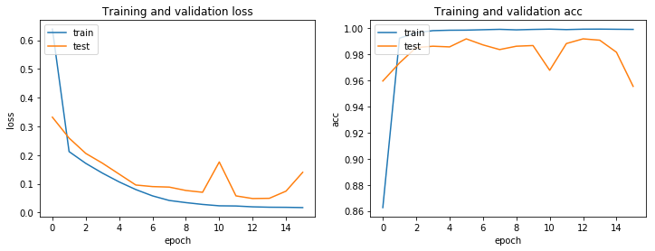
**结论：**
提交到kaggle中后得到成绩：private: 0.29843, public: 0.30522

**52.52**
**说明：**
使用了imgaug库对图像进行了增强处理，为每一张图片的右半都随机与同分类图片拼接，因此实际的训练数据集为原来的2倍，增加l2正则化，去掉最顶层的偏置项参数，使用Adam优化器，调低学习率，给予衰减值，尝试防止过拟合，使用ModelCheckpoint回调函数保存训练过程中得到的最优模型

**参数：**
- 模型: ResNet50
- epochs = 30
- batch_size = 64
- 锁层: NO
- 数据增强：imgaug+ImageDataGenerator
- 停止提升参数:
  - val_loss: 0.0005
  - 轮数(patience): 4
- 自定义层:
  ```
  x = GlobalAveragePooling2D()(x)
  x = Dropout(0.5)(x)
  predictions = Dense(10, activation='softmax', use_bias=False, kernel_regularizer=l2(0.01))(x)
  ```
- 优化器:
  - Adam:
    - lr = 0.00003
    - decay = 1e-8

**结果：**
```
Epoch 1/30
637/637 [==============================] - 1113s 2s/step - loss: 0.5850 - acc: 0.8769 - val_loss: 0.2496 - val_acc: 0.9795

Epoch 00001: val_loss improved from inf to 0.24958, saving model to saved_weights/resnet50_model.h5
Epoch 2/30
637/637 [==============================] - 1090s 2s/step - loss: 0.2121 - acc: 0.9921 - val_loss: 0.3878 - val_acc: 0.9323

Epoch 00002: val_loss did not improve from 0.24958
Epoch 3/30
637/637 [==============================] - 1090s 2s/step - loss: 0.1779 - acc: 0.9962 - val_loss: 0.3272 - val_acc: 0.9467

Epoch 00003: val_loss did not improve from 0.24958
Epoch 4/30
637/637 [==============================] - 1090s 2s/step - loss: 0.1490 - acc: 0.9974 - val_loss: 0.1773 - val_acc: 0.9821

Epoch 00004: val_loss improved from 0.24958 to 0.17732, saving model to saved_weights/resnet50_model.h5
Epoch 5/30
637/637 [==============================] - 1089s 2s/step - loss: 0.1223 - acc: 0.9976 - val_loss: 0.6165 - val_acc: 0.8980

Epoch 00005: val_loss did not improve from 0.17732
Epoch 6/30
637/637 [==============================] - 1090s 2s/step - loss: 0.0926 - acc: 0.9989 - val_loss: 0.5809 - val_acc: 0.9088

Epoch 00006: val_loss did not improve from 0.17732
Epoch 7/30
637/637 [==============================] - 1088s 2s/step - loss: 0.0697 - acc: 0.9987 - val_loss: 0.7969 - val_acc: 0.8760

Epoch 00007: val_loss did not improve from 0.17732
Epoch 8/30
637/637 [==============================] - 1089s 2s/step - loss: 0.0511 - acc: 0.9986 - val_loss: 0.2161 - val_acc: 0.9359

Epoch 00008: val_loss did not improve from 0.17732
Epoch 00008: early stopping
```
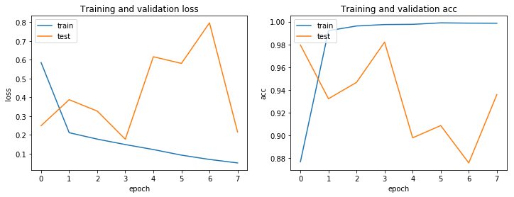
**结论：**
提交到kaggle中后得到成绩：private: 0.37684, public: 0.37684

**53.53**
**说明：**
使用了imgaug库对图像进行了增强处理，为每一张图片的右半都随机与同分类图片拼接，因此实际的训练数据集为原来的2倍，增加l2正则化，去掉最顶层的偏置项参数，使用Adam优化器，调低学习率，给予衰减值，尝试防止过拟合，使用ModelCheckpoint回调函数保存训练过程中得到的最优模型

**参数：**
- 模型: InceptionResNetV2
- epochs = 20
- batch_size = 32
- 锁层: NO
- 数据增强：imgaug+ImageDataGenerator
- 停止提升参数:
  - val_loss: 0.0005
  - 轮数(patience): 4
- 自定义层:
  ```
  x = GlobalAveragePooling2D()(x)
  x = Dropout(0.5)(x)
  predictions = Dense(10, activation='softmax', use_bias=False, kernel_regularizer=l2(0.01))(x)
  ```
- 优化器:
  - Adam:
    - lr = 0.00003
    - decay = 1e-8

**结果：**
```
Epoch 1/20
1275/1275 [==============================] - 1883s 1s/step - loss: 0.4755 - acc: 0.9083 - val_loss: 0.3025 - val_acc: 0.9607

Epoch 00001: val_loss improved from inf to 0.30252, saving model to saved_weights/inception_resnet_v2_model.h5
Epoch 2/20
1275/1275 [==============================] - 1117s 876ms/step - loss: 0.1779 - acc: 0.9937 - val_loss: 0.2424 - val_acc: 0.9659

Epoch 00002: val_loss improved from 0.30252 to 0.24240, saving model to saved_weights/inception_resnet_v2_model.h5
Epoch 3/20
1275/1275 [==============================] - 1097s 861ms/step - loss: 0.1213 - acc: 0.9966 - val_loss: 0.2027 - val_acc: 0.9654

Epoch 00003: val_loss improved from 0.24240 to 0.20272, saving model to saved_weights/inception_resnet_v2_model.h5
Epoch 4/20
1275/1275 [==============================] - 1102s 864ms/step - loss: 0.0790 - acc: 0.9969 - val_loss: 0.1363 - val_acc: 0.9773

Epoch 00004: val_loss improved from 0.20272 to 0.13631, saving model to saved_weights/inception_resnet_v2_model.h5
Epoch 5/20
1275/1275 [==============================] - 1110s 870ms/step - loss: 0.0505 - acc: 0.9980 - val_loss: 0.1781 - val_acc: 0.9571

Epoch 00005: val_loss did not improve from 0.13631
Epoch 6/20
1275/1275 [==============================] - 1108s 869ms/step - loss: 0.0394 - acc: 0.9976 - val_loss: 0.1473 - val_acc: 0.9680

Epoch 00006: val_loss did not improve from 0.13631
Epoch 7/20
1275/1275 [==============================] - 1112s 872ms/step - loss: 0.0331 - acc: 0.9978 - val_loss: 0.1262 - val_acc: 0.9747

Epoch 00007: val_loss improved from 0.13631 to 0.12615, saving model to saved_weights/inception_resnet_v2_model.h5
Epoch 8/20
1275/1275 [==============================] - 1105s 867ms/step - loss: 0.0267 - acc: 0.9986 - val_loss: 0.1077 - val_acc: 0.9731

Epoch 00008: val_loss improved from 0.12615 to 0.10774, saving model to saved_weights/inception_resnet_v2_model.h5
Epoch 9/20
1275/1275 [==============================] - 1093s 857ms/step - loss: 0.0261 - acc: 0.9981 - val_loss: 0.2314 - val_acc: 0.9659

Epoch 00009: val_loss did not improve from 0.10774
Epoch 10/20
1275/1275 [==============================] - 1106s 868ms/step - loss: 0.0225 - acc: 0.9987 - val_loss: 0.2403 - val_acc: 0.9654

Epoch 00010: val_loss did not improve from 0.10774
Epoch 11/20
1275/1275 [==============================] - 1109s 870ms/step - loss: 0.0214 - acc: 0.9985 - val_loss: 0.1655 - val_acc: 0.9659

Epoch 00011: val_loss did not improve from 0.10774
Epoch 12/20
1275/1275 [==============================] - 1114s 874ms/step - loss: 0.0211 - acc: 0.9985 - val_loss: 0.2252 - val_acc: 0.9514

Epoch 00012: val_loss did not improve from 0.10774
Epoch 00012: early stopping
```
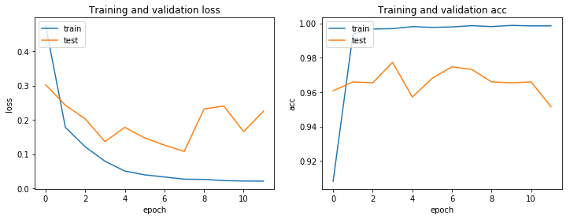
**结论：**
提交到kaggle中后得到成绩：private:  0.32819, public: 0.43092


在这一部分， 你需要描述你所建立的模型在给定数据上执行过程。模型的执行过程，以及过程中遇到的困难的描述应该清晰明了地记录和描述。需要考虑的问题：

你所用到的算法和技术执行的方式是否清晰记录了？
在运用上面所提及的技术及指标的执行过程中是否遇到了困难，是否需要作出改动来得到想要的结果？
是否有需要记录解释的代码片段(例如复杂的函数）？
### 完善
在这一部分，你需要描述你对原有的算法和技术完善的过程。例如调整模型的参数以达到更好的结果的过程应该有所记录。你需要记录最初和最终的模型，以及过程中有代表性意义的结果。你需要考虑的问题：

初始结果是否清晰记录了？
完善的过程是否清晰记录了，其中使用了什么技术？
完善过程中的结果以及最终结果是否清晰记录了？
## IV. 结果
（大概 2-3 页）

### 模型的评价与验证
在这一部分，你需要对你得出的最终模型的各种技术质量进行详尽的评价。最终模型是怎么得出来的，为什么它会被选为最佳需要清晰地描述。你也需要对模型和结果可靠性作出验证分析，譬如对输入数据或环境的一些操控是否会对结果产生影响（敏感性分析sensitivity analysis）。一些需要考虑的问题：

最终的模型是否合理，跟期待的结果是否一致？最后的各种参数是否合理？
模型是否对于这个问题是否足够稳健可靠？训练数据或输入的一些微小的改变是否会极大影响结果？（鲁棒性）
这个模型得出的结果是否可信？
### 合理性分析
在这个部分，你需要利用一些统计分析，把你的最终模型得到的结果与你的前面设定的基准模型进行对比。你也分析你的最终模型和结果是否确确实实解决了你在这个项目里设定的问题。你需要考虑：

最终结果对比你的基准模型表现得更好还是有所逊色？
你是否详尽地分析和讨论了最终结果？
最终结果是不是确确实实解决了问题？
## V. 项目结论
（大概 1-2 页）

### 结果可视化
在这一部分，你需要用可视化的方式展示项目中需要强调的重要技术特性。至于什么形式，你可以自由把握，但需要表达出一个关于这个项目重要的结论和特点，并对此作出讨论。一些需要考虑的：

你是否对一个与问题，数据集，输入数据，或结果相关的，重要的技术特性进行了可视化？
可视化结果是否详尽的分析讨论了？
绘图的坐标轴，标题，基准面是不是清晰定义了？
### 对项目的思考
在这一部分，你需要从头到尾总结一下整个问题的解决方案，讨论其中你认为有趣或困难的地方。从整体来反思一下整个项目，确保自己对整个流程是明确掌握的。需要考虑：

你是否详尽总结了项目的整个流程？
项目里有哪些比较有意思的地方？
项目里有哪些比较困难的地方？
最终模型和结果是否符合你对这个问题的期望？它可以在通用的场景下解决这些类型的问题吗？
### 需要作出的改进
在这一部分，你需要讨论你可以怎么样去完善你执行流程中的某一方面。例如考虑一下你的操作的方法是否可以进一步推广，泛化，有没有需要作出变更的地方。你并不需要确实作出这些改进，不过你应能够讨论这些改进可能对结果的影响，并与现有结果进行比较。一些需要考虑的问题：

是否可以有算法和技术层面的进一步的完善？
是否有一些你了解到，但是你还没能够实践的算法和技术？
如果将你最终模型作为新的基准，你认为还能有更好的解决方案吗？

## 参考文献
[1]Christian Szegedy, Vincent Vanhoucke, Sergey Ioffe, Jonathon Shlens, Zbigniew Wojna. [
Rethinking the Inception Architecture for Computer Vision](https://arxiv.org/pdf/1512.00567). arXiv:1512.00567, 2015.
[2]François Chollet. [Xception: Deep Learning with Depthwise Separable Convolutions](https://arxiv.org/pdf/1610.02357). arXiv prepr int arXiv:1610.02357, 2016.
[3]黄文坚. [CNN浅析和历年ImageNet冠军模型解析](http://www.infoq.com/cn/articles/cnn-and-imagenet-champion-model-analysis). 发表时间: 2017年5月22日.
[4]Kaggle. [State Farm Distracted Driver Detection](https://www.kaggle.com/c/state-farm-distracted-driver-detection). 2016.

**在提交之前， 问一下自己...**
- 你所写的项目报告结构对比于这个模板而言足够清晰了没有？
- 每一个部分（尤其分析和方法）是否清晰，简洁，明了？有没有存在歧义的术语和用语需要进一步说明的？
- 你的目标读者是不是能够明白你的分析，方法和结果？
- 报告里面是否有语法错误或拼写错误？
- 报告里提到的一些外部资料及来源是不是都正确引述或引用了？
- 代码可读性是否良好？必要的注释是否加上了？
- 代码是否可以顺利运行并重现跟报告相似的结果？
