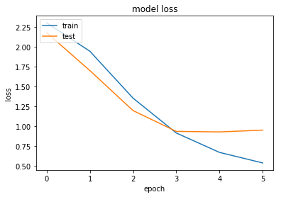
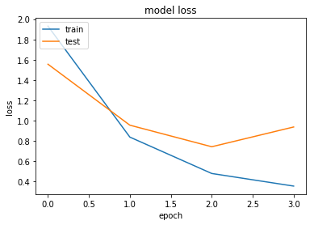

# 机器学习纳米学位
走神司机 潘超 优达学城  
2018年6月6日
## I. 问题的定义
### 项目概述
项目将从一些车载视频摄像头中截取的静态图像识别驾驶员是否处于安全驾驶的状态。

生活中许多驾驶员喜欢一边开车一边做别的事情，如：打电话、发微信、吃东西、聊天、疲劳驾驶等等，安全隐患非常大。特别是一些大巴车司机，关乎到整个大巴车上几十个人的人身安全。该项目的数据来源方Kaggle比赛平台中的资料也指出：
> 根据美国疾病防控中心机动车安全部门的数据，五分之一的车祸是由分心的司机造成的。可悲的是，这意味着每年有42.5万人受伤，3000人因分心驾驶而死亡。

早期驾驶员状态检测方法主要是基于车辆运行状态的检测方法，包括车道偏离报警、转向盘检测等，对驾驶员本身的特征敏感度不高，容易因环境因素误判，也不能从根本上解决驾驶员状态检测的问题，而近年的基于深度学习的图像识别技术则提供了不错的解决办法，可以通过对视频图像进行分析检测驾驶员当前的状态并给予提醒，甚至在出现更严重的危险情况时通过车辆控制信号及时主动刹停汽车。

项目使用的数据源来源于二年前的Kaggle比赛，当年一共有1440名参赛队伍参于该赛事。
### 问题陈述
处理通过车载摄像头记录到的驾驶员状态图像，对图像进行识别处理，分析图像中驾驶员当前所处的状态，以满足对安全驾驶提醒的需求。需要从图像中识别包括如下的驾驶员状态：
0. 安全驾驶
1. 右手打字
2. 右手打电话
3. 左手打字
4. 左手打电话
5. 调收音机
6. 喝饮料
7. 拿后面的东西
8. 整理头发和化妆
9. 和其他乘客说话
每一张图片识别出的结果应该是该图片分别在十种状态中的概率值，如安全驾驶的图片的理想识别结果应该为c0类别的概率为1，其他9种类别的概率为0。

项目将使用卷积神经网络来识别这些图像属于哪种状态，卷积神经网络是从2012年开始迅速成长起来的新型图像识别算法和架构，至今已发展出许多不同的版本，在图像识别方面取得了越来越高的准确率。
### 评价指标
评估指标使用kaggle中该项目的评估方式，即multi-class logarithmic loss，损失值计算公式：
$$
logloss = -\frac{1}{N}\sum_{i=1}^{N}\sum_{j=1}^{M}y_{ij}log(p_{ij})
$$
公式中$N$为图像的数量，用于训练集时为当前训练集的数量，用于验证集时为验证集的数量，测试集同理。$M$表示图像标记的数量，在该项目中$M$为10。$y_{ij}$为第$i$个图像在第$j$分类中的标记概率，如果图像为该类，则该值为1，否则为0。$log$为自然对数，$p_{ij}$为第$i$个图像在第$j$分类中标记的预测概率。将每一张图像每个分类的预测概率的自然对数与分类目标标记的积相加再取负均值，最终即为多分类损失值。
## II. 分析
### 数据的探索
数据集来源于往年的Kaggle竞赛。数据集中包含大量车载摄像头对驾驶员位置的摄影截图，可清楚看到驾驶员的各种行为，包括打电话、喝饮料、拿后面的东西、打字等。数据集中将图片数据分为了训练集和测试集，训练集可用于该项目中训练模型，测试集可在模型训练完毕后检验预测效果，可提交至Kaggle中计算已训练模型的最终得分。训练集中已将图像标记分类，分为c0到c9一共十个文件夹存放，共22424张图片。测试集中有79729张未标记分类的图片。

数据集中每一张图片大小为640*480像素。图片中的驾驶员各种各样，有胖有瘦，有高有矮，有男有女、甚至还有不同肤色的驾驶员，有的驾驶员手臂上还有纹身。图片的光线有明，也有暗，甚至还有些有点爆光过度，导致难以发现手中的透明杯子。
1. 因光照原因看不见喝饮料的杯子  

2. 胖驾驶员  

3. 图像模糊

### 探索性可视化
训练数据中司机状态分类呈均匀分布：


在这一部分，你需要对数据的特征或特性进行概括性或提取性的可视化。这个可视化的过程应该要适应你所使用的数据。就你为何使用这个形式的可视化，以及这个可视化过程为什么是有意义的，进行一定的讨论。你需要考虑的问题：

你是否对数据中与问题有关的特性进行了可视化？
你对可视化结果进行详尽的分析和讨论了吗？
绘图的坐标轴，标题，基准面是不是清晰定义了？
### 算法和技术
> 介绍tensorflow、Keras
> 介绍数据增强
> 介绍InceptionV3
> 介绍Xception
> 在最后的报告中， 也需要介绍一下InceptionV3和Xception，讨论一下选择这两个算法的理由：训练参数少，速度快，提出了新的神经网络架构（网中网）

### 基准模型
使用Kaggle中该项目的排名分数做为基准模型。使用前10%的分数作为基准，第144名，最小损失值为0.25634。
## III. 方法
(大概 3-5 页）
### 数据预处理
> 对图像数据进行预处理：旋转、添加噪点、模糊、缩小图片

在这一部分， 你需要清晰记录你所有必要的数据预处理步骤。在前一个部分所描述的数据的异常或特性在这一部分需要被更正和处理。需要考虑的问题有：

如果你选择的算法需要进行特征选取或特征变换，你对此进行记录和描述了吗？
数据的探索这一部分中提及的异常和特性是否被更正了，对此进行记录和描述了吗？
如果你认为不需要进行预处理，你解释个中原因了吗？
### 执行过程
1. 第一次
模型InceptionV3，自定义层
```
epochs = 50

x = GlobalAveragePooling2D()(x)
x = Dense(1024, activation='relu')(x)
predictions = Dense(10, activation='softmax')(x)
```
优化器：rmsprop
```
Found 20600 images belonging to 10 classes.
Found 1824 images belonging to 10 classes.
Epoch 1/50
1287/1287 [==============================] - 300s 233ms/step - loss: 2.1878 - acc: 0.2330 - val_loss: 2.7654 - val_acc: 0.0976
Epoch 2/50
1287/1287 [==============================] - 210s 164ms/step - loss: 1.9474 - acc: 0.3159 - val_loss: 3.5307 - val_acc: 0.1738
Epoch 3/50
1287/1287 [==============================] - 210s 163ms/step - loss: 1.8856 - acc: 0.3398 - val_loss: 3.0451 - val_acc: 0.2149
Epoch 4/50
1287/1287 [==============================] - 210s 163ms/step - loss: 1.8405 - acc: 0.3580 - val_loss: 3.0962 - val_acc: 0.2056
Epoch 5/50
1287/1287 [==============================] - 209s 162ms/step - loss: 1.8213 - acc: 0.3696 - val_loss: 2.9592 - val_acc: 0.2484
Epoch 6/50
1287/1287 [==============================] - 209s 162ms/step - loss: 1.7888 - acc: 0.3828 - val_loss: 3.6558 - val_acc: 0.1798
Epoch 7/50
1287/1287 [==============================] - 209s 162ms/step - loss: 1.7549 - acc: 0.3995 - val_loss: 3.6679 - val_acc: 0.2111
Epoch 8/50
1287/1287 [==============================] - 209s 162ms/step - loss: 1.7304 - acc: 0.4079 - val_loss: 3.3764 - val_acc: 0.1859
```
损失值不降，反升
2. 第二次
模型InceptionV3，自定义层
```
epochs = 50

x = GlobalAveragePooling2D()(x)
x = Dense(1024, activation='relu')(x)
predictions = Dense(10, activation='softmax')(x)
```
优化器：sgd
```
Found 20673 images belonging to 10 classes.
Found 1751 images belonging to 10 classes.
Epoch 1/50
1292/1292 [==============================] - 354s 274ms/step - loss: 1.1084 - acc: 0.6081 - val_loss: 1.5150 - val_acc: 0.6061
Epoch 2/50
1292/1292 [==============================] - 321s 249ms/step - loss: 0.3817 - acc: 0.8723 - val_loss: 0.8985 - val_acc: 0.7288
Epoch 3/50
1292/1292 [==============================] - 321s 248ms/step - loss: 0.2513 - acc: 0.9178 - val_loss: 0.8782 - val_acc: 0.7403
Epoch 4/50
1292/1292 [==============================] - 321s 249ms/step - loss: 0.1990 - acc: 0.9365 - val_loss: 0.6606 - val_acc: 0.7987
Epoch 5/50
1292/1292 [==============================] - 321s 249ms/step - loss: 0.1610 - acc: 0.9491 - val_loss: 0.8641 - val_acc: 0.7620
```
模型有些过拟合
3. 第三次
```
epochs = 50

x = GlobalAveragePooling2D()(x)
x = Dense(1024, activation='relu')(x)
x = Dropout(0.5)(x)
predictions = Dense(10, activation='softmax')(x)
```
优化器：sgd
```
Found 20714 images belonging to 10 classes.
Found 1710 images belonging to 10 classes.
Epoch 1/50
1294/1294 [==============================] - 358s 277ms/step - loss: 1.2635 - acc: 0.5512 - val_loss: 0.9768 - val_acc: 0.6763
Epoch 2/50
1294/1294 [==============================] - 322s 249ms/step - loss: 0.4318 - acc: 0.8616 - val_loss: 0.6057 - val_acc: 0.8154
Epoch 3/50
1294/1294 [==============================] - 322s 249ms/step - loss: 0.2799 - acc: 0.9079 - val_loss: 0.8785 - val_acc: 0.7836
Epoch 4/50
1294/1294 [==============================] - 321s 248ms/step - loss: 0.2039 - acc: 0.9356 - val_loss: 0.6909 - val_acc: 0.7960
```
模型有些过拟合
4. 第四次
```
epochs = 50

x = GlobalAveragePooling2D()(x)
x = Dense(1024, activation='relu')(x)
x = Dropout(0.5)(x)
predictions = Dense(10, activation='softmax')(x)
```
优化器：sgd，设定优化器参数
```
out_image_size = (150, 150)

sgd = SGD(lr=0.0001, decay=1e-8, momentum=0.9, nesterov=True)
```
```
Found 20665 images belonging to 10 classes.
Found 1759 images belonging to 10 classes.
model name: inceptionv3 , save weight file: inceptionv3_0.h5
Epoch 1/50
1291/1291 [==============================] - 341s 264ms/step - loss: 2.2996 - acc: 0.1512 - val_loss: 2.1757 - val_acc: 0.1915
Epoch 2/50
1291/1291 [==============================] - 318s 246ms/step - loss: 1.9428 - acc: 0.3126 - val_loss: 1.7000 - val_acc: 0.4209
Epoch 3/50
1291/1291 [==============================] - 317s 245ms/step - loss: 1.3533 - acc: 0.5319 - val_loss: 1.1974 - val_acc: 0.6468
Epoch 4/50
1291/1291 [==============================] - 317s 246ms/step - loss: 0.9164 - acc: 0.6893 - val_loss: 0.9361 - val_acc: 0.7070
Epoch 5/50
1291/1291 [==============================] - 317s 245ms/step - loss: 0.6728 - acc: 0.7771 - val_loss: 0.9294 - val_acc: 0.6898
Epoch 6/50
1291/1291 [==============================] - 317s 246ms/step - loss: 0.5401 - acc: 0.8213 - val_loss: 0.9519 - val_acc: 0.6915
```

5. 第五次
优化器：sgd，设定优化器参数
```
out_image_size = (150, 150)

sgd = SGD(lr=0.0003, decay=1e-8, momentum=0.9, nesterov=True)
```
```
Found 20714 images belonging to 10 classes.
Found 1710 images belonging to 10 classes.
model name: inceptionv3 , save weight file: inceptionv3_0.h5
Epoch 1/50
1294/1294 [==============================] - 366s 283ms/step - loss: 1.9313 - acc: 0.2954 - val_loss: 1.5559 - val_acc: 0.4292
Epoch 2/50
1294/1294 [==============================] - 319s 247ms/step - loss: 0.8376 - acc: 0.7157 - val_loss: 0.9551 - val_acc: 0.6922
Epoch 3/50
1294/1294 [==============================] - 319s 246ms/step - loss: 0.4790 - acc: 0.8444 - val_loss: 0.7425 - val_acc: 0.7642
Epoch 4/50
1294/1294 [==============================] - 319s 247ms/step - loss: 0.3549 - acc: 0.8839 - val_loss: 0.9373 - val_acc: 0.7317
```

6. 第六次
```
out_image_size = (299, 299)

sgd = SGD(lr=0.0003, decay=1e-8, momentum=0.9, nesterov=True)
```
```
Found 20778 images belonging to 10 classes.
Found 1646 images belonging to 10 classes.
model name: inceptionv3 , save weight file: inceptionv3_0.h5
Epoch 1/10
1298/1298 [==============================] - 955s 736ms/step - loss: 1.0527 - acc: 0.6448 - val_loss: 0.7547 - val_acc: 0.7727
Epoch 2/10
1298/1298 [==============================] - 914s 704ms/step - loss: 0.2423 - acc: 0.9241 - val_loss: 0.5667 - val_acc: 0.8358
Epoch 3/10
1298/1298 [==============================] - 914s 704ms/step - loss: 0.1482 - acc: 0.9544 - val_loss: 0.4412 - val_acc: 0.8505
Epoch 4/10
1298/1298 [==============================] - 915s 705ms/step - loss: 0.1043 - acc: 0.9682 - val_loss: 0.6557 - val_acc: 0.7911
Epoch 5/10
1298/1298 [==============================] - 907s 699ms/step - loss: 0.0821 - acc: 0.9756 - val_loss: 0.6776 - val_acc: 0.7990
Epoch 6/10
1298/1298 [==============================] - 905s 697ms/step - loss: 0.0664 - acc: 0.9812 - val_loss: 0.6797 - val_acc: 0.7659
```
7. 第七次
```
epochs = 20
batch_size=32
out_image_size = (150, 150)

x = GlobalAveragePooling2D()(x)
x = Dropout(0.5)(x)
predictions = Dense(10, activation='softmax')(x)
```
```
sgd = SGD(lr=0.0003, decay=1e-8, momentum=0.9, nesterov=True)
```
```
Found 20841 images belonging to 10 classes.
Found 1583 images belonging to 10 classes.
model name: inceptionv3 , save weight file: saved_weights/inceptionv3_0.h5
WARNING:tensorflow:Variable *= will be deprecated. Use variable.assign_mul if you want assignment to the variable value or 'x = x * y' if you want a new python Tensor object.
Epoch 1/20
651/651 [==============================] - 546s 839ms/step - loss: 2.1665 - acc: 0.2133 - val_loss: 1.7801 - val_acc: 0.3412
Epoch 2/20
651/651 [==============================] - 245s 377ms/step - loss: 1.2576 - acc: 0.5664 - val_loss: 1.2006 - val_acc: 0.5727
Epoch 3/20
651/651 [==============================] - 245s 377ms/step - loss: 0.6566 - acc: 0.7830 - val_loss: 1.2307 - val_acc: 0.6135
Epoch 4/20
651/651 [==============================] - 247s 380ms/step - loss: 0.4338 - acc: 0.8569 - val_loss: 1.6721 - val_acc: 0.5638
Epoch 5/20
651/651 [==============================] - 242s 372ms/step - loss: 0.3366 - acc: 0.8909 - val_loss: 1.7700 - val_acc: 0.5797
```
8. 第八次
```
epochs = 30
batch_size=32
out_image_size = (150, 150)

x = Dropout(0.5)(x)
x = GlobalAveragePooling2D()(x)
predictions = Dense(10, activation='softmax')(x)
```
```
sgd = SGD(lr=0.0002, decay=1e-8, momentum=0.9, nesterov=True)
```
```
Found 20600 images belonging to 10 classes.
Found 1824 images belonging to 10 classes.
model name: inceptionv3 , save weight file: saved_weights/inceptionv3_0.h5
Epoch 1/30
643/643 [==============================] - 254s 394ms/step - loss: 2.1295 - acc: 0.2329 - val_loss: 1.6416 - val_acc: 0.4172
Epoch 2/30
643/643 [==============================] - 244s 380ms/step - loss: 1.3747 - acc: 0.5371 - val_loss: 0.9983 - val_acc: 0.6305
Epoch 3/30
643/643 [==============================] - 244s 379ms/step - loss: 0.8124 - acc: 0.7381 - val_loss: 0.7881 - val_acc: 0.7138
Epoch 4/30
643/643 [==============================] - 246s 383ms/step - loss: 0.5515 - acc: 0.8263 - val_loss: 0.6987 - val_acc: 0.7374
Epoch 5/30
643/643 [==============================] - 245s 381ms/step - loss: 0.4126 - acc: 0.8685 - val_loss: 0.8456 - val_acc: 0.7029
Epoch 6/30
643/643 [==============================] - 248s 386ms/step - loss: 0.3444 - acc: 0.8889 - val_loss: 0.6771 - val_acc: 0.7604
Epoch 7/30
643/643 [==============================] - 246s 382ms/step - loss: 0.2870 - acc: 0.9088 - val_loss: 0.6297 - val_acc: 0.7708
Epoch 8/30
643/643 [==============================] - 243s 378ms/step - loss: 0.2459 - acc: 0.9217 - val_loss: 0.7042 - val_acc: 0.7659
Epoch 9/30
643/643 [==============================] - 244s 379ms/step - loss: 0.2144 - acc: 0.9334 - val_loss: 0.7639 - val_acc: 0.7582
Epoch 10/30
643/643 [==============================] - 245s 381ms/step - loss: 0.1944 - acc: 0.9385 - val_loss: 0.6920 - val_acc: 0.7692
Epoch 11/30
643/643 [==============================] - 242s 376ms/step - loss: 0.1781 - acc: 0.9439 - val_loss: 0.8613 - val_acc: 0.7560
```
9. 第九次
```
epochs = 30
batch_size=32
out_image_size = (150, 150)

x = Dropout(0.5)(x)
x = GlobalAveragePooling2D()(x)
predictions = Dense(10, activation='softmax')(x)
```
```
sgd = SGD(lr=0.0001, decay=1e-8, momentum=0.9, nesterov=True)
```
```
Found 20593 images belonging to 10 classes.
Found 1831 images belonging to 10 classes.
model name: inceptionv3 , save weight file: saved_weights/inceptionv3_0.h5
Epoch 1/30
643/643 [==============================] - 258s 401ms/step - loss: 2.2729 - acc: 0.1658 - val_loss: 1.9633 - val_acc: 0.3476
Epoch 2/30
643/643 [==============================] - 245s 382ms/step - loss: 1.9426 - acc: 0.3252 - val_loss: 1.6037 - val_acc: 0.4413
Epoch 3/30
643/643 [==============================] - 245s 382ms/step - loss: 1.5190 - acc: 0.4831 - val_loss: 1.3965 - val_acc: 0.4885
Epoch 4/30
643/643 [==============================] - 248s 386ms/step - loss: 1.1433 - acc: 0.6262 - val_loss: 1.3790 - val_acc: 0.5395
Epoch 5/30
643/643 [==============================] - 245s 380ms/step - loss: 0.8879 - acc: 0.7121 - val_loss: 1.1363 - val_acc: 0.6360
Epoch 6/30
643/643 [==============================] - 246s 382ms/step - loss: 0.7009 - acc: 0.7752 - val_loss: 1.1552 - val_acc: 0.6398
Epoch 7/30
643/643 [==============================] - 246s 382ms/step - loss: 0.5793 - acc: 0.8135 - val_loss: 1.0737 - val_acc: 0.6787
Epoch 8/30
643/643 [==============================] - 243s 378ms/step - loss: 0.4999 - acc: 0.8370 - val_loss: 1.0415 - val_acc: 0.6985
Epoch 9/30
643/643 [==============================] - 242s 376ms/step - loss: 0.4349 - acc: 0.8604 - val_loss: 1.0303 - val_acc: 0.7083
Epoch 10/30
643/643 [==============================] - 244s 380ms/step - loss: 0.3855 - acc: 0.8791 - val_loss: 0.9776 - val_acc: 0.7182
Epoch 11/30
643/643 [==============================] - 241s 375ms/step - loss: 0.3436 - acc: 0.8900 - val_loss: 1.0551 - val_acc: 0.7111
Epoch 12/30
643/643 [==============================] - 241s 375ms/step - loss: 0.3080 - acc: 0.9024 - val_loss: 0.9495 - val_acc: 0.7314
Epoch 13/30
643/643 [==============================] - 241s 374ms/step - loss: 0.2872 - acc: 0.9107 - val_loss: 0.9546 - val_acc: 0.7292
```
10. 第十次
```
epochs = 20
batch_size=32
out_image_size = (299, 299)

x = Dropout(0.5)(x)
x = GlobalAveragePooling2D()(x)
predictions = Dense(10, activation='softmax')(x)

sgd = SGD(lr=0.0001, decay=1e-8, momentum=0.9, nesterov=True)
```
```
Found 20841 images belonging to 10 classes.
Found 1583 images belonging to 10 classes.
model name: inceptionv3 , save weight file: saved_weights/inceptionv3_0.h5
WARNING:tensorflow:Variable *= will be deprecated. Use variable.assign_mul if you want assignment to the variable value or 'x = x * y' if you want a new python Tensor object.
Epoch 1/20
651/651 [==============================] - 1032s 2s/step - loss: 2.1989 - acc: 0.2142 - val_loss: 2.0238 - val_acc: 0.3482
Epoch 2/20
651/651 [==============================] - 800s 1s/step - loss: 1.7572 - acc: 0.4931 - val_loss: 1.4019 - val_acc: 0.6052
Epoch 3/20
651/651 [==============================] - 798s 1s/step - loss: 1.1024 - acc: 0.7125 - val_loss: 1.0235 - val_acc: 0.6684
Epoch 4/20
651/651 [==============================] - 798s 1s/step - loss: 0.6730 - acc: 0.8208 - val_loss: 0.9216 - val_acc: 0.6983
Epoch 5/20
651/651 [==============================] - 798s 1s/step - loss: 0.4653 - acc: 0.8737 - val_loss: 0.8929 - val_acc: 0.7124
Epoch 6/20
651/651 [==============================] - 798s 1s/step - loss: 0.3654 - acc: 0.8981 - val_loss: 0.8979 - val_acc: 0.7219
Epoch 7/20
651/651 [==============================] - 798s 1s/step - loss: 0.3044 - acc: 0.9144 - val_loss: 0.9012 - val_acc: 0.7423
Epoch 8/20
651/651 [==============================] - 798s 1s/step - loss: 0.2594 - acc: 0.9268 - val_loss: 0.8911 - val_acc: 0.7474
Epoch 9/20
651/651 [==============================] - 799s 1s/step - loss: 0.2274 - acc: 0.9364 - val_loss: 0.8941 - val_acc: 0.7583
Epoch 10/20
651/651 [==============================] - 798s 1s/step - loss: 0.1998 - acc: 0.9450 - val_loss: 0.9376 - val_acc: 0.7519
```
11. 第十一次
```
epochs = 20
batch_size=32
out_image_size = (299, 299)

x = Dropout(0.5)(x)
x = GlobalAveragePooling2D()(x)
x = Dropout(0.5)(x)
predictions = Dense(10, activation='softmax')(x)

sgd = SGD(lr=0.0001, decay=1e-8, momentum=0.9, nesterov=True)
```
```
Found 20600 images belonging to 10 classes.
Found 1824 images belonging to 10 classes.
model name: inceptionv3 , save weight file: saved_weights/inceptionv3_0.h5
Epoch 1/20
643/643 [==============================] - 813s 1s/step - loss: 2.3364 - acc: 0.1400 - val_loss: 2.0628 - val_acc: 0.3536
Epoch 2/20
643/643 [==============================] - 794s 1s/step - loss: 1.9671 - acc: 0.3163 - val_loss: 1.3928 - val_acc: 0.6557
Epoch 3/20
643/643 [==============================] - 793s 1s/step - loss: 1.2817 - acc: 0.6006 - val_loss: 0.7182 - val_acc: 0.8191
Epoch 4/20
643/643 [==============================] - 793s 1s/step - loss: 0.7879 - acc: 0.7603 - val_loss: 0.4521 - val_acc: 0.8618
Epoch 5/20
643/643 [==============================] - 793s 1s/step - loss: 0.5487 - acc: 0.8364 - val_loss: 0.3339 - val_acc: 0.8942
Epoch 6/20
643/643 [==============================] - 793s 1s/step - loss: 0.4130 - acc: 0.8789 - val_loss: 0.2857 - val_acc: 0.9079
Epoch 7/20
643/643 [==============================] - 793s 1s/step - loss: 0.3313 - acc: 0.9028 - val_loss: 0.2660 - val_acc: 0.9194
Epoch 8/20
643/643 [==============================] - 792s 1s/step - loss: 0.2828 - acc: 0.9149 - val_loss: 0.2513 - val_acc: 0.9194
Epoch 9/20
643/643 [==============================] - 793s 1s/step - loss: 0.2421 - acc: 0.9291 - val_loss: 0.2260 - val_acc: 0.9309
Epoch 10/20
643/643 [==============================] - 793s 1s/step - loss: 0.2164 - acc: 0.9372 - val_loss: 0.2289 - val_acc: 0.9337
Epoch 11/20
643/643 [==============================] - 793s 1s/step - loss: 0.1906 - acc: 0.9449 - val_loss: 0.2330 - val_acc: 0.9227
```
12. 第十二次
```
epochs = 20
batch_size=32
out_image_size = (299, 299)

x = Dropout(0.5)(x)
x = GlobalAveragePooling2D()(x)
x = Dropout(0.5)(x)
predictions = Dense(10, activation='softmax')(x)

sgd = SGD(lr=0.0001, decay=1e-7, momentum=0.9, nesterov=True)
```
```
Found 20622 images belonging to 10 classes.
Found 1802 images belonging to 10 classes.
model name: inceptionv3 , save weight file: saved_weights/inceptionv3_0.h5
Epoch 1/20
644/644 [==============================] - 823s 1s/step - loss: 2.3173 - acc: 0.1498 - val_loss: 2.0363 - val_acc: 0.3253
Epoch 2/20
644/644 [==============================] - 800s 1s/step - loss: 1.9181 - acc: 0.3263 - val_loss: 1.3049 - val_acc: 0.6217
Epoch 3/20
644/644 [==============================] - 799s 1s/step - loss: 1.2794 - acc: 0.5822 - val_loss: 0.7394 - val_acc: 0.7885
Epoch 4/20
644/644 [==============================] - 795s 1s/step - loss: 0.8195 - acc: 0.7442 - val_loss: 0.5157 - val_acc: 0.8387
Epoch 5/20
644/644 [==============================] - 794s 1s/step - loss: 0.5611 - acc: 0.8251 - val_loss: 0.3948 - val_acc: 0.8834
Epoch 6/20
644/644 [==============================] - 794s 1s/step - loss: 0.4305 - acc: 0.8688 - val_loss: 0.3637 - val_acc: 0.8761
Epoch 7/20
644/644 [==============================] - 795s 1s/step - loss: 0.3503 - acc: 0.8952 - val_loss: 0.3263 - val_acc: 0.8884
Epoch 8/20
644/644 [==============================] - 795s 1s/step - loss: 0.2964 - acc: 0.9087 - val_loss: 0.3658 - val_acc: 0.8705
```

13. 第十三次
```
epochs = 20
batch_size=32
out_image_size = (299, 299)

x = Dropout(0.5)(x)
x = GlobalAveragePooling2D()(x)
x = Dropout(0.5)(x)
predictions = Dense(10, activation='softmax')(x)

sgd = SGD(lr=0.0002, decay=8e-8, momentum=0.9, nesterov=True)
```
```
Found 20841 images belonging to 10 classes.
Found 1583 images belonging to 10 classes.
model name: inceptionv3 , will save weight file: saved_weights/inceptionv3_0.h5
WARNING:tensorflow:Variable *= will be deprecated. Use variable.assign_mul if you want assignment to the variable value or 'x = x * y' if you want a new python Tensor object.
Epoch 1/20
651/651 [==============================] - 1009s 2s/step - loss: 2.1669 - acc: 0.2182 - val_loss: 1.7369 - val_acc: 0.4649
Epoch 2/20
651/651 [==============================] - 789s 1s/step - loss: 1.1223 - acc: 0.6467 - val_loss: 1.0019 - val_acc: 0.6747
Epoch 3/20
651/651 [==============================] - 789s 1s/step - loss: 0.4861 - acc: 0.8584 - val_loss: 1.1148 - val_acc: 0.6856
```
14. 第十四次
```
epochs = 20
batch_size=32
out_image_size = (299, 299)

x = Dropout(0.5)(x)
x = GlobalAveragePooling2D()(x)
x = Dropout(0.5)(x)
predictions = Dense(10, activation='softmax')(x)

sgd = SGD(lr=0.0002, decay=1.5e-7, momentum=0.9, nesterov=True)
```
```
Found 20593 images belonging to 10 classes.
Found 1831 images belonging to 10 classes.
model name: inceptionv3 , will save weight file: saved_weights/inceptionv3_0.h5
Epoch 1/20
643/643 [==============================] - 809s 1s/step - loss: 2.1591 - acc: 0.2256 - val_loss: 1.4405 - val_acc: 0.5636
Epoch 2/20
643/643 [==============================] - 789s 1s/step - loss: 1.0908 - acc: 0.6509 - val_loss: 0.7204 - val_acc: 0.7730
Epoch 3/20
643/643 [==============================] - 784s 1s/step - loss: 0.5063 - acc: 0.8516 - val_loss: 0.6072 - val_acc: 0.7939
Epoch 4/20
643/643 [==============================] - 783s 1s/step - loss: 0.3192 - acc: 0.9077 - val_loss: 0.6964 - val_acc: 0.7577
```
15. 第十五次
```
epochs = 20
batch_size=32
out_image_size = (299, 299)

x = Dropout(0.5)(x)
x = GlobalAveragePooling2D()(x)
x = Dropout(0.5)(x)
predictions = Dense(10, activation='softmax')(x)

sgd = SGD(lr=0.0002, decay=6e-8, momentum=0.9, nesterov=True)
```
```
Found 20673 images belonging to 10 classes.
Found 1751 images belonging to 10 classes.
model name: inceptionv3 , will save weight file: saved_weights/inceptionv3_0.h5
Epoch 1/20
646/646 [==============================] - 816s 1s/step - loss: 2.1847 - acc: 0.2111 - val_loss: 1.7028 - val_acc: 0.4404
Epoch 2/20
646/646 [==============================] - 791s 1s/step - loss: 1.1735 - acc: 0.6189 - val_loss: 0.7388 - val_acc: 0.7847
Epoch 3/20
646/646 [==============================] - 789s 1s/step - loss: 0.5489 - acc: 0.8351 - val_loss: 0.4982 - val_acc: 0.8322
Epoch 4/20
646/646 [==============================] - 786s 1s/step - loss: 0.3462 - acc: 0.8973 - val_loss: 0.3818 - val_acc: 0.8814
Epoch 5/20
646/646 [==============================] - 786s 1s/step - loss: 0.2567 - acc: 0.9240 - val_loss: 0.3237 - val_acc: 0.8866
Epoch 6/20
646/646 [==============================] - 785s 1s/step - loss: 0.2097 - acc: 0.9383 - val_loss: 0.2726 - val_acc: 0.9201
Epoch 7/20
646/646 [==============================] - 786s 1s/step - loss: 0.1676 - acc: 0.9517 - val_loss: 0.3537 - val_acc: 0.8785
```
16. 第十六次
```
epochs = 20
batch_size=32
out_image_size = (299, 299)

x = Dropout(0.5)(x)
x = GlobalAveragePooling2D()(x)
x = Dropout(0.5)(x)
predictions = Dense(10, activation='softmax')(x)

sgd = SGD(lr=0.0001, decay=1e-8, momentum=0.9, nesterov=True)
```
```
Found 20754 images belonging to 10 classes.
Found 1670 images belonging to 10 classes.
model name: inceptionv3 , will save weight file: saved_weights/inceptionv3_0.h5
Epoch 1/20
648/648 [==============================] - 827s 1s/step - loss: 2.3405 - acc: 0.1409 - val_loss: 2.1493 - val_acc: 0.2097
Epoch 2/20
648/648 [==============================] - 793s 1s/step - loss: 1.9716 - acc: 0.3121 - val_loss: 1.6622 - val_acc: 0.4567
Epoch 3/20
648/648 [==============================] - 793s 1s/step - loss: 1.3582 - acc: 0.5614 - val_loss: 1.1167 - val_acc: 0.6016
Epoch 4/20
648/648 [==============================] - 789s 1s/step - loss: 0.8507 - acc: 0.7343 - val_loss: 0.8583 - val_acc: 0.7380

未完待续
```
17. 第十七次
```
epochs = 20
batch_size=32
out_image_size = (299, 299)
val_loss_stop = 5

x = Dropout(0.5)(x)
x = GlobalAveragePooling2D()(x)
x = Dropout(0.5)(x)
predictions = Dense(10, activation='softmax')(x)

op = Adam(lr=0.0005)
```
```
Found 20673 images belonging to 10 classes.
Found 1751 images belonging to 10 classes.
model name: inceptionv3 , will save weight file: saved_weights/inceptionv3_0.h5
Epoch 1/20
646/646 [==============================] - 847s 1s/step - loss: 0.7558 - acc: 0.7401 - val_loss: 0.9402 - val_acc: 0.6968
Epoch 2/20
646/646 [==============================] - 817s 1s/step - loss: 0.2239 - acc: 0.9295 - val_loss: 0.1532 - val_acc: 0.9525

Found 20714 images belonging to 10 classes.
Found 1710 images belonging to 10 classes.
model name: inceptionv3 , will save weight file: saved_weights/inceptionv3_1.h5
Epoch 1/20
647/647 [==============================] - 854s 1s/step - loss: 0.5405 - acc: 0.8222 - val_loss: 1.2955 - val_acc: 0.6822
Epoch 2/20
647/647 [==============================] - 818s 1s/step - loss: 0.2101 - acc: 0.9363 - val_loss: 0.4554 - val_acc: 0.8608

Found 20754 images belonging to 10 classes.
Found 1670 images belonging to 10 classes.
model name: inceptionv3 , will save weight file: saved_weights/inceptionv3_2.h5
Epoch 1/20
648/648 [==============================] - 862s 1s/step - loss: 0.5553 - acc: 0.8174 - val_loss: 0.8580 - val_acc: 0.7548
Epoch 2/20
648/648 [==============================] - 820s 1s/step - loss: 0.2135 - acc: 0.9337 - val_loss: 0.4685 - val_acc: 0.8552
```
18. 第十八次
```
epochs = 20
batch_size=32
out_image_size = (299, 299)
val_loss_stop = 0.01

x = Dropout(0.5)(x)
x = GlobalAveragePooling2D()(x)
x = Dropout(0.5)(x)
predictions = Dense(10, activation='softmax')(x)

sgd = SGD(lr=0.0002, decay=4e-8, momentum=0.9, nesterov=True)
```
使用imgaug换掉了keras自带的图像生成器
```
Found 20600 images belonging to 10 classes.
Found 1824 images belonging to 10 classes.
model name: inceptionv3 , will save weight file: saved_weights/inceptionv3_0.h5
Epoch 1/20
643/643 [==============================] - 1052s 2s/step - loss: 2.2899 - acc: 0.1622 - val_loss: 1.5193 - val_acc: 0.5280
Epoch 2/20
643/643 [==============================] - 884s 1s/step - loss: 1.6777 - acc: 0.4136 - val_loss: 0.5402 - val_acc: 0.8432
Epoch 3/20
643/643 [==============================] - 898s 1s/step - loss: 1.0957 - acc: 0.6269 - val_loss: 0.3259 - val_acc: 0.8925
Epoch 4/20
643/643 [==============================] - 887s 1s/step - loss: 0.8092 - acc: 0.7269 - val_loss: 0.2082 - val_acc: 0.9309
```

19. 第十九次
```
epochs = 20
batch_size=32
out_image_size = (299, 299)
val_loss_stop = 0.01

x = Dropout(0.5)(x)
x = GlobalAveragePooling2D()(x)
predictions = Dense(10, activation='softmax')(x)

op = Adam(lr=0.0003)
```
自动停止
```
Found 20600 images belonging to 10 classes.
Found 1824 images belonging to 10 classes.
model name: inceptionv3 , will save weight file: saved_weights/inceptionv3_0.h5
Epoch 1/10
643/643 [==============================] - 711s 1s/step - loss: 0.7969 - acc: 0.7280 - val_loss: 0.1855 - val_acc: 0.9276
Epoch 2/10
643/643 [==============================] - 695s 1s/step - loss: 0.3945 - acc: 0.8697 - val_loss: 0.2586 - val_acc: 0.9112

Found 20593 images belonging to 10 classes.
Found 1831 images belonging to 10 classes.
model name: inceptionv3 , will save weight file: saved_weights/inceptionv3_1.h5
Epoch 1/10
643/643 [==============================] - 705s 1s/step - loss: 0.8024 - acc: 0.7301 - val_loss: 0.2657 - val_acc: 0.9013
Epoch 2/10
643/643 [==============================] - 694s 1s/step - loss: 0.3988 - acc: 0.8697 - val_loss: 0.2169 - val_acc: 0.9227
Epoch 3/10
643/643 [==============================] - 698s 1s/step - loss: 0.3369 - acc: 0.8876 - val_loss: 0.2117 - val_acc: 0.9282

Found 20577 images belonging to 10 classes.
Found 1847 images belonging to 10 classes.
model name: inceptionv3 , will save weight file: saved_weights/inceptionv3_2.h5
Epoch 1/10
643/643 [==============================] - 700s 1s/step - loss: 0.7956 - acc: 0.7307 - val_loss: 0.7737 - val_acc: 0.7615
Epoch 2/10
643/643 [==============================] - 731s 1s/step - loss: 0.4041 - acc: 0.8697 - val_loss: 0.2663 - val_acc: 0.9265
Epoch 3/10
643/643 [==============================] - 729s 1s/step - loss: 0.3291 - acc: 0.8941 - val_loss: 0.2251 - val_acc: 0.9221
Epoch 4/10
643/643 [==============================] - 716s 1s/step - loss: 0.2981 - acc: 0.9040 - val_loss: 0.1864 - val_acc: 0.9293
Epoch 5/10
643/643 [==============================] - 706s 1s/step - loss: 0.2704 - acc: 0.9112 - val_loss: 0.2249 - val_acc: 0.9090

Found 20622 images belonging to 10 classes.
Found 1802 images belonging to 10 classes.
model name: inceptionv3 , will save weight file: saved_weights/inceptionv3_3.h5
Epoch 1/10
644/644 [==============================] - 725s 1s/step - loss: 0.7771 - acc: 0.7370 - val_loss: 0.3927 - val_acc: 0.8789
Epoch 2/10
644/644 [==============================] - 701s 1s/step - loss: 0.3955 - acc: 0.8714 - val_loss: 0.4207 - val_acc: 0.8605

Found 20665 images belonging to 10 classes.
Found 1759 images belonging to 10 classes.
model name: inceptionv3 , will save weight file: saved_weights/inceptionv3_4.h5
Epoch 1/10
645/645 [==============================] - 708s 1s/step - loss: 0.7724 - acc: 0.7365 - val_loss: 0.4658 - val_acc: 0.8461
Epoch 2/10
645/645 [==============================] - 707s 1s/step - loss: 0.3953 - acc: 0.8712 - val_loss: 0.5559 - val_acc: 0.8681

Found 20673 images belonging to 10 classes.
Found 1751 images belonging to 10 classes.
model name: inceptionv3 , will save weight file: saved_weights/inceptionv3_5.h5
Epoch 1/10
646/646 [==============================] - 717s 1s/step - loss: 0.7878 - acc: 0.7301 - val_loss: 0.3215 - val_acc: 0.9034
Epoch 2/10
646/646 [==============================] - 709s 1s/step - loss: 0.4031 - acc: 0.8661 - val_loss: 0.4694 - val_acc: 0.8634

Found 20714 images belonging to 10 classes.
Found 1710 images belonging to 10 classes.
model name: inceptionv3 , will save weight file: saved_weights/inceptionv3_6.h5
Epoch 1/10
647/647 [==============================] - 725s 1s/step - loss: 0.7579 - acc: 0.7437 - val_loss: 0.7232 - val_acc: 0.7995
Epoch 2/10
647/647 [==============================] - 710s 1s/step - loss: 0.3827 - acc: 0.8765 - val_loss: 1.0598 - val_acc: 0.7936

Found 20754 images belonging to 10 classes.
Found 1670 images belonging to 10 classes.
model name: inceptionv3 , will save weight file: saved_weights/inceptionv3_7.h5
Epoch 1/10
648/648 [==============================] - 735s 1s/step - loss: 0.7734 - acc: 0.7397 - val_loss: 0.2928 - val_acc: 0.9261
Epoch 2/10
648/648 [==============================] - 697s 1s/step - loss: 0.3890 - acc: 0.8727 - val_loss: 0.5392 - val_acc: 0.8504

Found 20740 images belonging to 10 classes.
Found 1684 images belonging to 10 classes.
model name: inceptionv3 , will save weight file: saved_weights/inceptionv3_8.h5
Epoch 1/10
648/648 [==============================] - 748s 1s/step - loss: 0.8334 - acc: 0.7189 - val_loss: 0.8631 - val_acc: 0.7386
Epoch 2/10
648/648 [==============================] - 707s 1s/step - loss: 0.4124 - acc: 0.8655 - val_loss: 0.6439 - val_acc: 0.8005
Epoch 3/10
648/648 [==============================] - 707s 1s/step - loss: 0.3281 - acc: 0.8932 - val_loss: 0.5077 - val_acc: 0.8155
Epoch 4/10
648/648 [==============================] - 709s 1s/step - loss: 0.2815 - acc: 0.9084 - val_loss: 0.4365 - val_acc: 0.8528
Epoch 5/10
648/648 [==============================] - 706s 1s/step - loss: 0.2655 - acc: 0.9141 - val_loss: 0.4702 - val_acc: 0.8714
```
19. 第十九次
使用Xception模型
```
epochs = 20
batch_size=32
out_image_size = (299, 299)
val_loss_stop = 0.01

x = Dropout(0.5)(x)
x = GlobalAveragePooling2D()(x)
predictions = Dense(10, activation='softmax')(x)

op = Adadelta()
```
```
Found 20754 images belonging to 10 classes.
Found 1670 images belonging to 10 classes.
model name: xception , will save weight file: saved_weights/xception_0.h5
Epoch 1/10
648/648 [==============================] - 738s 1s/step - loss: 0.6810 - acc: 0.7740 - val_loss: 0.3584 - val_acc: 0.8804
Epoch 2/10
648/648 [==============================] - 742s 1s/step - loss: 0.3443 - acc: 0.8896 - val_loss: 0.2012 - val_acc: 0.9417
Epoch 3/10
648/648 [==============================] - 736s 1s/step - loss: 0.2783 - acc: 0.9116 - val_loss: 0.2665 - val_acc: 0.9171
```

```
Found 20740 images belonging to 10 classes.
Found 1684 images belonging to 10 classes.
model name: xception , will save weight file: saved_weights/xception_1.h5
Epoch 1/10
648/648 [==============================] - 758s 1s/step - loss: 0.6857 - acc: 0.7733 - val_loss: 0.8786 - val_acc: 0.8017
Epoch 2/10
648/648 [==============================] - 727s 1s/step - loss: 0.3378 - acc: 0.8920 - val_loss: 0.2434 - val_acc: 0.9213
Epoch 3/10
648/648 [==============================] - 751s 1s/step - loss: 0.2795 - acc: 0.9109 - val_loss: 0.3092 - val_acc: 0.9099
```

```
Found 20762 images belonging to 10 classes.
Found 1662 images belonging to 10 classes.
model name: xception , will save weight file: saved_weights/xception_2.h5
Epoch 1/10
648/648 [==============================] - 747s 1s/step - loss: 0.6995 - acc: 0.7654 - val_loss: 0.1780 - val_acc: 0.9485
Epoch 2/10
648/648 [==============================] - 747s 1s/step - loss: 0.3354 - acc: 0.8927 - val_loss: 0.3984 - val_acc: 0.9001
```

```
Found 20769 images belonging to 10 classes.
Found 1655 images belonging to 10 classes.
model name: xception , will save weight file: saved_weights/xception_3.h5
Epoch 1/10
649/649 [==============================] - 763s 1s/step - loss: 0.6959 - acc: 0.7666 - val_loss: 0.5046 - val_acc: 0.8634
Epoch 2/10
649/649 [==============================] - 729s 1s/step - loss: 0.3423 - acc: 0.8892 - val_loss: 0.4905 - val_acc: 0.8315
Epoch 3/10
649/649 [==============================] - 743s 1s/step - loss: 0.2615 - acc: 0.9150 - val_loss: 0.4351 - val_acc: 0.8493
Epoch 4/10
649/649 [==============================] - 743s 1s/step - loss: 0.2368 - acc: 0.9225 - val_loss: 0.5228 - val_acc: 0.8505
```

```
Found 20778 images belonging to 10 classes.
Found 1646 images belonging to 10 classes.
model name: xception , will save weight file: saved_weights/xception_4.h5
Epoch 1/10
649/649 [==============================] - 781s 1s/step - loss: 0.6643 - acc: 0.7800 - val_loss: 1.0727 - val_acc: 0.7212
Epoch 2/10
649/649 [==============================] - 744s 1s/step - loss: 0.3314 - acc: 0.8915 - val_loss: 0.6295 - val_acc: 0.8499
Epoch 3/10
649/649 [==============================] - 731s 1s/step - loss: 0.2747 - acc: 0.9118 - val_loss: 0.5324 - val_acc: 0.8542
Epoch 4/10
649/649 [==============================] - 739s 1s/step - loss: 0.2272 - acc: 0.9279 - val_loss: 0.3692 - val_acc: 0.8811
Epoch 5/10
649/649 [==============================] - 743s 1s/step - loss: 0.2042 - acc: 0.9330 - val_loss: 0.7392 - val_acc: 0.8480
```

20. 第二十次
使用InceptionV3模型，KFold分为5组
```
epochs = 6
batch_size=32
out_image_size = (299, 299)
val_loss_stop = None

x = Dropout(0.5)(x)
x = GlobalAveragePooling2D()(x)
x = Dropout(0.5)(x)
predictions = Dense(10, activation='softmax')(x)

op = Adam(lr=0.0003, decay=3e-8)
```
```
Found 18017 images belonging to 10 classes.
Found 4407 images belonging to 10 classes.
model name: inception_v3 , will save weight file: saved_weights/inception_v3_0.h5
WARNING:tensorflow:Variable *= will be deprecated. Use variable.assign_mul if you want assignment to the variable value or 'x = x * y' if you want a new python Tensor object.
Epoch 1/6
563/563 [==============================] - 925s 2s/step - loss: 0.9648 - acc: 0.6748 - val_loss: 0.6726 - val_acc: 0.8200
Epoch 2/6
563/563 [==============================] - 654s 1s/step - loss: 0.4614 - acc: 0.8518 - val_loss: 0.5315 - val_acc: 0.8369
Epoch 3/6
563/563 [==============================] - 652s 1s/step - loss: 0.3580 - acc: 0.8840 - val_loss: 0.7412 - val_acc: 0.8047
Epoch 4/6
563/563 [==============================] - 647s 1s/step - loss: 0.3204 - acc: 0.8978 - val_loss: 0.4037 - val_acc: 0.8652
Epoch 5/6
563/563 [==============================] - 645s 1s/step - loss: 0.2838 - acc: 0.9084 - val_loss: 0.4717 - val_acc: 0.8679
Epoch 6/6
563/563 [==============================] - 643s 1s/step - loss: 0.2694 - acc: 0.9142 - val_loss: 0.4441 - val_acc: 0.8807
```

21. 第二十一次
使用InceptionV3模型，KFold分为5组
```
epochs = 10
batch_size=32
out_image_size = (299, 299)
val_loss_stop = None

x = Dropout(0.5)(x)
x = GlobalAveragePooling2D()(x)
predictions = Dense(10, activation='softmax')(x)

op = Adam(lr=0.0001, decay=4e-8)
```
```
Found 18017 images belonging to 10 classes.
Found 4407 images belonging to 10 classes.
model name: inception_v3 , will save weight file: saved_weights/inception_v3_0.h5
WARNING:tensorflow:Variable *= will be deprecated. Use variable.assign_mul if you want assignment to the variable value or 'x = x * y' if you want a new python Tensor object.
Epoch 1/10
563/563 [==============================] - 724s 1s/step - loss: 0.4831 - acc: 0.8466 - val_loss: 0.6032 - val_acc: 0.8159
Epoch 2/10
563/563 [==============================] - 494s 878ms/step - loss: 0.1116 - acc: 0.9647 - val_loss: 0.8054 - val_acc: 0.7876
Epoch 3/10
563/563 [==============================] - 489s 868ms/step - loss: 0.0741 - acc: 0.9772 - val_loss: 0.5017 - val_acc: 0.8485
Epoch 4/10
563/563 [==============================] - 483s 859ms/step - loss: 0.0597 - acc: 0.9805 - val_loss: 0.7995 - val_acc: 0.8417
```
22. 第二十二次
使用InceptionV3模型，KFold分为5组，使用ImageDataGenerator
```
epochs = 20
batch_size=64
out_image_size = (299, 299)
val_loss_stop = None

x = Dropout(0.5)(x)
x = GlobalAveragePooling2D()(x)
x = Dropout(0.5)(x)
predictions = Dense(10, activation='softmax')(x)

op = Adam(lr=0.0001, decay=10e-8)
```
```
Found 17949 images belonging to 10 classes.
Found 4475 images belonging to 10 classes.
model name: inception_v3 , will save weight file: saved_weights/inception_v3_0.h5
Epoch 1/20
280/280 [==============================] - 506s 2s/step - loss: 0.7758 - acc: 0.7400 - val_loss: 0.5572 - val_acc: 0.8306
Epoch 2/20
280/280 [==============================] - 505s 2s/step - loss: 0.1233 - acc: 0.9615 - val_loss: 0.6580 - val_acc: 0.7973
Epoch 3/20
280/280 [==============================] - 484s 2s/step - loss: 0.0745 - acc: 0.9772 - val_loss: 0.5475 - val_acc: 0.8243
Epoch 4/20
280/280 [==============================] - 498s 2s/step - loss: 0.0531 - acc: 0.9845 - val_loss: 1.4999 - val_acc: 0.6440
Epoch 5/20
280/280 [==============================] - 489s 2s/step - loss: 0.0415 - acc: 0.9864 - val_loss: 0.5675 - val_acc: 0.8376
Epoch 6/20
280/280 [==============================] - 485s 2s/step - loss: 0.0399 - acc: 0.9883 - val_loss: 1.0448 - val_acc: 0.7321
Epoch 7/20
280/280 [==============================] - 481s 2s/step - loss: 0.0345 - acc: 0.9887 - val_loss: 1.1757 - val_acc: 0.7285
Epoch 8/20
280/280 [==============================] - 487s 2s/step - loss: 0.0329 - acc: 0.9909 - val_loss: 0.6601 - val_acc: 0.8471
Epoch 9/20
280/280 [==============================] - 490s 2s/step - loss: 0.0246 - acc: 0.9922 - val_loss: 0.8080 - val_acc: 0.8105
Epoch 10/20
280/280 [==============================] - 488s 2s/step - loss: 0.0223 - acc: 0.9933 - val_loss: 0.9342 - val_acc: 0.7991
Epoch 11/20
280/280 [==============================] - 485s 2s/step - loss: 0.0247 - acc: 0.9929 - val_loss: 0.5744 - val_acc: 0.8585
Epoch 12/20
280/280 [==============================] - 482s 2s/step - loss: 0.0226 - acc: 0.9928 - val_loss: 0.6600 - val_acc: 0.8261
Epoch 13/20
280/280 [==============================] - 496s 2s/step - loss: 0.0211 - acc: 0.9929 - val_loss: 0.3713 - val_acc: 0.9049
Epoch 14/20
280/280 [==============================] - 481s 2s/step - loss: 0.0214 - acc: 0.9935 - val_loss: 0.6793 - val_acc: 0.8179
Epoch 15/20
280/280 [==============================] - 483s 2s/step - loss: 0.0240 - acc: 0.9927 - val_loss: 0.4862 - val_acc: 0.8845
Epoch 16/20
280/280 [==============================] - 482s 2s/step - loss: 0.0173 - acc: 0.9949 - val_loss: 1.3515 - val_acc: 0.7095
Epoch 17/20
280/280 [==============================] - 473s 2s/step - loss: 0.0160 - acc: 0.9959 - val_loss: 0.4426 - val_acc: 0.8834
```
23. 第二十三次
使用InceptionV3模型，KFold分为5组，使用ImageDataGenerator，不锁层
```
epochs = 20
batch_size=64
out_image_size = (299, 299)
val_loss_stop = None

x = GlobalAveragePooling2D()(x)
x = Dense(1024, activation='relu')(x)
predictions = Dense(10, activation='softmax')(x)

op = Adam(lr=0.001, decay=10e-8)
```
```
Found 17720 images belonging to 10 classes.
Found 4704 images belonging to 10 classes.
model name: inception_v3 , will save weight file: saved_weights/inception_v3_0.h5
Epoch 1/20
276/276 [==============================] - 498s 2s/step - loss: 2.3124 - acc: 0.1049 - val_loss: 14.4690 - val_acc: 0.1023
Epoch 2/20
276/276 [==============================] - 478s 2s/step - loss: 2.2553 - acc: 0.1327 - val_loss: 12.4018 - val_acc: 0.1023
Epoch 3/20
276/276 [==============================] - 475s 2s/step - loss: 1.9356 - acc: 0.2310 - val_loss: 12.2009 - val_acc: 0.1089
Epoch 4/20
276/276 [==============================] - 485s 2s/step - loss: 1.5795 - acc: 0.3821 - val_loss: 6.1384 - val_acc: 0.1316
Epoch 5/20
276/276 [==============================] - 493s 2s/step - loss: 0.9947 - acc: 0.6319 - val_loss: 3.3032 - val_acc: 0.1432
Epoch 6/20
276/276 [==============================] - 484s 2s/step - loss: 0.6442 - acc: 0.7737 - val_loss: 3.6159 - val_acc: 0.2954
Epoch 7/20
276/276 [==============================] - 474s 2s/step - loss: 0.4456 - acc: 0.8523 - val_loss: 8.9494 - val_acc: 0.1565
Epoch 8/20
276/276 [==============================] - 479s 2s/step - loss: 0.3519 - acc: 0.8846 - val_loss: 2.6147 - val_acc: 0.3245
Epoch 9/20
276/276 [==============================] - 477s 2s/step - loss: 0.2779 - acc: 0.9129 - val_loss: 3.2279 - val_acc: 0.2506
Epoch 10/20
276/276 [==============================] - 490s 2s/step - loss: 0.2214 - acc: 0.9281 - val_loss: 6.5470 - val_acc: 0.1539
Epoch 11/20
276/276 [==============================] - 482s 2s/step - loss: 0.1921 - acc: 0.9404 - val_loss: 2.7608 - val_acc: 0.2678
```
24. 第二十四次
使用InceptionV3模型，KFold分为5组，使用ImageDataGenerator，不锁层
```
epochs = 20
batch_size=64
out_image_size = (299, 299)
val_loss_stop = None

x = Dropout(0.5)(x)
x = GlobalAveragePooling2D()(x)
x = Dropout(0.5)(x)
predictions = Dense(10, activation='softmax')(x)

op = SGD(lr=0.0002, decay=4e-8, momentum=0.9, nesterov=True)
```
```
Found 18060 images belonging to 10 classes.
Found 4364 images belonging to 10 classes.
model name: inception_v3 , will save weight file: saved_weights/inception_v3_0.h5
Epoch 1/20
282/282 [==============================] - 487s 2s/step - loss: 2.3355 - acc: 0.1451 - val_loss: 2.1266 - val_acc: 0.2877
Epoch 2/20
282/282 [==============================] - 492s 2s/step - loss: 2.0175 - acc: 0.2914 - val_loss: 1.7082 - val_acc: 0.4596
Epoch 3/20
282/282 [==============================] - 485s 2s/step - loss: 1.4400 - acc: 0.5394 - val_loss: 1.1838 - val_acc: 0.6365
Epoch 4/20
282/282 [==============================] - 490s 2s/step - loss: 0.8942 - acc: 0.7267 - val_loss: 0.9241 - val_acc: 0.6990
Epoch 5/20
282/282 [==============================] - 489s 2s/step - loss: 0.5983 - acc: 0.8210 - val_loss: 0.7710 - val_acc: 0.7390
Epoch 6/20
282/282 [==============================] - 480s 2s/step - loss: 0.4437 - acc: 0.8670 - val_loss: 0.7111 - val_acc: 0.7569
Epoch 7/20
282/282 [==============================] - 482s 2s/step - loss: 0.3534 - acc: 0.8965 - val_loss: 0.6931 - val_acc: 0.7624
Epoch 8/20
282/282 [==============================] - 494s 2s/step - loss: 0.2924 - acc: 0.9151 - val_loss: 0.6475 - val_acc: 0.7721
Epoch 9/20
282/282 [==============================] - 479s 2s/step - loss: 0.2515 - acc: 0.9249 - val_loss: 0.6469 - val_acc: 0.7769
Epoch 10/20
282/282 [==============================] - 484s 2s/step - loss: 0.2182 - acc: 0.9365 - val_loss: 0.6128 - val_acc: 0.7916
Epoch 11/20
282/282 [==============================] - 487s 2s/step - loss: 0.2000 - acc: 0.9413 - val_loss: 0.6187 - val_acc: 0.7920
Epoch 12/20
282/282 [==============================] - 484s 2s/step - loss: 0.1724 - acc: 0.9500 - val_loss: 0.6657 - val_acc: 0.7790
```
25. 第二十五次
使用InceptionV3模型，KFold分为5组，使用ImageImgAugDataGenerator，不锁层
```
epochs = 30
batch_size=64
out_image_size = (299, 299)
val_loss_stop = None

x = GlobalAveragePooling2D()(x)
x = Dropout(0.5)(x)
predictions = Dense(10, activation='softmax')(x)

op = SGD(lr=0.0003, decay=9e-8, momentum=0.9, nesterov=True)
```
```
Found 18017 images belonging to 10 classes.
Found 4407 images belonging to 10 classes.
model name: inception_v3 , will save weight file: saved_weights/inception_v3_0.h5
WARNING:tensorflow:Variable *= will be deprecated. Use variable.assign_mul if you want assignment to the variable value or 'x = x * y' if you want a new python Tensor object.
Epoch 1/30
187/187 [==============================] - 898s 5s/step - loss: 2.4120 - acc: 0.1177 - val_loss: 2.4894 - val_acc: 0.1007
Epoch 2/30
187/187 [==============================] - 631s 3s/step - loss: 2.2448 - acc: 0.1776 - val_loss: 2.3916 - val_acc: 0.1169
Epoch 3/30
187/187 [==============================] - 644s 3s/step - loss: 1.9702 - acc: 0.2973 - val_loss: 2.3625 - val_acc: 0.1035
Epoch 4/30
187/187 [==============================] - 639s 3s/step - loss: 1.6160 - acc: 0.4393 - val_loss: 2.4399 - val_acc: 0.1028
Epoch 5/30
187/187 [==============================] - 631s 3s/step - loss: 1.2728 - acc: 0.5720 - val_loss: 2.3980 - val_acc: 0.0912
Epoch 6/30
187/187 [==============================] - 626s 3s/step - loss: 1.0420 - acc: 0.6485 - val_loss: 2.4035 - val_acc: 0.1032
Epoch 7/30
187/187 [==============================] - 613s 3s/step - loss: 0.8575 - acc: 0.7120 - val_loss: 2.3862 - val_acc: 0.1035
```
26. 第二十六次
使用InceptionV3模型，KFold分为5组，使用ImageDataGenerator，不锁层
```
epochs = 30
batch_size=64
out_image_size = (299, 299)
val_loss_stop = None

x = GlobalAveragePooling2D()(x)
x = Dropout(0.5)(x)
predictions = Dense(10, activation='softmax')(x)

op = SGD(lr=0.0003, decay=9e-8, momentum=0.9, nesterov=True)
```
```
Found 17949 images belonging to 10 classes.
Found 4475 images belonging to 10 classes.
model name: inception_v3 , will save weight file: saved_weights/inception_v3_0.h5
Epoch 1/30
186/186 [==============================] - 498s 3s/step - loss: 2.3412 - acc: 0.1413 - val_loss: 2.1325 - val_acc: 0.2434
Epoch 2/30
186/186 [==============================] - 478s 3s/step - loss: 2.0382 - acc: 0.2836 - val_loss: 1.7160 - val_acc: 0.4688
Epoch 3/30
186/186 [==============================] - 507s 3s/step - loss: 1.4908 - acc: 0.5310 - val_loss: 1.1032 - val_acc: 0.6166
Epoch 4/30
186/186 [==============================] - 483s 3s/step - loss: 0.9380 - acc: 0.7236 - val_loss: 0.7529 - val_acc: 0.7568
Epoch 5/30
186/186 [==============================] - 486s 3s/step - loss: 0.6222 - acc: 0.8237 - val_loss: 0.5732 - val_acc: 0.8238
Epoch 6/30
186/186 [==============================] - 484s 3s/step - loss: 0.4437 - acc: 0.8760 - val_loss: 0.4956 - val_acc: 0.8478
Epoch 7/30
186/186 [==============================] - 490s 3s/step - loss: 0.3438 - acc: 0.9016 - val_loss: 0.4629 - val_acc: 0.8598
Epoch 8/30
186/186 [==============================] - 482s 3s/step - loss: 0.2861 - acc: 0.9178 - val_loss: 0.4212 - val_acc: 0.8732
Epoch 9/30
186/186 [==============================] - 491s 3s/step - loss: 0.2404 - acc: 0.9304 - val_loss: 0.4211 - val_acc: 0.8723
Epoch 10/30
186/186 [==============================] - 489s 3s/step - loss: 0.2125 - acc: 0.9389 - val_loss: 0.4176 - val_acc: 0.8730
Epoch 11/30
186/186 [==============================] - 491s 3s/step - loss: 0.1875 - acc: 0.9464 - val_loss: 0.4217 - val_acc: 0.8798
```
27. 第二十七次
使用InceptionV3模型，KFold分为5组，使用ImageDataGenerator，不锁层
```
epochs = 30
batch_size=64
out_image_size = (299, 299)
val_loss_stop = 0.01

x = GlobalAveragePooling2D()(x)
x = Dropout(0.8)(x)
predictions = Dense(10, activation='softmax')(x)

op = SGD(lr=0.0003, decay=9e-8, momentum=0.9, nesterov=True)
```
```
Found 18017 images belonging to 10 classes.
Found 4407 images belonging to 10 classes.
model name: inception_v3 , will save weight file: saved_weights/inception_v3_0.h5
WARNING:tensorflow:Variable *= will be deprecated. Use variable.assign_mul if you want assignment to the variable value or 'x = x * y' if you want a new python Tensor object.
Epoch 1/30
187/187 [==============================] - 500s 3s/step - loss: 2.4817 - acc: 0.1111 - val_loss: 2.2818 - val_acc: 0.1481
Epoch 2/30
187/187 [==============================] - 496s 3s/step - loss: 2.3047 - acc: 0.1266 - val_loss: 2.2683 - val_acc: 0.1977
Epoch 3/30
187/187 [==============================] - 485s 3s/step - loss: 2.2719 - acc: 0.1487 - val_loss: 2.2364 - val_acc: 0.2873
Epoch 4/30
187/187 [==============================] - 489s 3s/step - loss: 2.1899 - acc: 0.2025 - val_loss: 2.1157 - val_acc: 0.3275
Epoch 5/30
187/187 [==============================] - 483s 3s/step - loss: 1.8973 - acc: 0.3404 - val_loss: 1.7119 - val_acc: 0.4139
Epoch 6/30
187/187 [==============================] - 493s 3s/step - loss: 1.3464 - acc: 0.5550 - val_loss: 1.3021 - val_acc: 0.5442
Epoch 7/30
187/187 [==============================] - 487s 3s/step - loss: 0.9071 - acc: 0.7056 - val_loss: 1.1667 - val_acc: 0.5958
Epoch 8/30
187/187 [==============================] - 485s 3s/step - loss: 0.6448 - acc: 0.8039 - val_loss: 1.0653 - val_acc: 0.6512
Epoch 9/30
187/187 [==============================] - 468s 3s/step - loss: 0.4673 - acc: 0.8652 - val_loss: 0.9697 - val_acc: 0.6826
Epoch 10/30
187/187 [==============================] - 482s 3s/step - loss: 0.3591 - acc: 0.8984 - val_loss: 0.9909 - val_acc: 0.6951
```

28. 第二十八次
使用InceptionV3模型，KFold分为5组，使用ImageDataGenerator，从249开始锁层
```
epochs = 30
batch_size=64
out_image_size = (299, 299)
val_loss_stop = 0.01

x = GlobalAveragePooling2D()(x)
x = Dropout(0.5)(x)
predictions = Dense(10, activation='softmax')(x)

op = SGD(lr=0.0003, decay=9e-8, momentum=0.9, nesterov=True)
```
```
Found 17949 images belonging to 10 classes.
Found 4475 images belonging to 10 classes.
model name: inception_v3 , will save weight file: saved_weights/inception_v3_0.h5
Epoch 1/30
186/186 [==============================] - 463s 2s/step - loss: 2.3617 - acc: 0.1329 - val_loss: 2.4160 - val_acc: 0.1039
Epoch 2/30
186/186 [==============================] - 460s 2s/step - loss: 2.1765 - acc: 0.2169 - val_loss: 2.4193 - val_acc: 0.1037
Epoch 3/30
186/186 [==============================] - 461s 2s/step - loss: 1.9887 - acc: 0.3042 - val_loss: 2.4258 - val_acc: 0.1037
```

在这一部分， 你需要描述你所建立的模型在给定数据上执行过程。模型的执行过程，以及过程中遇到的困难的描述应该清晰明了地记录和描述。需要考虑的问题：

你所用到的算法和技术执行的方式是否清晰记录了？
在运用上面所提及的技术及指标的执行过程中是否遇到了困难，是否需要作出改动来得到想要的结果？
是否有需要记录解释的代码片段(例如复杂的函数）？
### 完善
在这一部分，你需要描述你对原有的算法和技术完善的过程。例如调整模型的参数以达到更好的结果的过程应该有所记录。你需要记录最初和最终的模型，以及过程中有代表性意义的结果。你需要考虑的问题：

初始结果是否清晰记录了？
完善的过程是否清晰记录了，其中使用了什么技术？
完善过程中的结果以及最终结果是否清晰记录了？
## IV. 结果
（大概 2-3 页）

### 模型的评价与验证
在这一部分，你需要对你得出的最终模型的各种技术质量进行详尽的评价。最终模型是怎么得出来的，为什么它会被选为最佳需要清晰地描述。你也需要对模型和结果可靠性作出验证分析，譬如对输入数据或环境的一些操控是否会对结果产生影响（敏感性分析sensitivity analysis）。一些需要考虑的问题：

最终的模型是否合理，跟期待的结果是否一致？最后的各种参数是否合理？
模型是否对于这个问题是否足够稳健可靠？训练数据或输入的一些微小的改变是否会极大影响结果？（鲁棒性）
这个模型得出的结果是否可信？
### 合理性分析
在这个部分，你需要利用一些统计分析，把你的最终模型得到的结果与你的前面设定的基准模型进行对比。你也分析你的最终模型和结果是否确确实实解决了你在这个项目里设定的问题。你需要考虑：

最终结果对比你的基准模型表现得更好还是有所逊色？
你是否详尽地分析和讨论了最终结果？
最终结果是不是确确实实解决了问题？
## V. 项目结论
（大概 1-2 页）

### 结果可视化
在这一部分，你需要用可视化的方式展示项目中需要强调的重要技术特性。至于什么形式，你可以自由把握，但需要表达出一个关于这个项目重要的结论和特点，并对此作出讨论。一些需要考虑的：

你是否对一个与问题，数据集，输入数据，或结果相关的，重要的技术特性进行了可视化？
可视化结果是否详尽的分析讨论了？
绘图的坐标轴，标题，基准面是不是清晰定义了？
### 对项目的思考
在这一部分，你需要从头到尾总结一下整个问题的解决方案，讨论其中你认为有趣或困难的地方。从整体来反思一下整个项目，确保自己对整个流程是明确掌握的。需要考虑：

你是否详尽总结了项目的整个流程？
项目里有哪些比较有意思的地方？
项目里有哪些比较困难的地方？
最终模型和结果是否符合你对这个问题的期望？它可以在通用的场景下解决这些类型的问题吗？
### 需要作出的改进
在这一部分，你需要讨论你可以怎么样去完善你执行流程中的某一方面。例如考虑一下你的操作的方法是否可以进一步推广，泛化，有没有需要作出变更的地方。你并不需要确实作出这些改进，不过你应能够讨论这些改进可能对结果的影响，并与现有结果进行比较。一些需要考虑的问题：

是否可以有算法和技术层面的进一步的完善？
是否有一些你了解到，但是你还没能够实践的算法和技术？
如果将你最终模型作为新的基准，你认为还能有更好的解决方案吗？

## 参考文献
[1]Christian Szegedy, Vincent Vanhoucke, Sergey Ioffe, Jonathon Shlens, Zbigniew Wojna. [
Rethinking the Inception Architecture for Computer Vision](https://arxiv.org/pdf/1512.00567). arXiv:1512.00567, 2015.
[2]François Chollet. [Xception: Deep Learning with Depthwise Separable Convolutions](https://arxiv.org/pdf/1610.02357). arXiv prepr int arXiv:1610.02357, 2016.
[3]黄文坚. [CNN浅析和历年ImageNet冠军模型解析](http://www.infoq.com/cn/articles/cnn-and-imagenet-champion-model-analysis). 发表时间: 2017年5月22日.
[4]Kaggle. [State Farm Distracted Driver Detection](https://www.kaggle.com/c/state-farm-distracted-driver-detection). 2016.

**在提交之前， 问一下自己...**
- 你所写的项目报告结构对比于这个模板而言足够清晰了没有？
- 每一个部分（尤其分析和方法）是否清晰，简洁，明了？有没有存在歧义的术语和用语需要进一步说明的？
- 你的目标读者是不是能够明白你的分析，方法和结果？
- 报告里面是否有语法错误或拼写错误？
- 报告里提到的一些外部资料及来源是不是都正确引述或引用了？
- 代码可读性是否良好？必要的注释是否加上了？
- 代码是否可以顺利运行并重现跟报告相似的结果？
